# Build System Architecture

This document details the comprehensive build system architecture of ONNX Runtime, covering cross-platform builds, dependency management, packaging, and CI/CD integration.

## Overview

ONNX Runtime uses a sophisticated build system based on CMake that supports multiple platforms, architectures, execution providers, and language bindings while maintaining consistency and flexibility.

## Build System Architecture

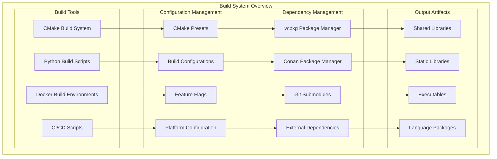

## CMake Build Structure

The hierarchical CMake structure organizes the complex build system:

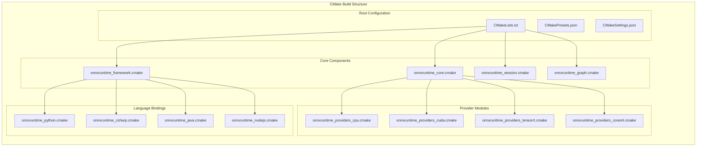

## Platform Support Matrix

Cross-platform build support across different operating systems and architectures:

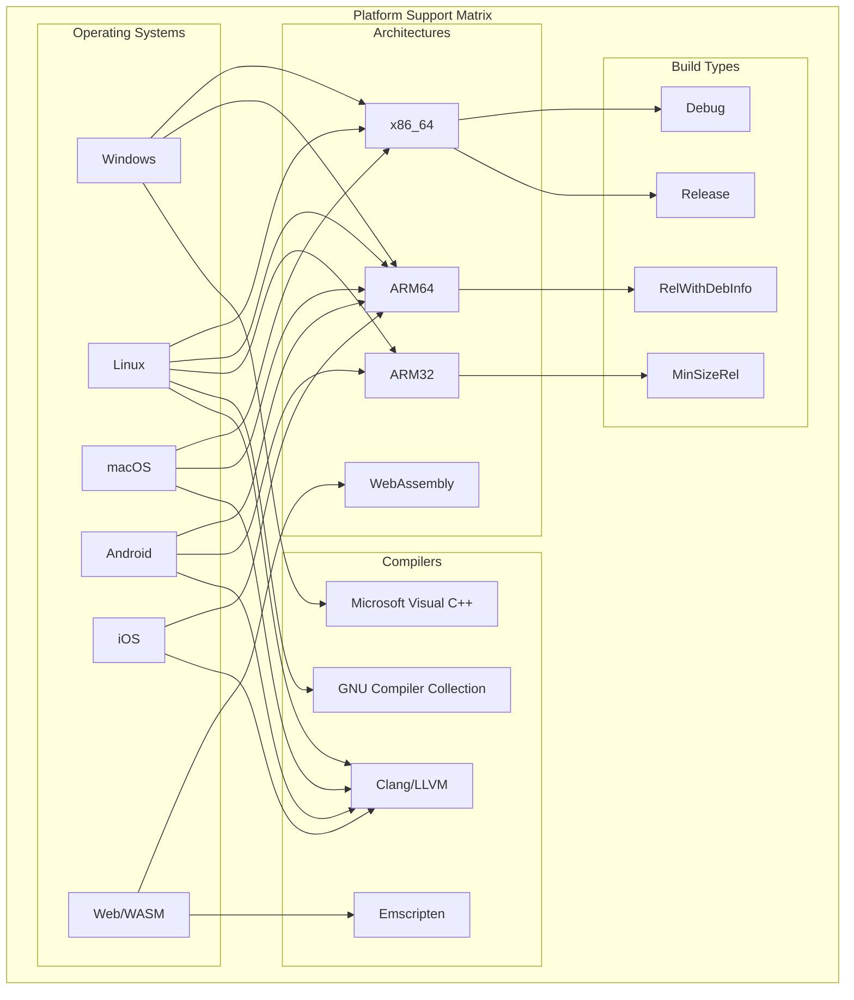

## Dependency Management

Comprehensive dependency management across different package managers:

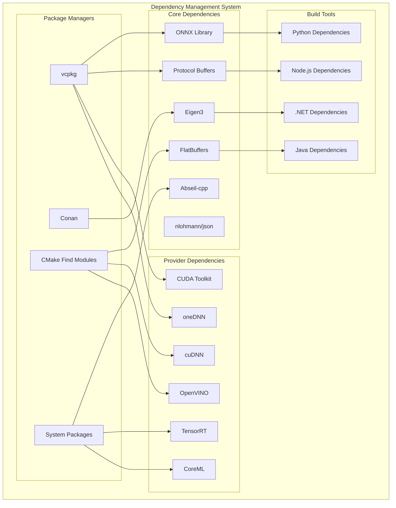

## Build Configuration System

Flexible configuration system for different build scenarios:

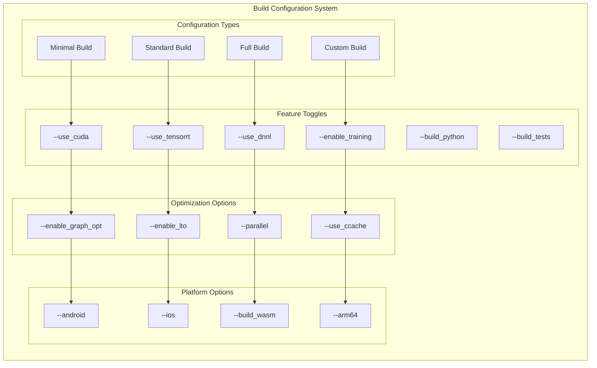

## Language Binding Build Process

Specific build processes for different language bindings:

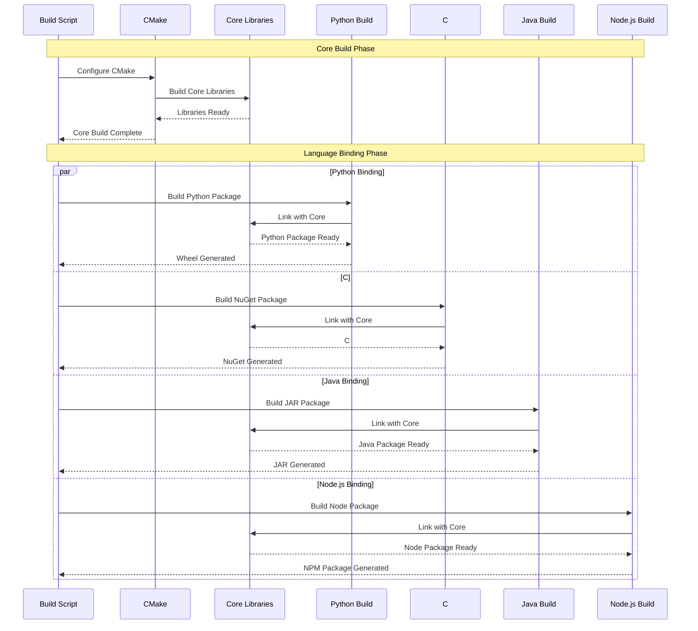

## Docker Build Environments

Containerized build environments for consistent builds:

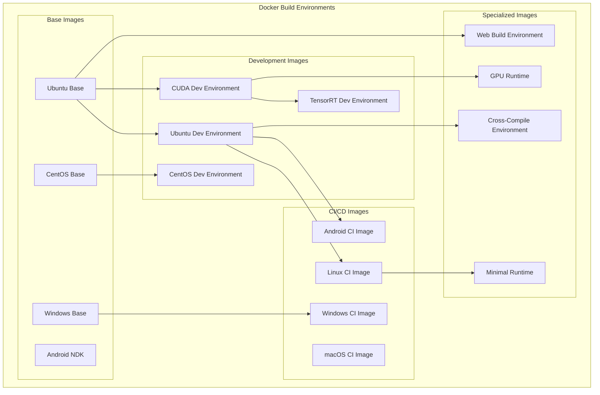

## CI/CD Pipeline Architecture

Comprehensive CI/CD pipeline for automated builds and testing:

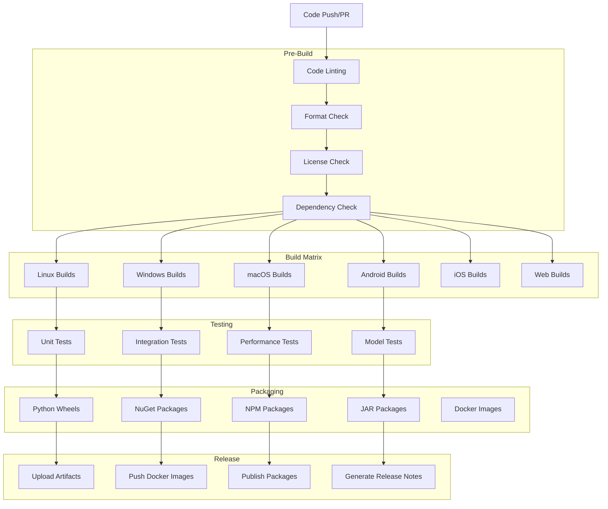

## Build Optimization Strategies

Various strategies to optimize build performance:

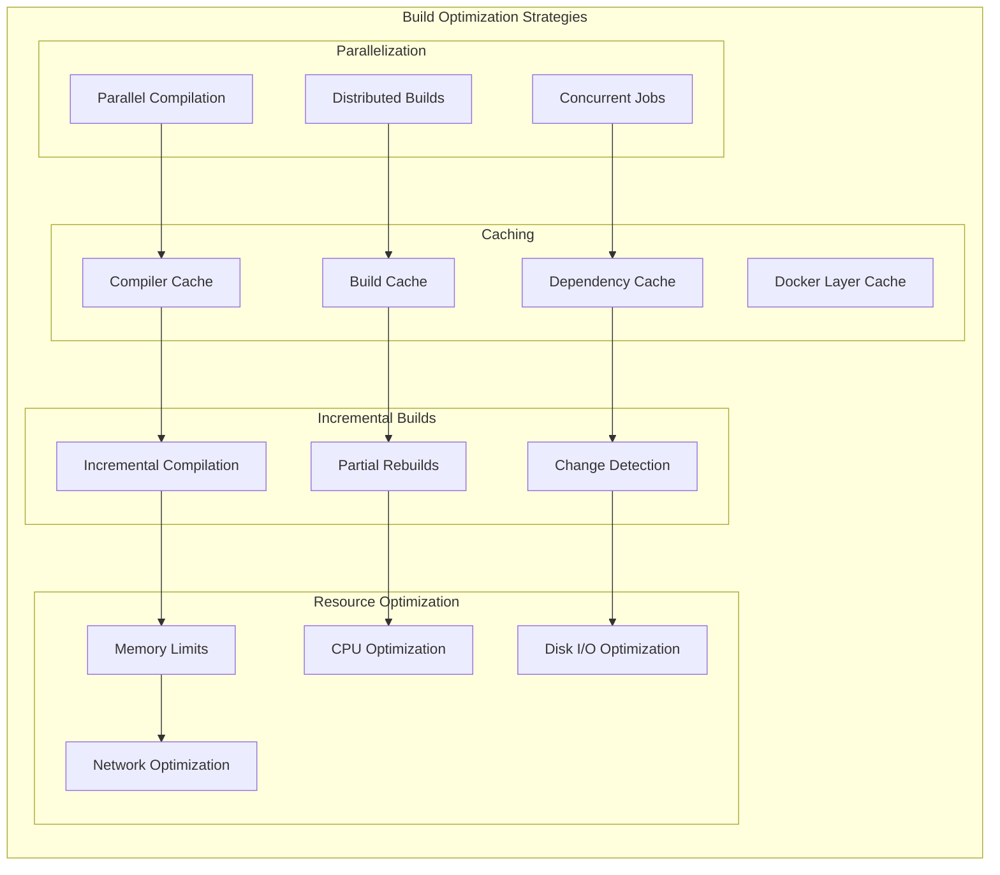

## Package Generation Process

Process for generating packages for different platforms and languages:

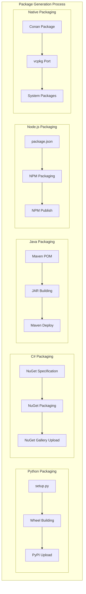

## Build Tool Integration

Integration with various development tools and IDEs:

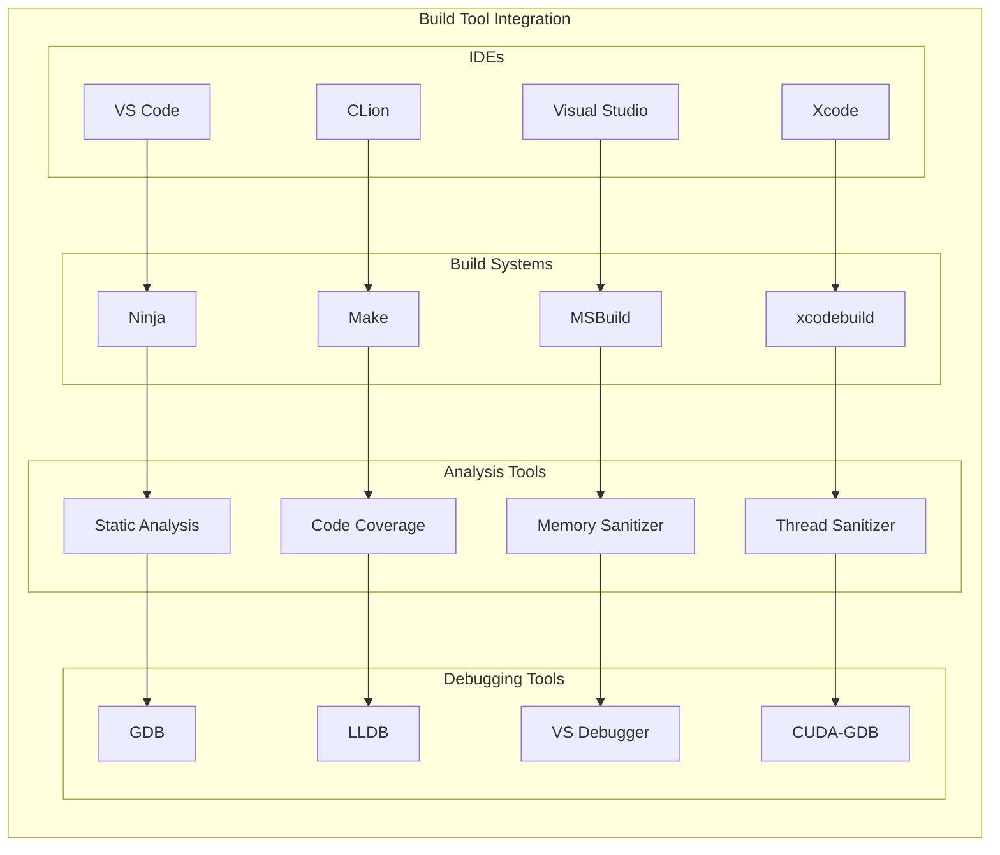

## Build Performance Metrics

Key metrics for monitoring and optimizing build performance:

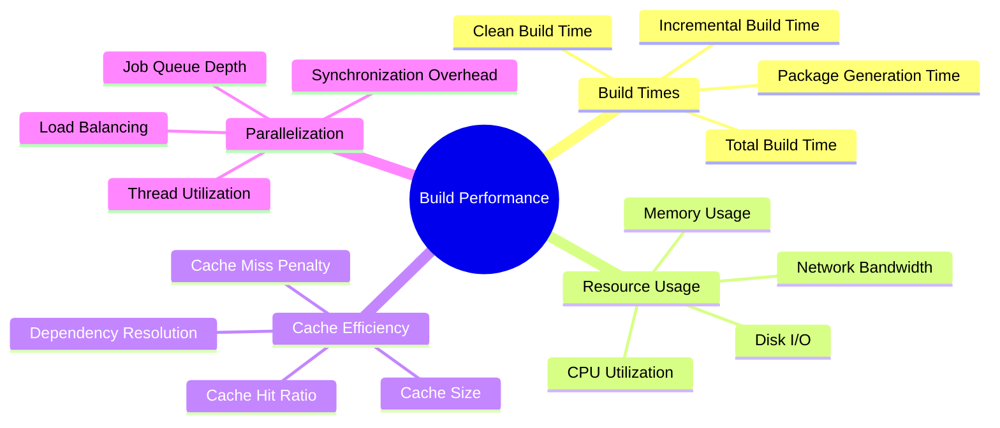

## Build System Maintenance

Ongoing maintenance and updates to the build system:

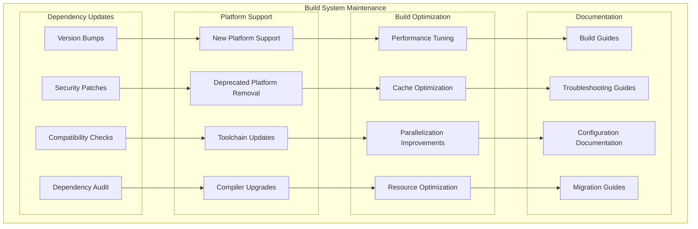

This comprehensive build system architecture ensures reliable, efficient, and maintainable builds across all supported platforms and configurations while providing flexibility for different deployment scenarios.