# Deployment Patterns and Architectures

This document outlines various deployment patterns and architectures for ONNX Runtime across different environments, from edge devices to cloud-scale deployments.

## Overview

ONNX Runtime supports diverse deployment patterns to meet different performance, scalability, and resource requirements across cloud, edge, mobile, and web environments.

## Deployment Architecture Overview

```mermaid
graph TB
    subgraph "Deployment Environments"
        subgraph "Cloud Deployments"
            CLOUD_SERVER[Server Applications]
            CLOUD_CONTAINER[Containerized Services]
            CLOUD_SERVERLESS[Serverless Functions]
            CLOUD_BATCH[Batch Processing]
        end
        
        subgraph "Edge Deployments"
            EDGE_DEVICE[Edge Devices]
            EDGE_GATEWAY[Edge Gateways]
            EDGE_IOT[IoT Devices]
            EDGE_EMBEDDED[Embedded Systems]
        end
        
        subgraph "Mobile Deployments"
            MOBILE_ANDROID[Android Apps]
            MOBILE_IOS[iOS Apps]
            MOBILE_CROSS[Cross-Platform Apps]
            MOBILE_PWA[Progressive Web Apps]
        end
        
        subgraph "Web Deployments"
            WEB_BROWSER[Browser Applications]
            WEB_NODE[Node.js Services]
            WEB_WORKER[Web Workers]
            WEB_SERVICE_WORKER[Service Workers]
        end
    end
    
    subgraph "Runtime Configurations"
        HIGH_PERF[High Performance]
        LOW_LATENCY[Low Latency]
        MINIMAL_SIZE[Minimal Size]
        LOW_POWER[Low Power]
    end
    
    CLOUD_SERVER --> HIGH_PERF
    CLOUD_CONTAINER --> HIGH_PERF
    CLOUD_SERVERLESS --> LOW_LATENCY
    CLOUD_BATCH --> HIGH_PERF
    
    EDGE_DEVICE --> LOW_POWER
    EDGE_GATEWAY --> LOW_LATENCY
    EDGE_IOT --> MINIMAL_SIZE
    EDGE_EMBEDDED --> LOW_POWER
    
    MOBILE_ANDROID --> MINIMAL_SIZE
    MOBILE_IOS --> LOW_POWER
    MOBILE_CROSS --> MINIMAL_SIZE
    MOBILE_PWA --> MINIMAL_SIZE
    
    WEB_BROWSER --> MINIMAL_SIZE
    WEB_NODE --> HIGH_PERF
    WEB_WORKER --> LOW_LATENCY
    WEB_SERVICE_WORKER --> MINIMAL_SIZE
```

## Cloud Deployment Patterns

### Microservices Architecture

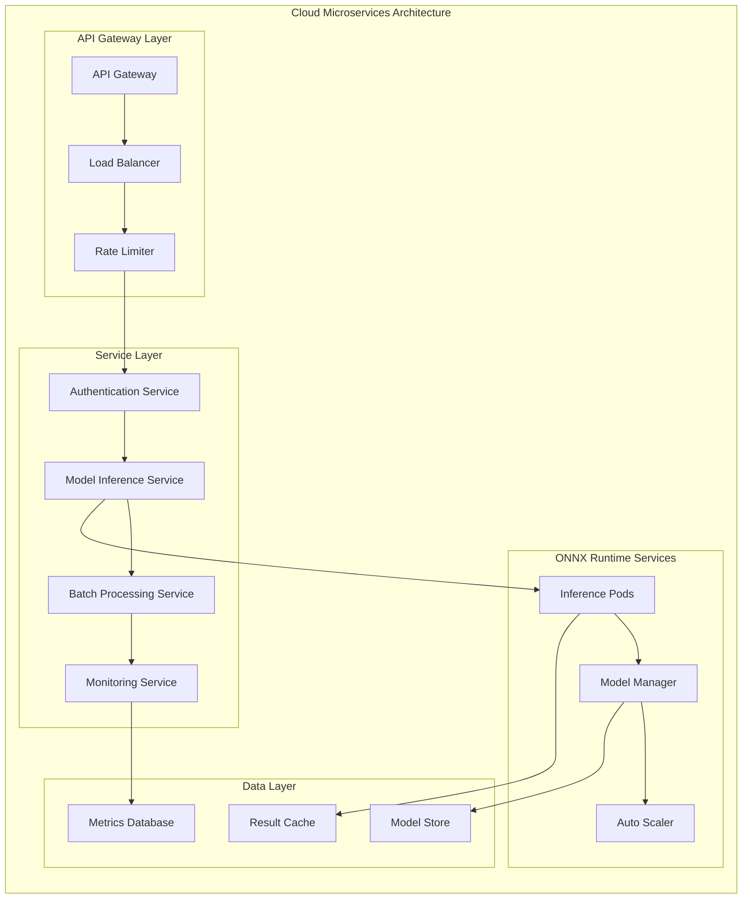

### Containerized Deployment

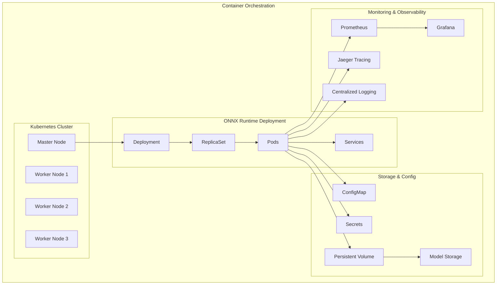

### Serverless Deployment

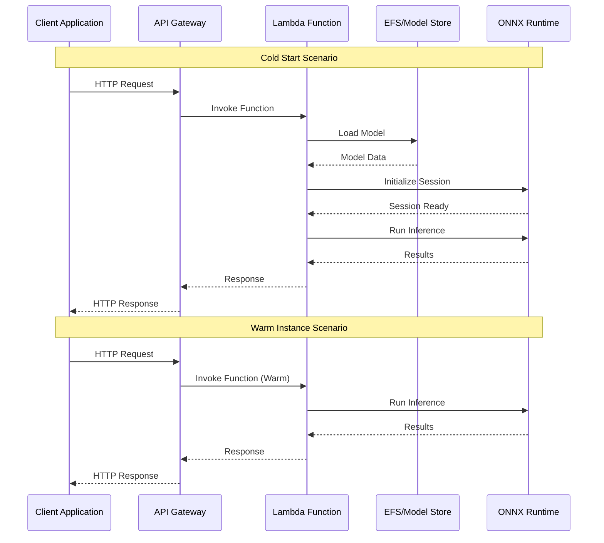

## Edge Deployment Patterns

### Edge Computing Architecture

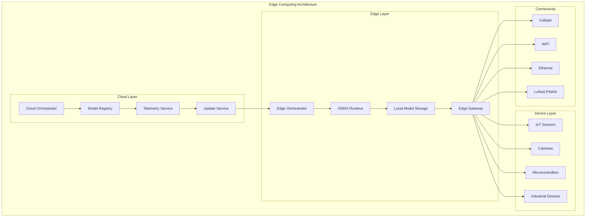

### IoT Device Deployment

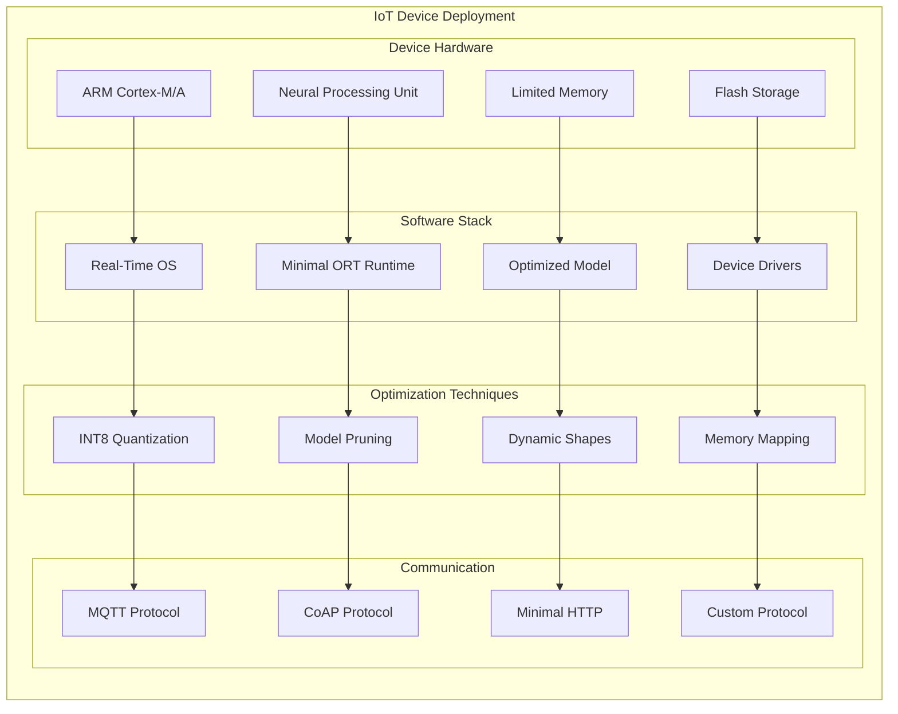

## Mobile Deployment Patterns

### Android Deployment

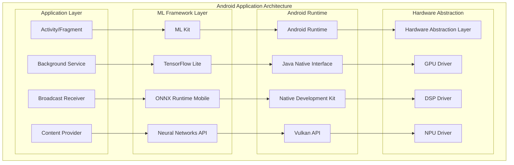

### iOS Deployment

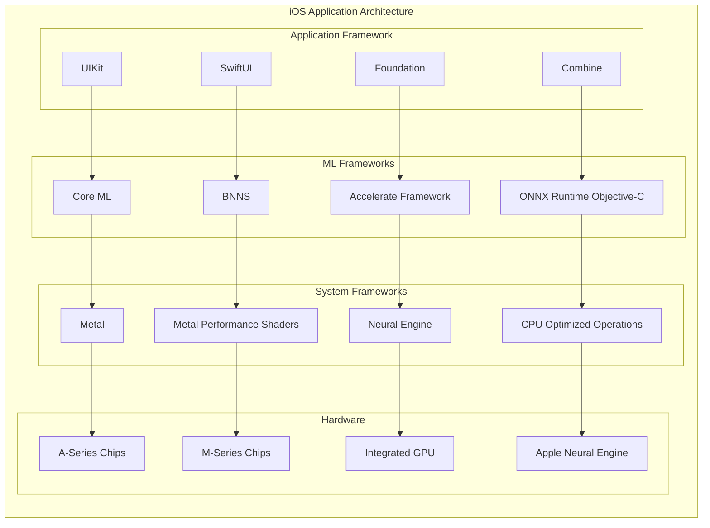

## Web Deployment Patterns

### Browser-Based Deployment

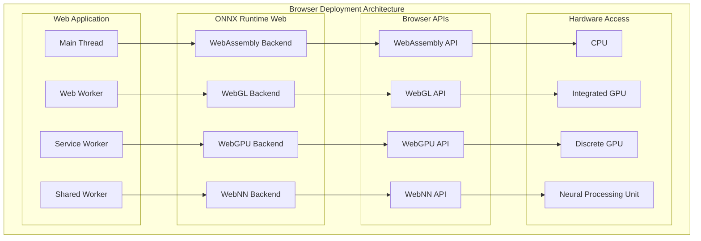

### Node.js Server Deployment

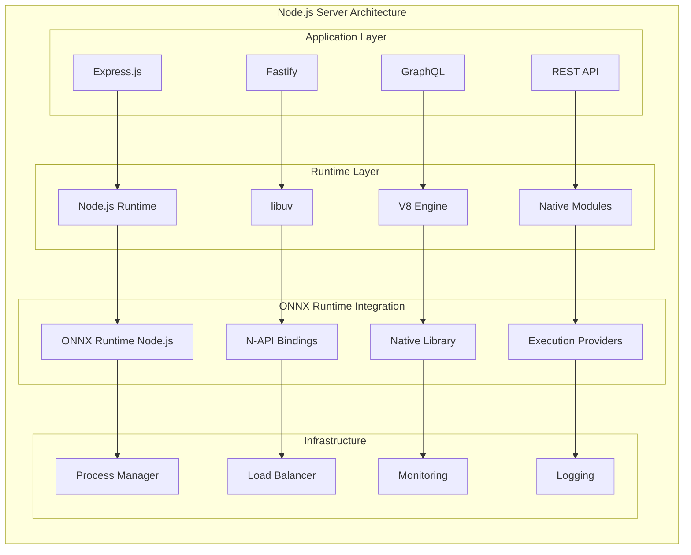

## Hybrid Deployment Patterns

### Edge-Cloud Hybrid

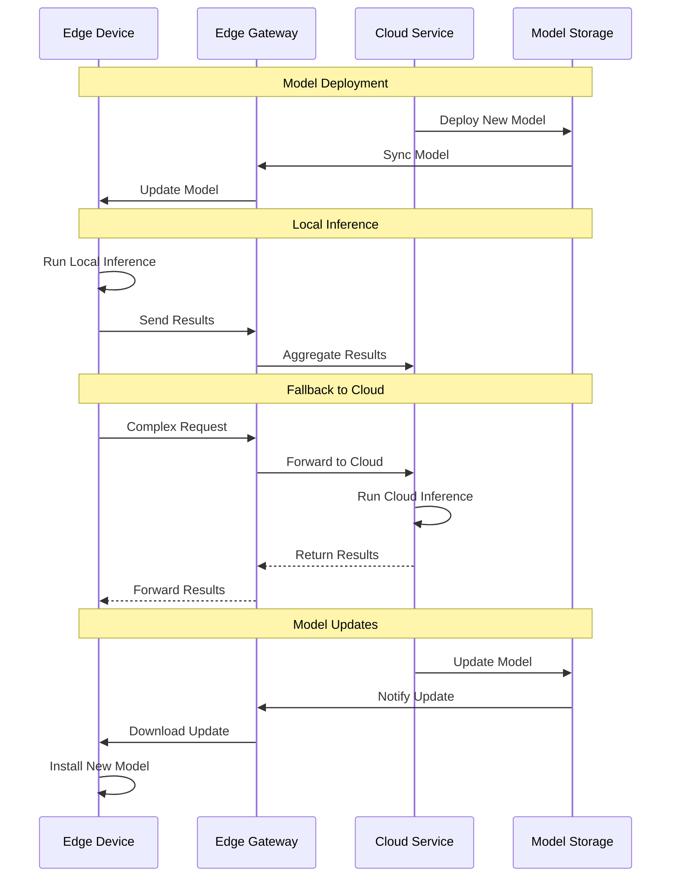

### Multi-Tier Architecture

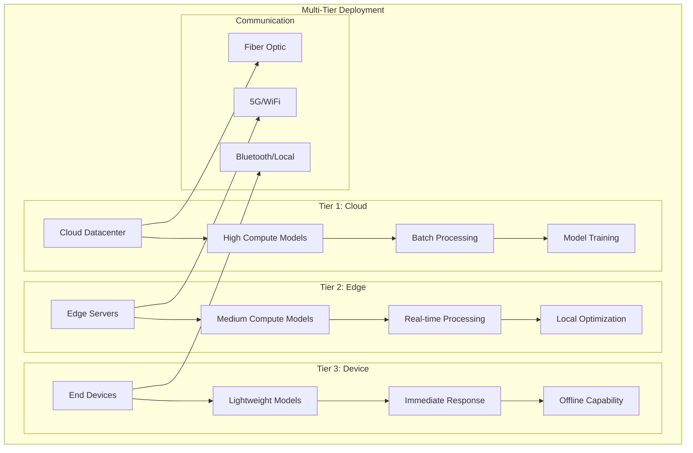

## Performance Optimization by Deployment

Different deployment patterns require specific optimizations:

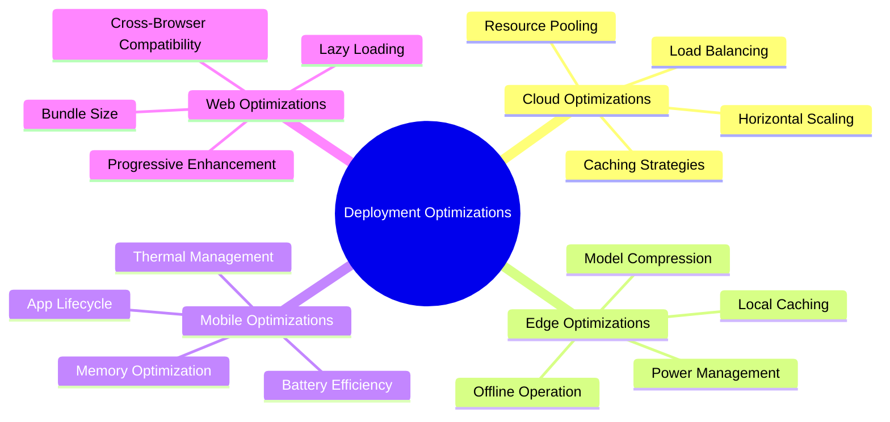

## Deployment Configuration Management

Managing configurations across different deployment environments:

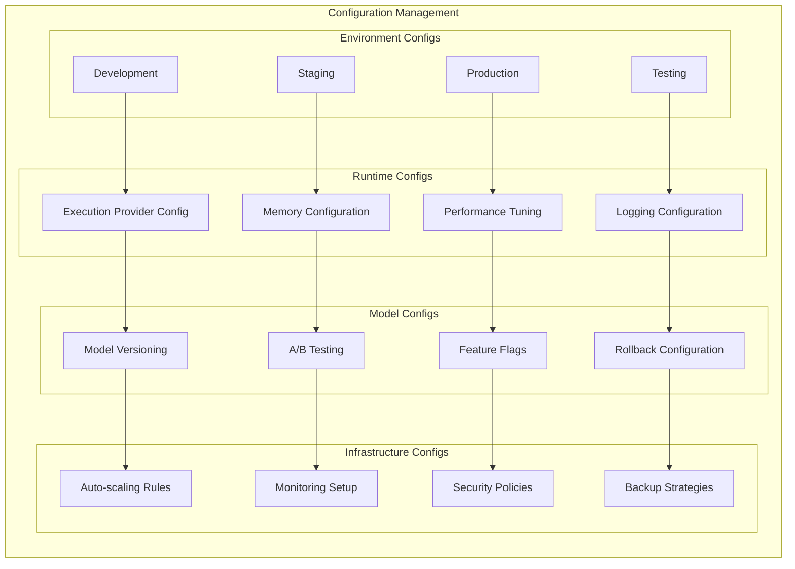

## Monitoring and Observability

Comprehensive monitoring across all deployment patterns:

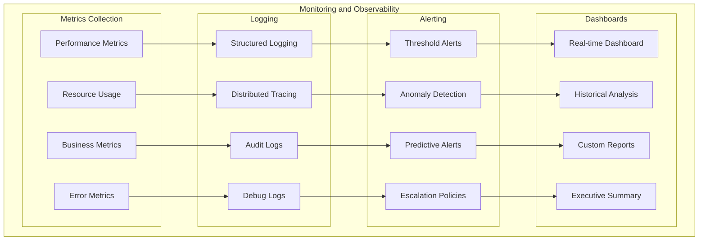

This comprehensive deployment architecture guide enables organizations to choose and implement the most appropriate deployment patterns for their specific use cases, performance requirements, and infrastructure constraints.