# Execution Provider Architecture

This document details the execution provider architecture in ONNX Runtime, which enables support for diverse hardware accelerators and runtime environments.

## Overview

Execution Providers (EPs) are the abstraction layer that allows ONNX Runtime to leverage different hardware and software acceleration libraries. Each provider implements a common interface while providing hardware-specific optimizations.

## Execution Provider Interface

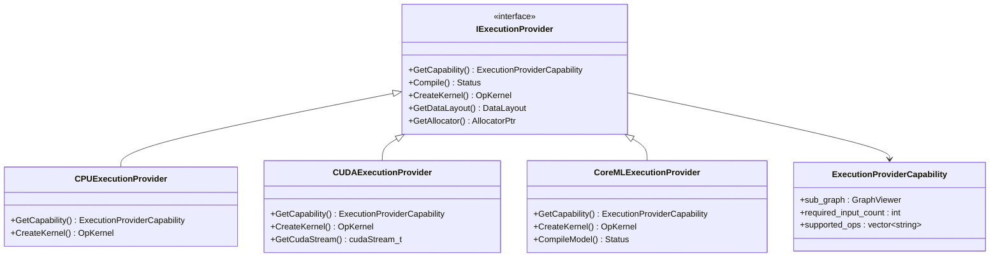

## Provider Selection and Fallback

The execution provider selection follows a priority-based system with fallback mechanisms:

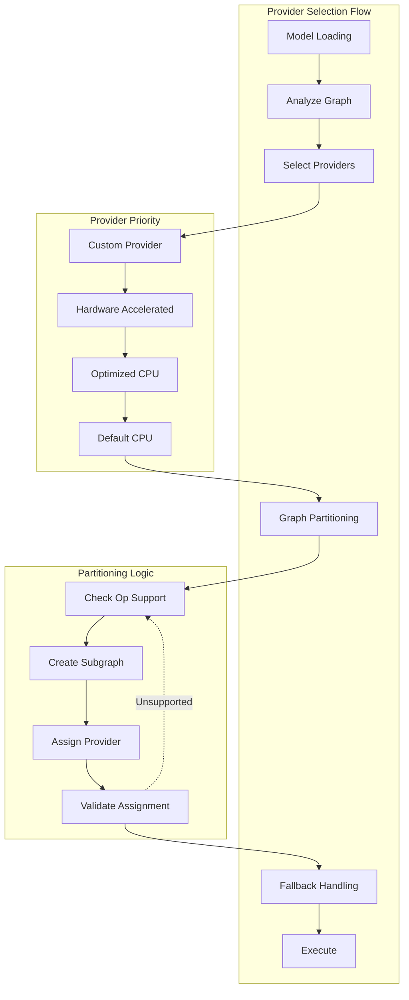

## Provider Categories

### CPU Providers

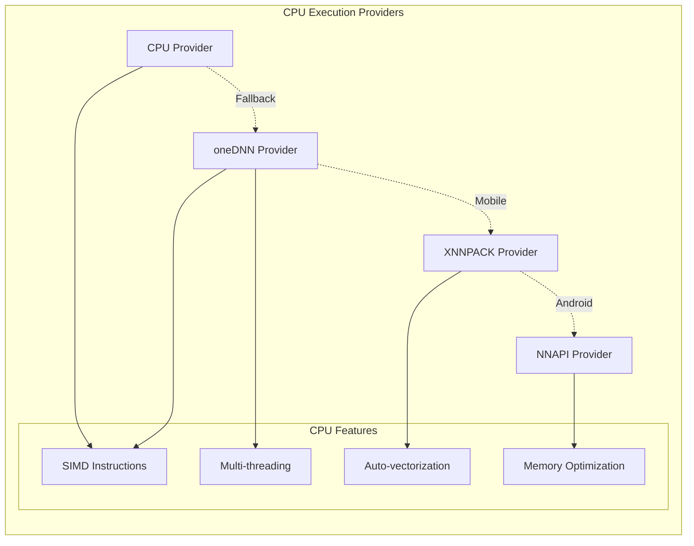

### GPU Providers

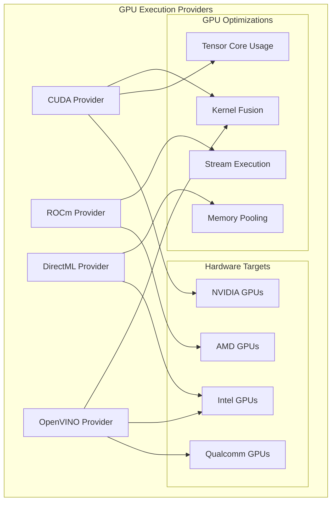

### Specialized Providers

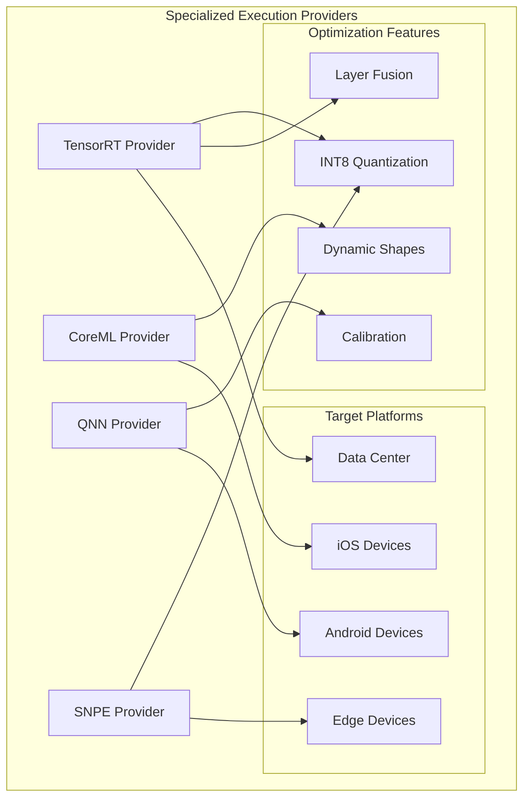

### Web Providers

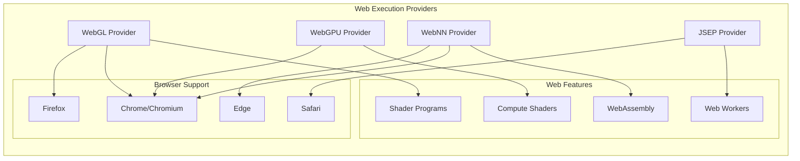

## Provider Lifecycle

The lifecycle of an execution provider from registration to execution:

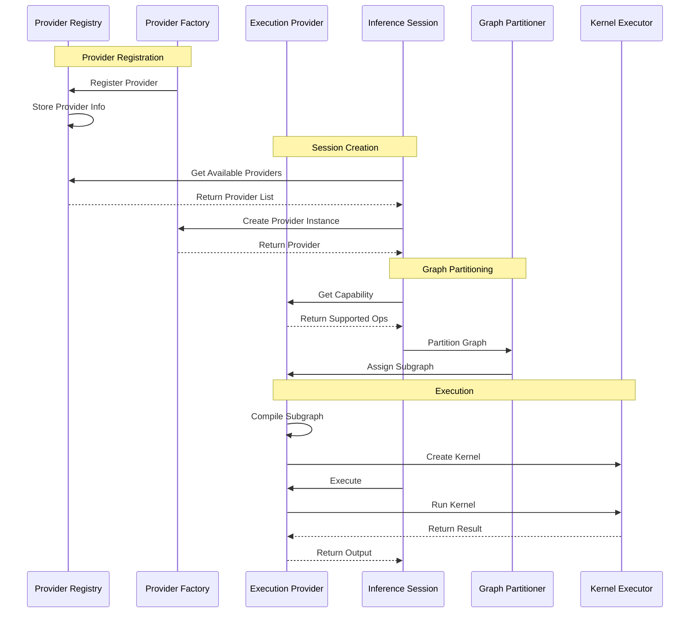

## Graph Partitioning

How the graph is partitioned across multiple execution providers:

```mermaid
graph TB
    subgraph "Original Graph"
        OP1[Conv2D]
        OP2[BatchNorm]
        OP3[ReLU]
        OP4[MaxPool]
        OP5[Flatten]
        OP6[MatMul]
        OP7[Softmax]
        
        OP1 --> OP2
        OP2 --> OP3
        OP3 --> OP4
        OP4 --> OP5
        OP5 --> OP6
        OP6 --> OP7
    end
    
    subgraph "Partitioned Graph"
        subgraph "CUDA Subgraph"
            COP1[Conv2D]
            COP2[BatchNorm]
            COP3[ReLU]
            COP4[MaxPool]
            
            COP1 --> COP2
            COP2 --> COP3
            COP3 --> COP4
        end
        
        subgraph "CPU Subgraph"
            CCOP5[Flatten]
            CCOP6[MatMul]
            CCOP7[Softmax]
            
            CCOP5 --> CCOP6
            CCOP6 --> CCOP7
        end
        
        subgraph "Memory Transfers"
            H2D[Host to Device]
            D2H[Device to Host]
        end
    end
    
    COP4 --> H2D
    H2D --> D2H
    D2H --> CCOP5
```

## Provider-Specific Optimizations

Each provider implements specific optimizations:

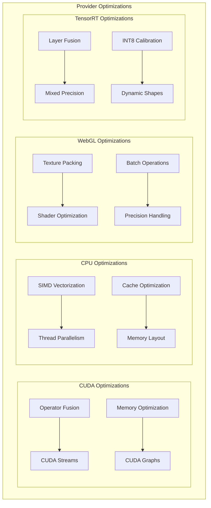

## Error Handling and Fallback

Error handling and fallback mechanisms in execution providers:

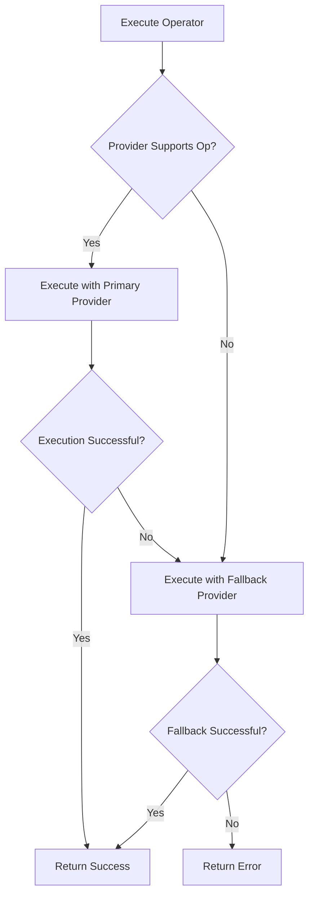

## Performance Considerations

Key performance considerations for execution providers:

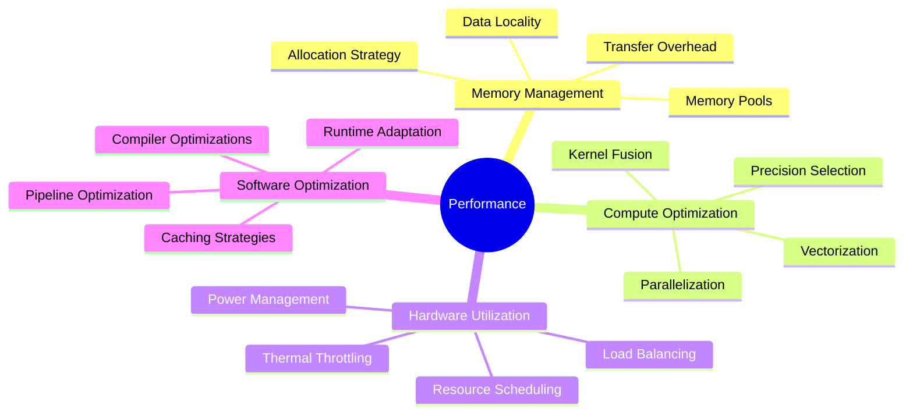

## Provider Configuration

Configuration options available for different execution providers:

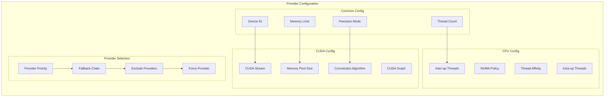

This execution provider architecture enables ONNX Runtime to provide optimal performance across a wide range of hardware platforms while maintaining a consistent programming interface for developers.