# Graph Processing and Optimization Pipeline

This document details the graph processing and optimization pipeline in ONNX Runtime, covering how models are parsed, validated, optimized, and prepared for execution.

## Overview

The graph processing pipeline transforms an ONNX model into an optimized execution graph that can be efficiently executed by various execution providers. This involves multiple stages of analysis, transformation, and optimization.

## Graph Processing Pipeline

```mermaid
flowchart TD
    subgraph "Model Loading"
        ONNX_FILE[ONNX Model File]
        PROTOBUF_PARSE[Protobuf Parsing]
        GRAPH_PROTO[GraphProto]
    end
    
    subgraph "Graph Construction"
        GRAPH_BUILD[Graph Builder]
        NODE_CREATE[Node Creation]
        EDGE_CREATE[Edge Creation]
        GRAPH_OBJ[Graph Object]
    end
    
    subgraph "Graph Validation"
        SCHEMA_CHECK[Schema Validation]
        TYPE_CHECK[Type Checking]
        SHAPE_INFER[Shape Inference]
        VALIDATED_GRAPH[Validated Graph]
    end
    
    subgraph "Graph Optimization"
        CONSTANT_FOLD[Constant Folding]
        DEAD_ELIM[Dead Code Elimination]
        OPERATOR_FUSION[Operator Fusion]
        LAYOUT_OPT[Layout Optimization]
        OPTIMIZED_GRAPH[Optimized Graph]
    end
    
    subgraph "Graph Partitioning"
        PROVIDER_SELECT[Provider Selection]
        CAPABILITY_CHECK[Capability Check]
        SUBGRAPH_CREATE[Subgraph Creation]
        PARTITIONED_GRAPH[Partitioned Graph]
    end
    
    subgraph "Execution Preparation"
        KERNEL_SELECT[Kernel Selection]
        MEMORY_PLAN[Memory Planning]
        EXEC_PLAN[Execution Plan]
        READY_GRAPH[Execution Ready Graph]
    end
    
    ONNX_FILE --> PROTOBUF_PARSE
    PROTOBUF_PARSE --> GRAPH_PROTO
    GRAPH_PROTO --> GRAPH_BUILD
    
    GRAPH_BUILD --> NODE_CREATE
    NODE_CREATE --> EDGE_CREATE
    EDGE_CREATE --> GRAPH_OBJ
    
    GRAPH_OBJ --> SCHEMA_CHECK
    SCHEMA_CHECK --> TYPE_CHECK
    TYPE_CHECK --> SHAPE_INFER
    SHAPE_INFER --> VALIDATED_GRAPH
    
    VALIDATED_GRAPH --> CONSTANT_FOLD
    CONSTANT_FOLD --> DEAD_ELIM
    DEAD_ELIM --> OPERATOR_FUSION
    OPERATOR_FUSION --> LAYOUT_OPT
    LAYOUT_OPT --> OPTIMIZED_GRAPH
    
    OPTIMIZED_GRAPH --> PROVIDER_SELECT
    PROVIDER_SELECT --> CAPABILITY_CHECK
    CAPABILITY_CHECK --> SUBGRAPH_CREATE
    SUBGRAPH_CREATE --> PARTITIONED_GRAPH
    
    PARTITIONED_GRAPH --> KERNEL_SELECT
    KERNEL_SELECT --> MEMORY_PLAN
    MEMORY_PLAN --> EXEC_PLAN
    EXEC_PLAN --> READY_GRAPH
```

## Graph Representation

The internal graph representation uses a directed acyclic graph (DAG) structure:

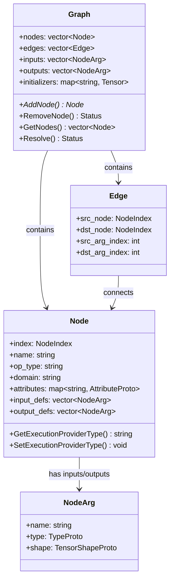

## Shape Inference

Shape inference propagates tensor shapes through the graph:

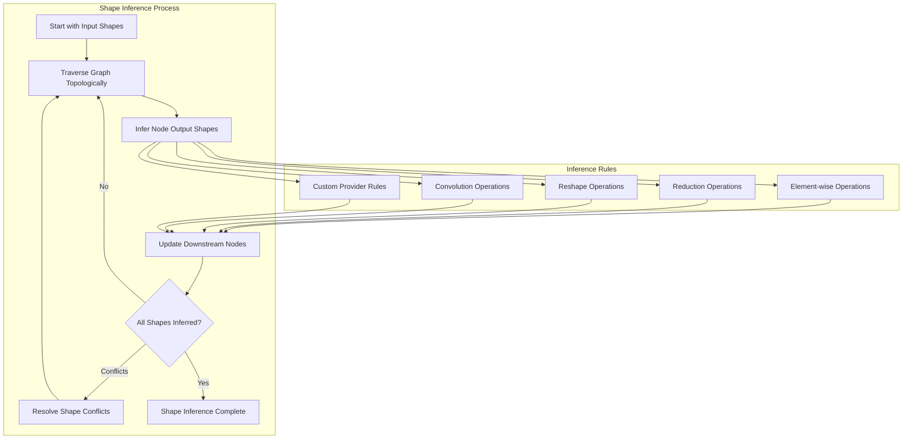

## Graph Optimization Passes

Multiple optimization passes are applied to improve performance:

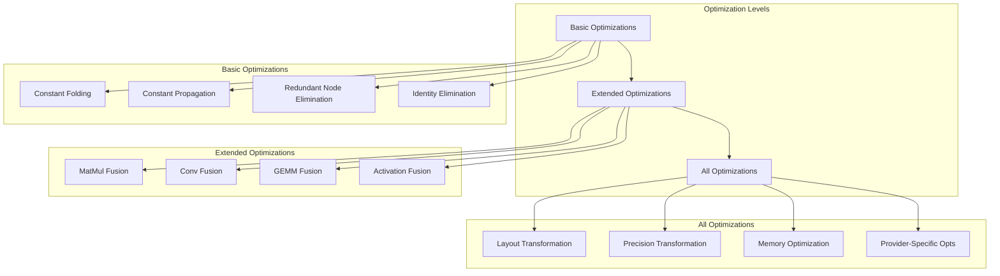

## Operator Fusion

Operator fusion combines multiple operations into single fused kernels:

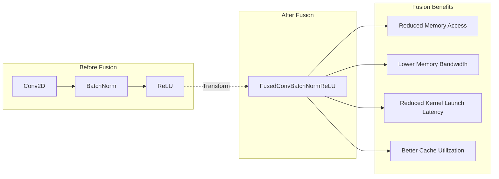

### Common Fusion Patterns

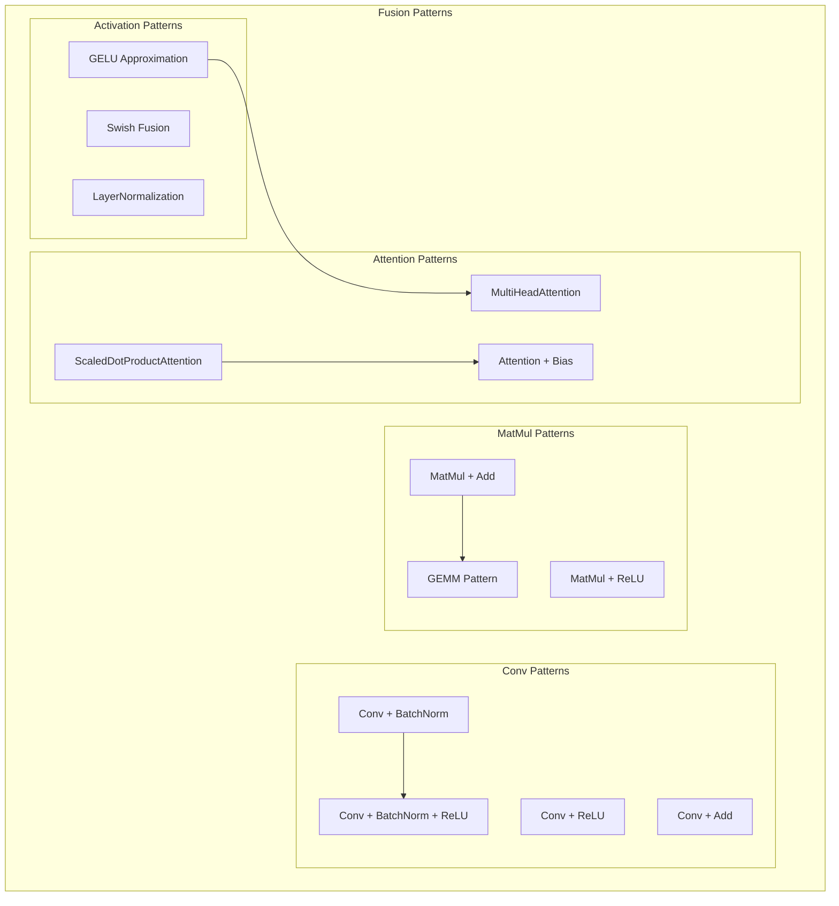

## Memory Planning

Memory planning optimizes memory usage during execution:

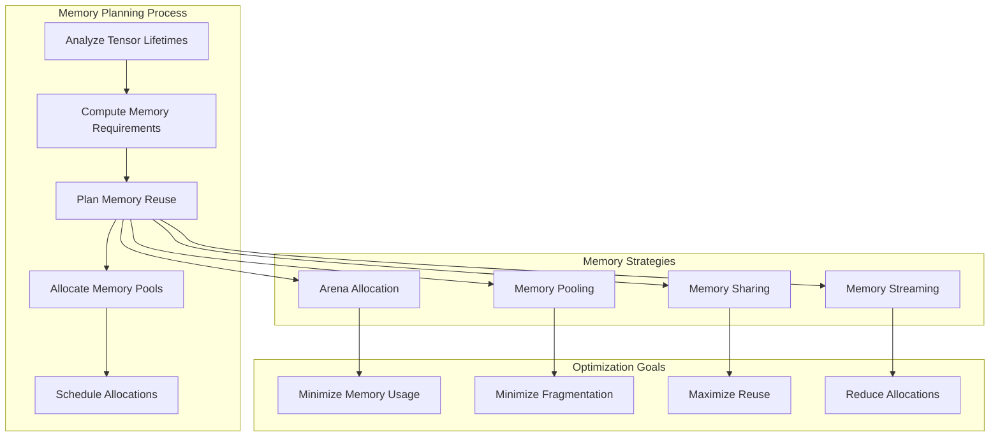

## Execution Planning

The execution planner creates an efficient execution schedule:

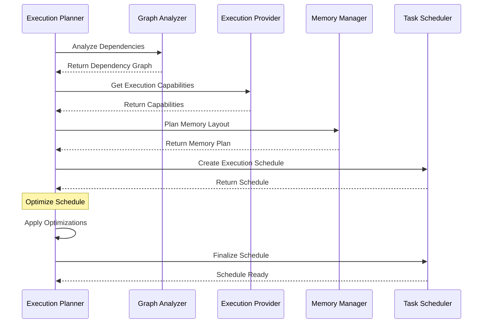

## Graph Transformations

Various graph transformations optimize the computational graph:

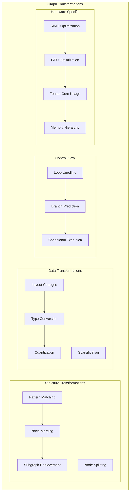

## Provider-Specific Optimizations

Different execution providers apply specific optimizations:

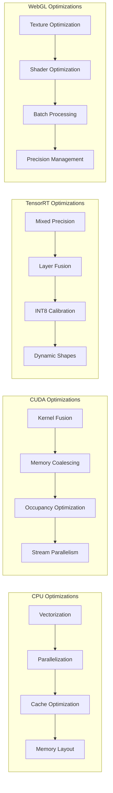

## Optimization Heuristics

The optimization system uses various heuristics to make decisions:

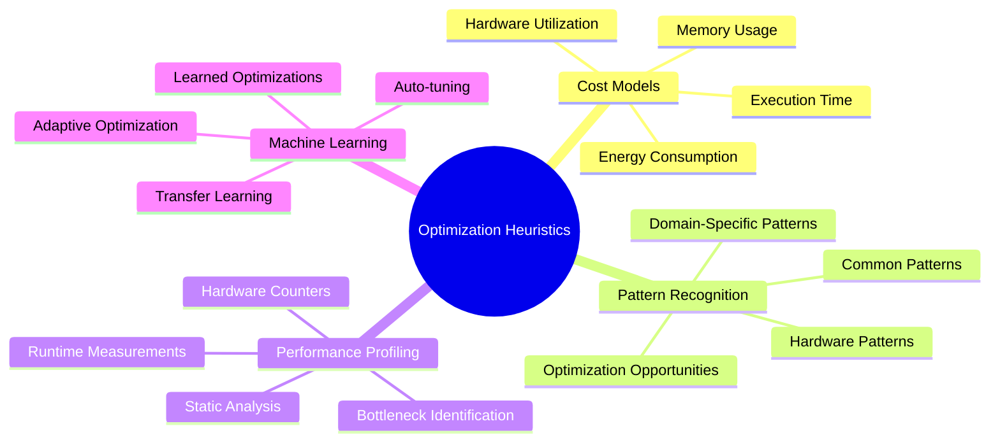

## Graph Analysis

Comprehensive graph analysis provides insights for optimization:

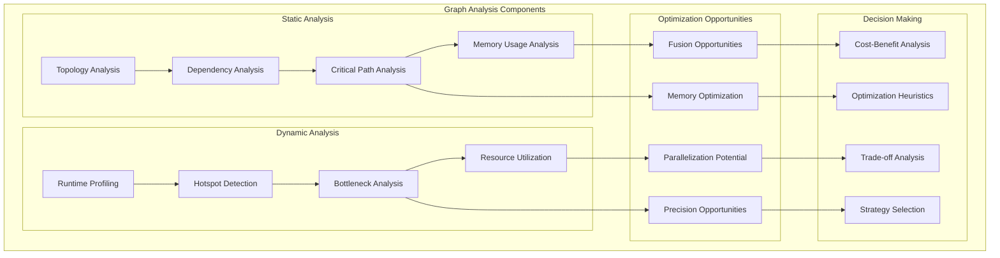

## Error Handling in Graph Processing

Robust error handling throughout the graph processing pipeline:

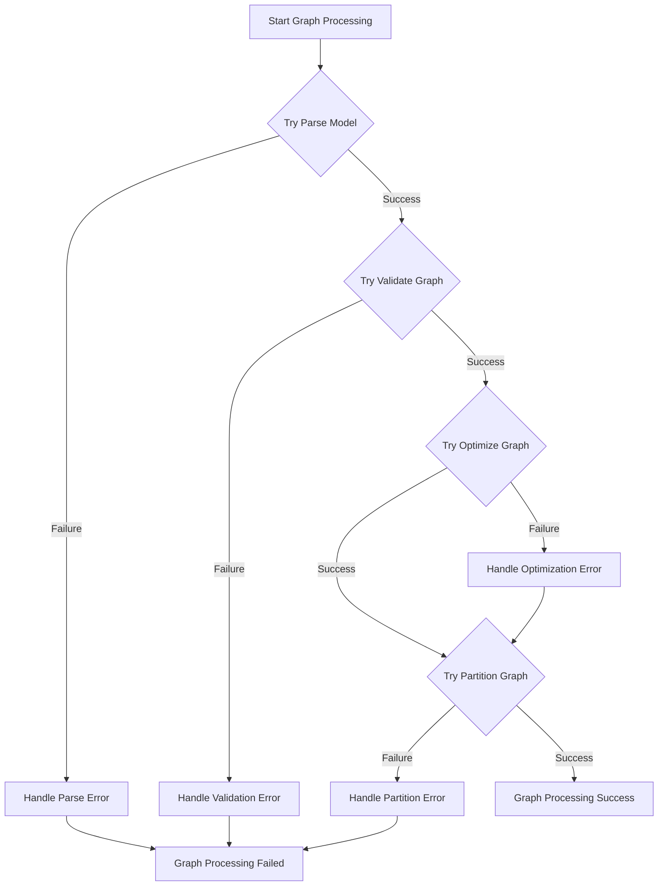

This comprehensive graph processing and optimization pipeline ensures that ONNX models are efficiently prepared for execution across diverse hardware platforms and execution providers.