# Language Bindings Architecture

This document details the architecture of ONNX Runtime's language bindings, showing how different programming languages interface with the core C++ runtime engine.

## Overview

ONNX Runtime provides native APIs for multiple programming languages through a layered architecture that maintains performance while offering language-specific ergonomics and idioms.

## Language Binding Architecture

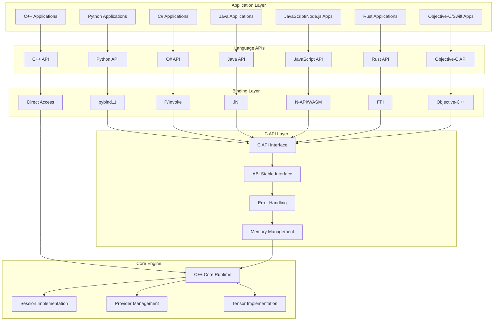

## C API Foundation

The C API provides a stable ABI interface for all language bindings:

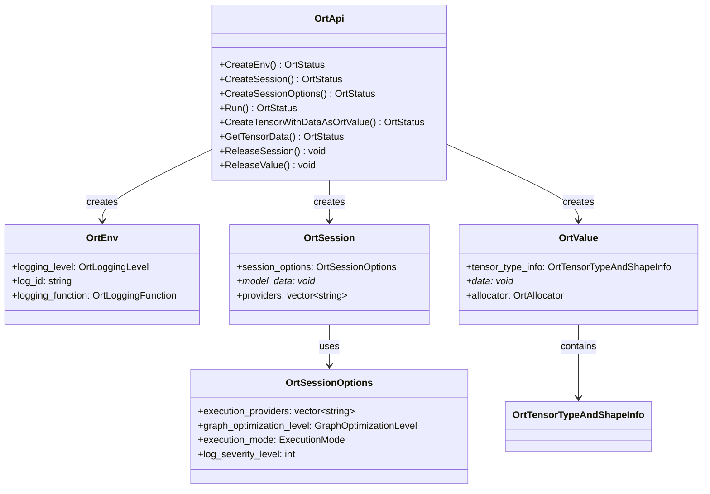

## Python Bindings

Python bindings use pybind11 for seamless C++ integration:

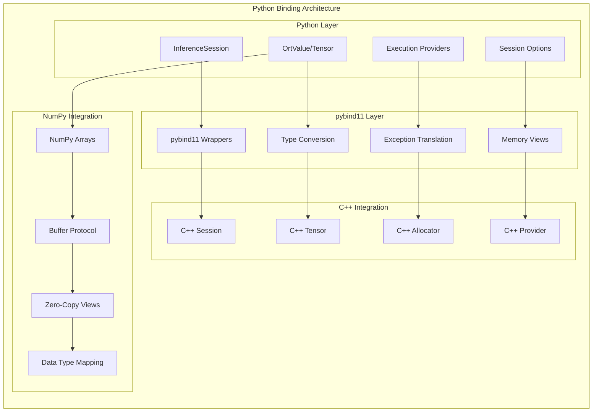

### Python API Flow

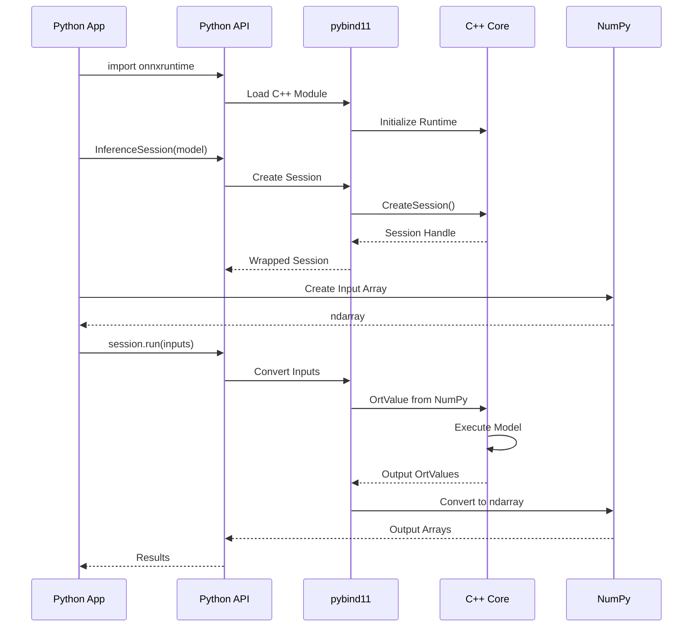

## C# Bindings

C# bindings use P/Invoke for .NET interoperability:

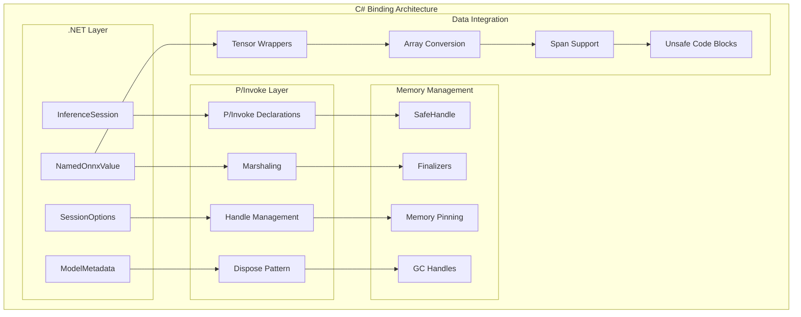

### C# Memory Management

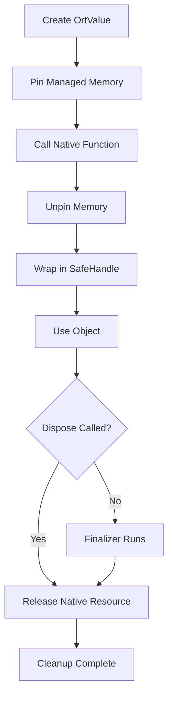

## Java Bindings

Java bindings use JNI for native integration:

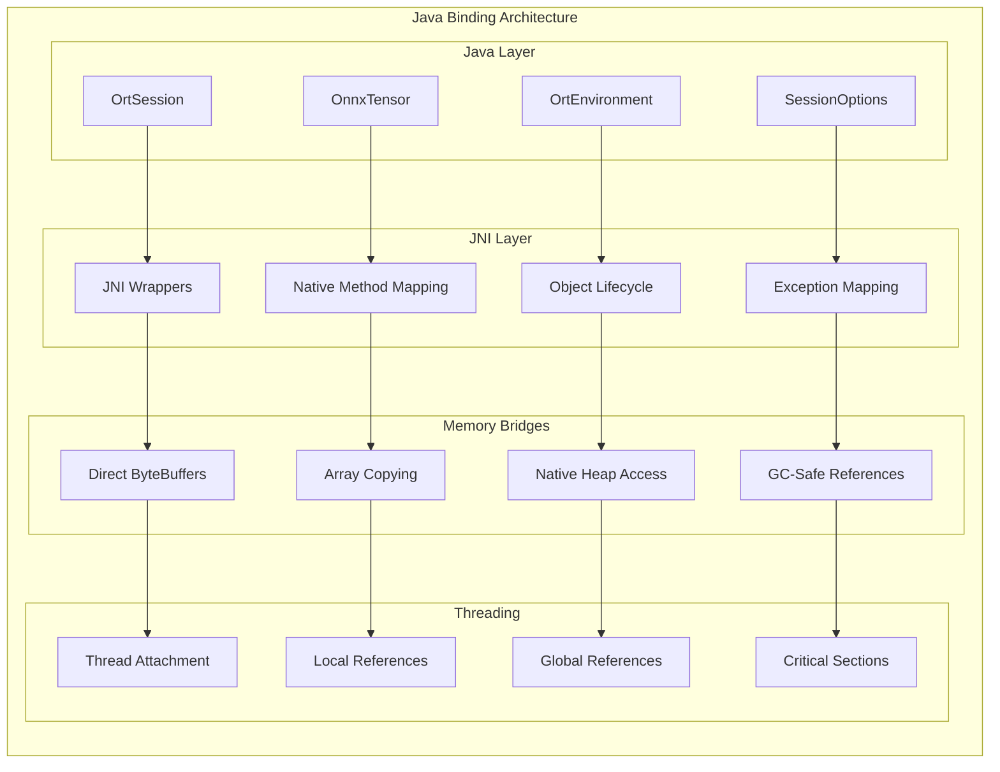

### JNI Object Lifecycle

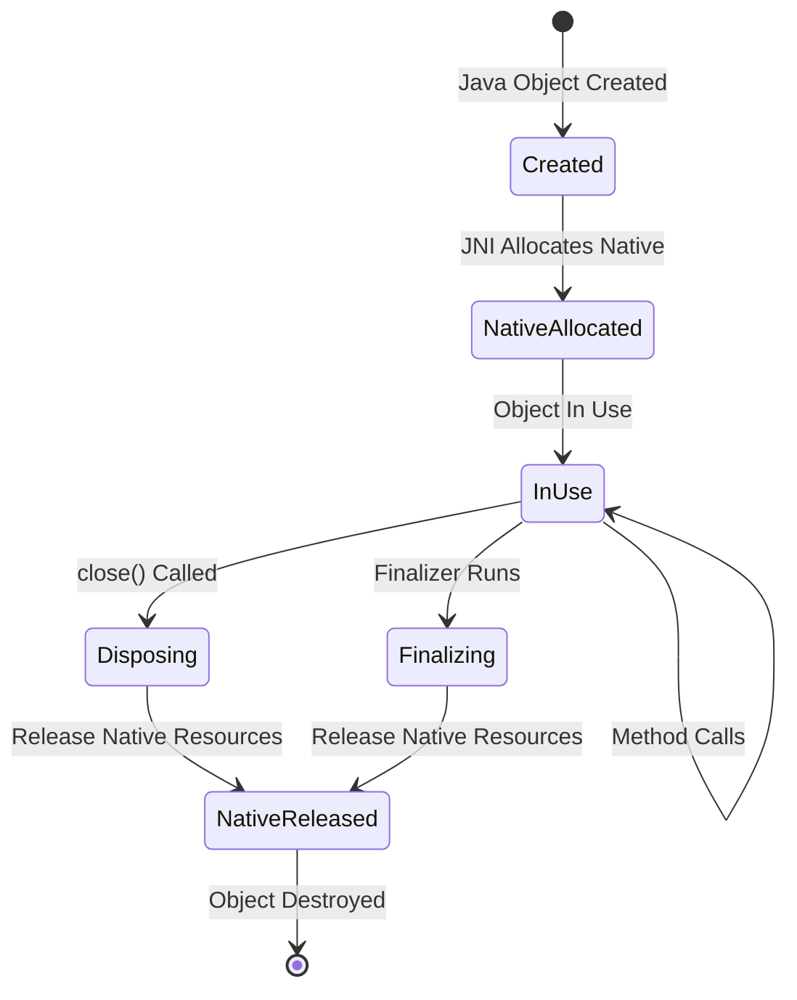

## JavaScript/WebAssembly Bindings

JavaScript bindings support both Node.js and browser environments:

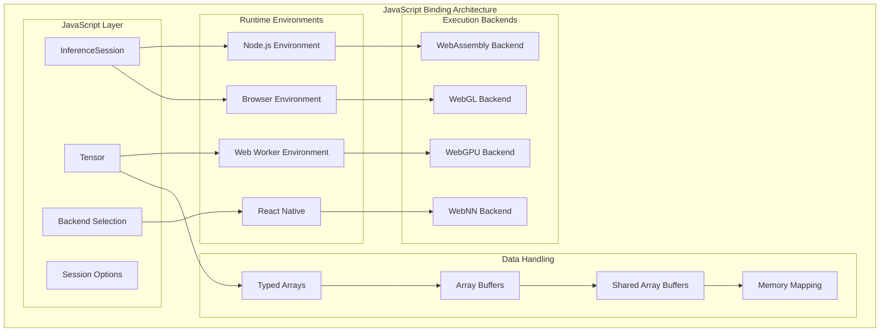

### WebAssembly Integration

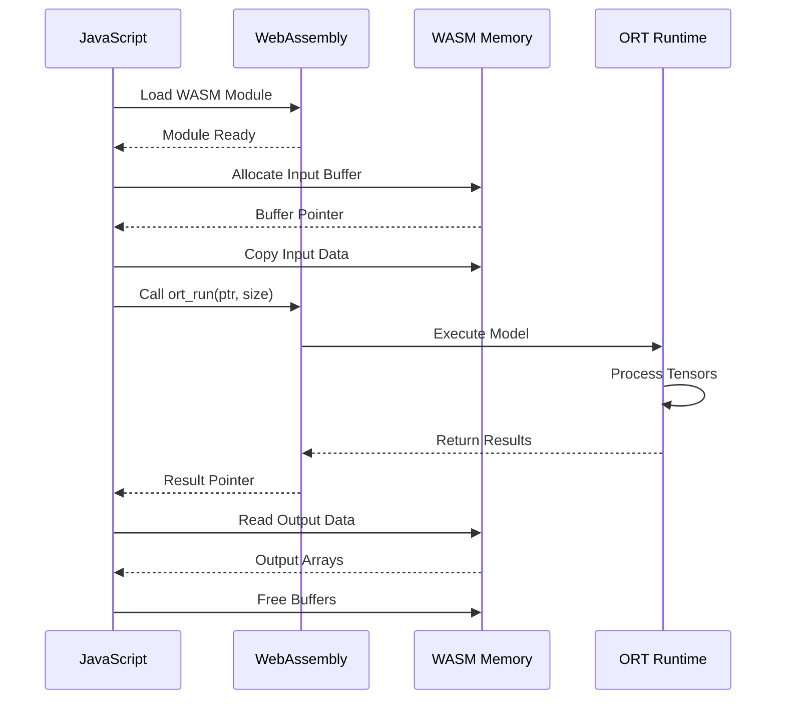

## Rust Bindings

Rust bindings provide safe FFI access to the C API:

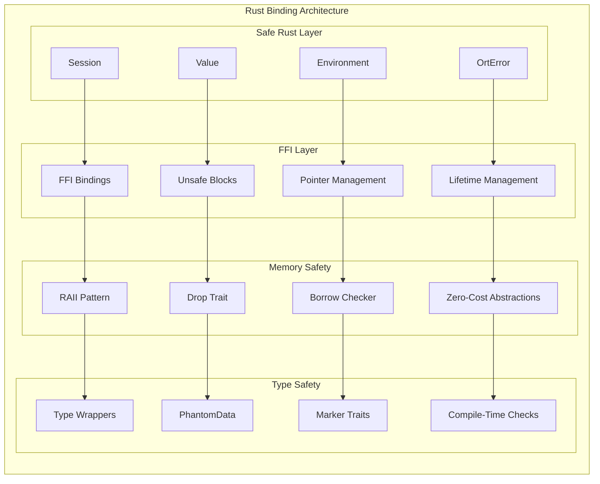

## Objective-C/Swift Bindings

Native iOS and macOS integration:

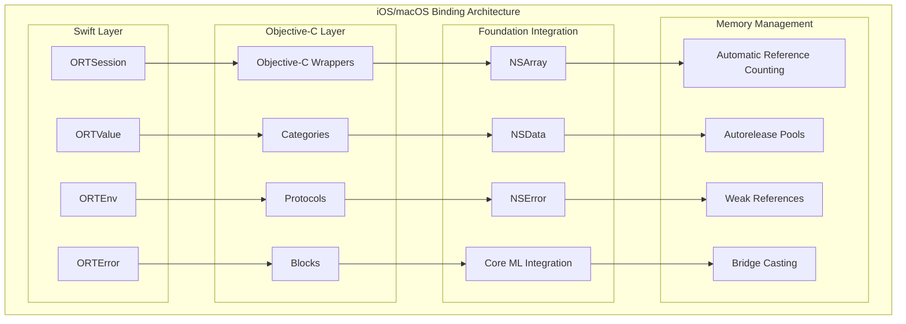

## Cross-Language Data Types

Mapping between language-specific types and ONNX Runtime types:

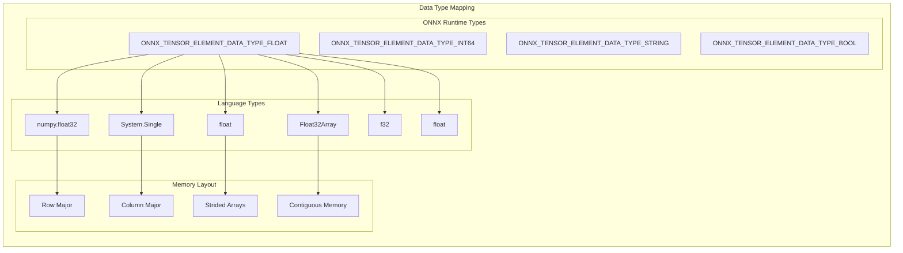

## Error Handling Across Languages

Consistent error handling patterns across all language bindings:

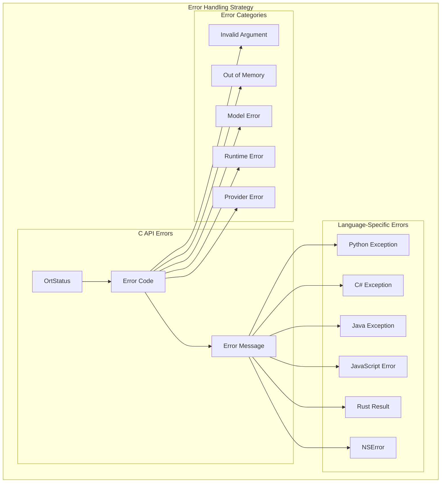

## Performance Considerations

Key performance aspects of language bindings:

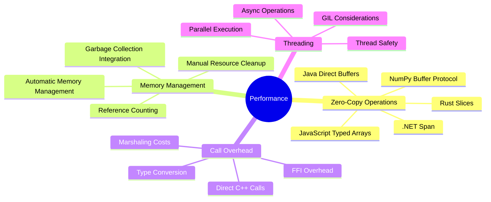

## Language-Specific Optimizations

Each language binding implements specific optimizations:

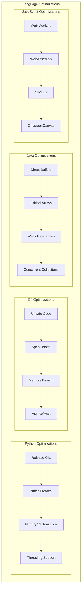

This comprehensive language binding architecture enables ONNX Runtime to provide native, high-performance APIs across multiple programming languages while maintaining consistency and safety.