# Memory Management Architecture

This document details the memory management architecture in ONNX Runtime, covering allocators, memory planning, optimization strategies, and cross-device memory handling.

## Overview

ONNX Runtime implements a sophisticated memory management system that handles diverse memory types across different execution providers while optimizing for performance, memory usage, and device compatibility.

## Memory Management Architecture

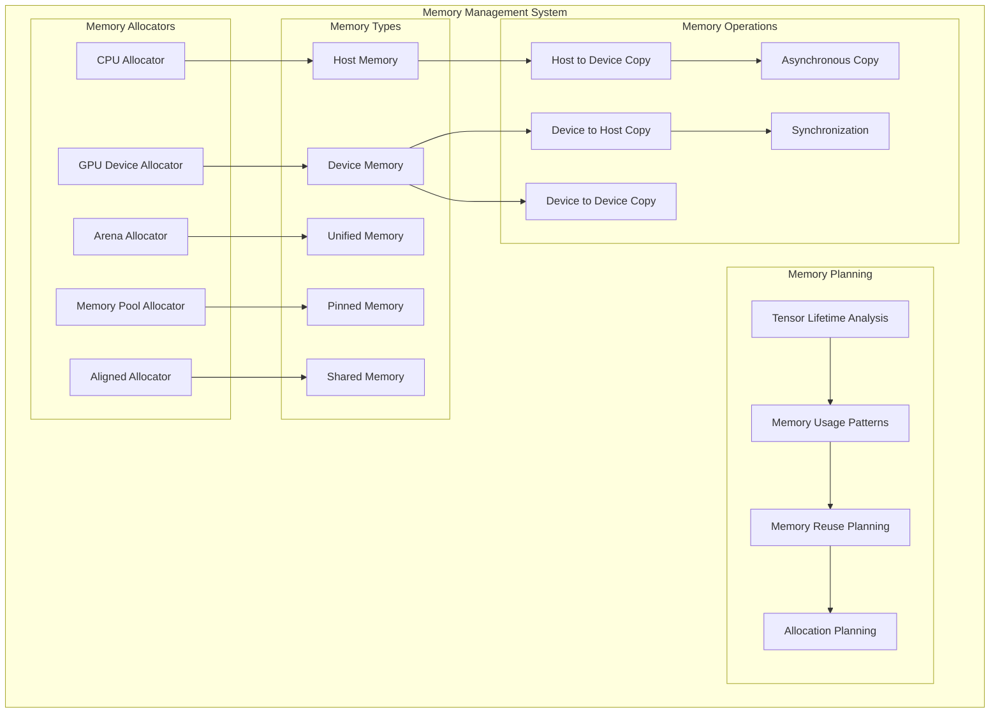

## Allocator Hierarchy

The allocator system provides a flexible hierarchy for different memory requirements:

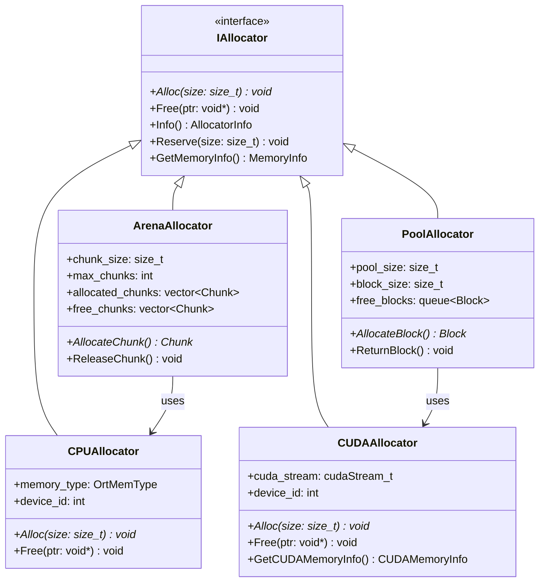

## Memory Planning Process

Memory planning optimizes memory allocation patterns across the execution graph:

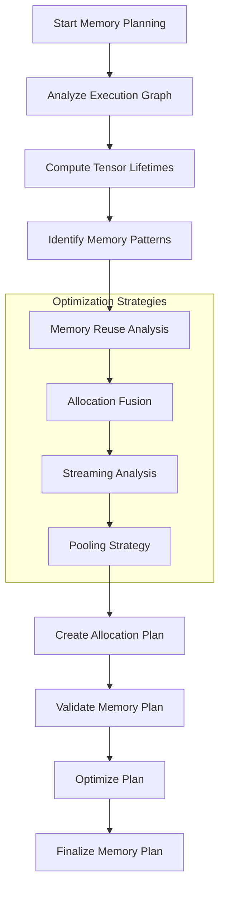

## Tensor Lifetime Analysis

Understanding when tensors are created, used, and can be freed:

```mermaid
gantt
    title Tensor Lifetime Analysis
    dateFormat X
    axisFormat %s
    
    section Input Tensors
    Input A     :active, inp_a, 0, 2
    Input B     :active, inp_b, 0, 3
    
    section Intermediate Tensors
    Conv Output :active, conv_out, 1, 4
    BN Output   :active, bn_out, 2, 5
    ReLU Output :active, relu_out, 3, 6
    Pool Output :active, pool_out, 4, 7
    
    section Output Tensors
    Final Output :active, final_out, 6, 8
    
    section Memory Reuse Opportunities
    Reuse Window 1 :crit, reuse1, 2, 3
    Reuse Window 2 :crit, reuse2, 4, 5
    Reuse Window 3 :crit, reuse3, 5, 6
```

## Memory Pool Management

Efficient memory pool management for different memory types:

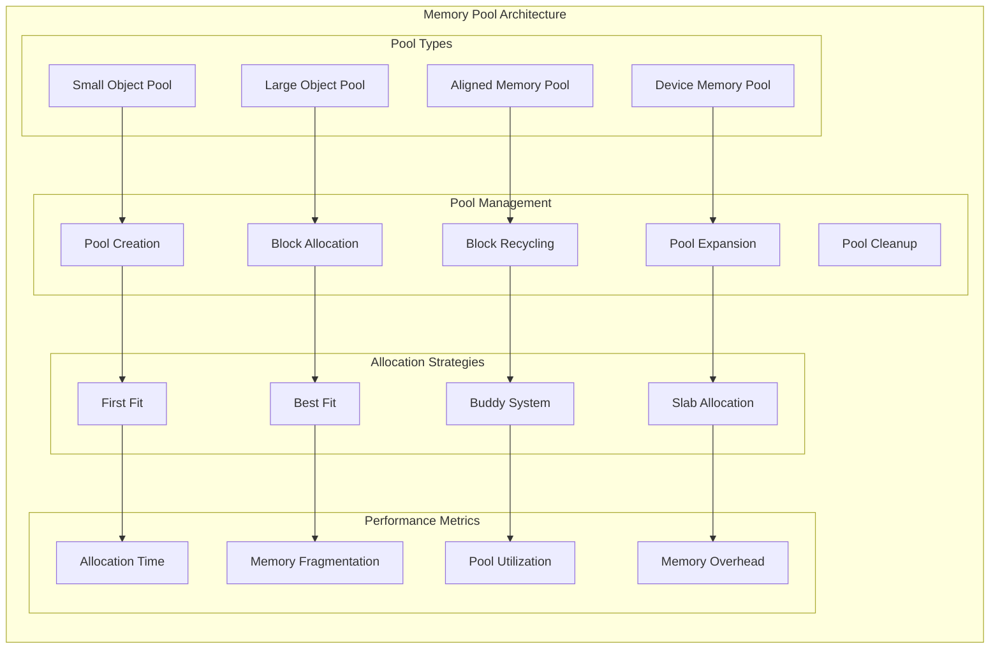

## Cross-Device Memory Management

Managing memory across different execution providers and devices:

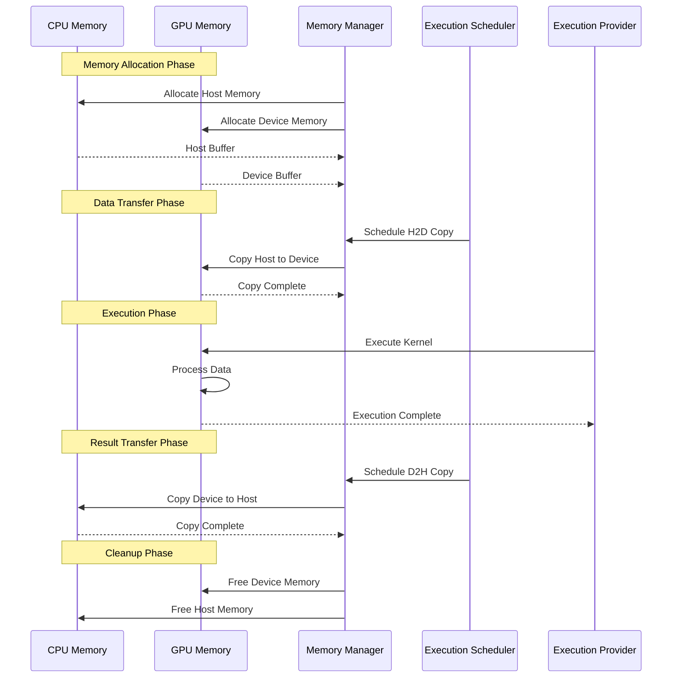

## Memory Optimization Strategies

Various strategies to optimize memory usage:

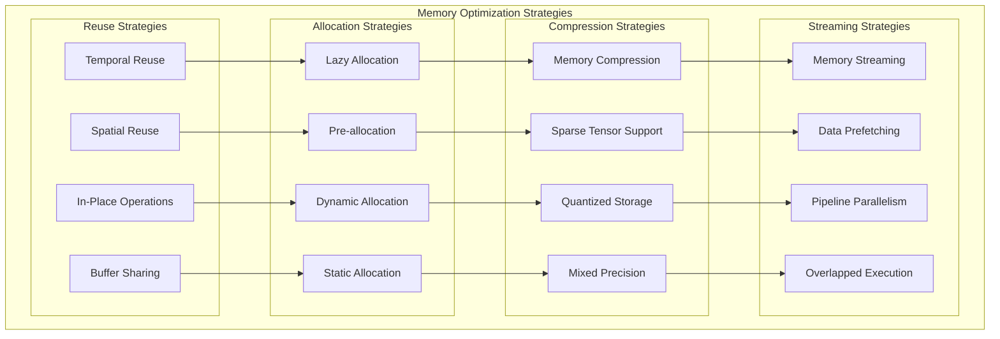

## Memory Layout Optimization

Optimizing tensor memory layouts for different execution providers:

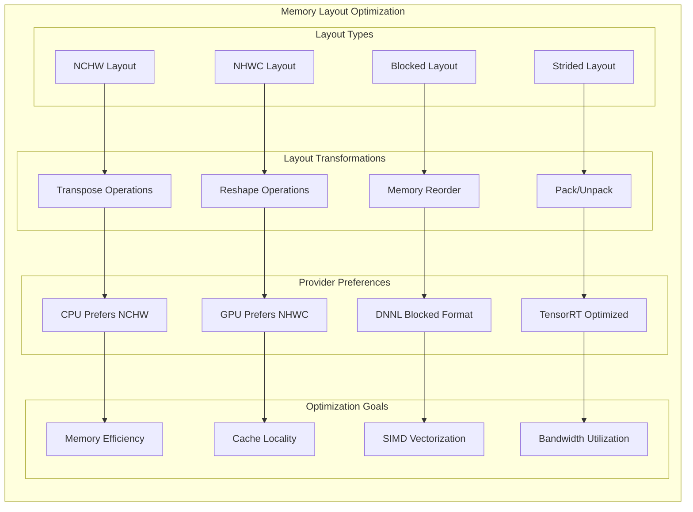

## Memory Debugging and Profiling

Tools and techniques for memory analysis:

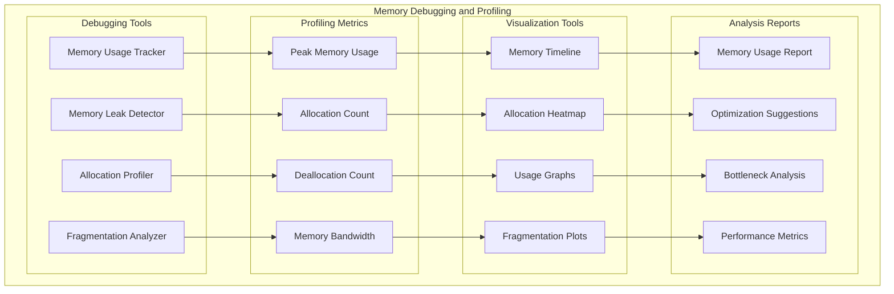

## Provider-Specific Memory Management

Different execution providers have specific memory management requirements:

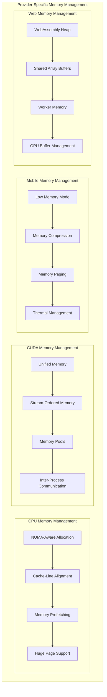

## Memory Safety and Error Handling

Ensuring memory safety across all operations:

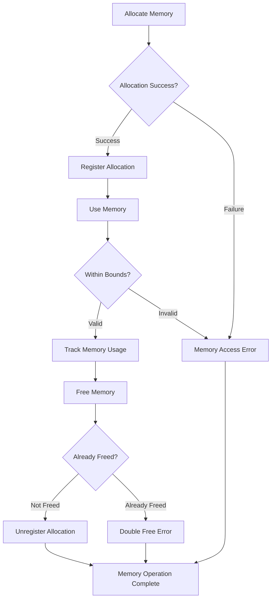

## Memory Optimization Configuration

Configuration options for memory optimization:

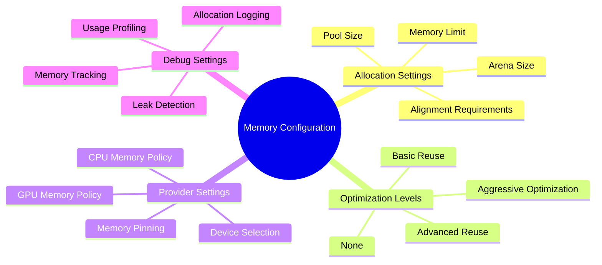

## Memory Performance Metrics

Key metrics for evaluating memory performance:

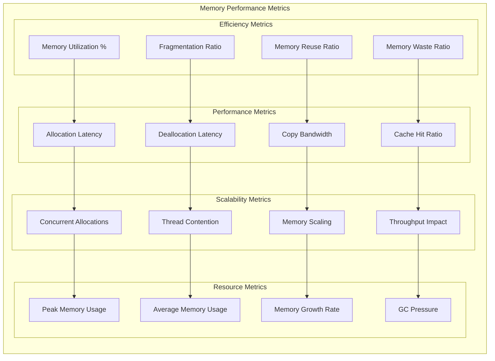

This comprehensive memory management architecture ensures efficient, safe, and optimized memory usage across all execution providers and deployment scenarios in ONNX Runtime.