# Training vs Inference Architecture

This document details the architectural differences between ONNX Runtime's training and inference modes, highlighting specialized components, optimizations, and use cases for each mode.

## Overview

ONNX Runtime supports both inference and training workloads with distinct architectural optimizations. While sharing core components, each mode has specialized features tailored to its specific requirements.

## Architectural Comparison

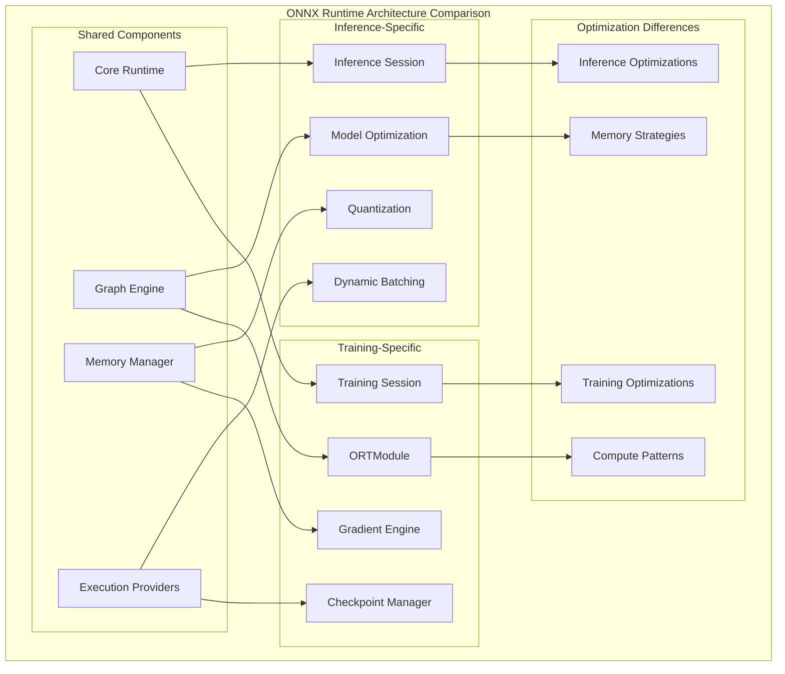

## Inference Architecture

### Inference Pipeline

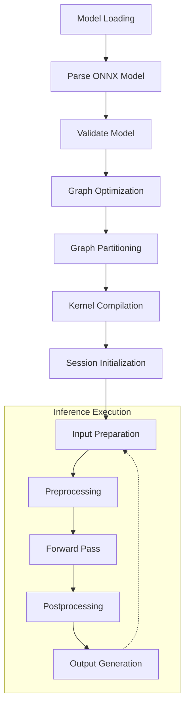

### Inference Optimizations

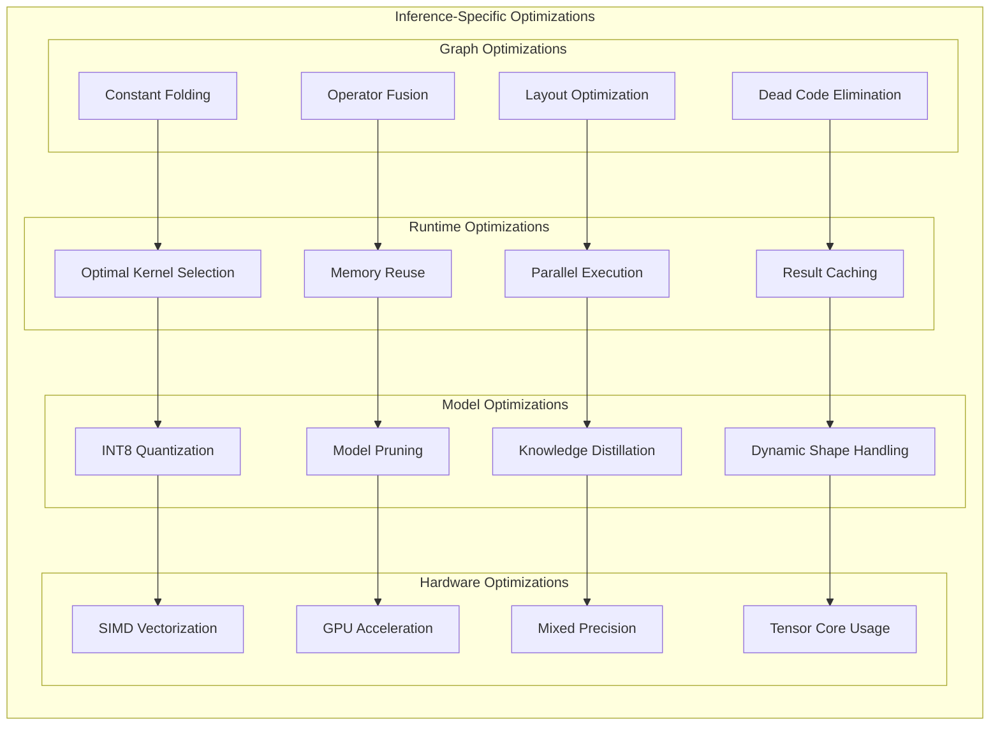

## Training Architecture

### ORTModule Architecture

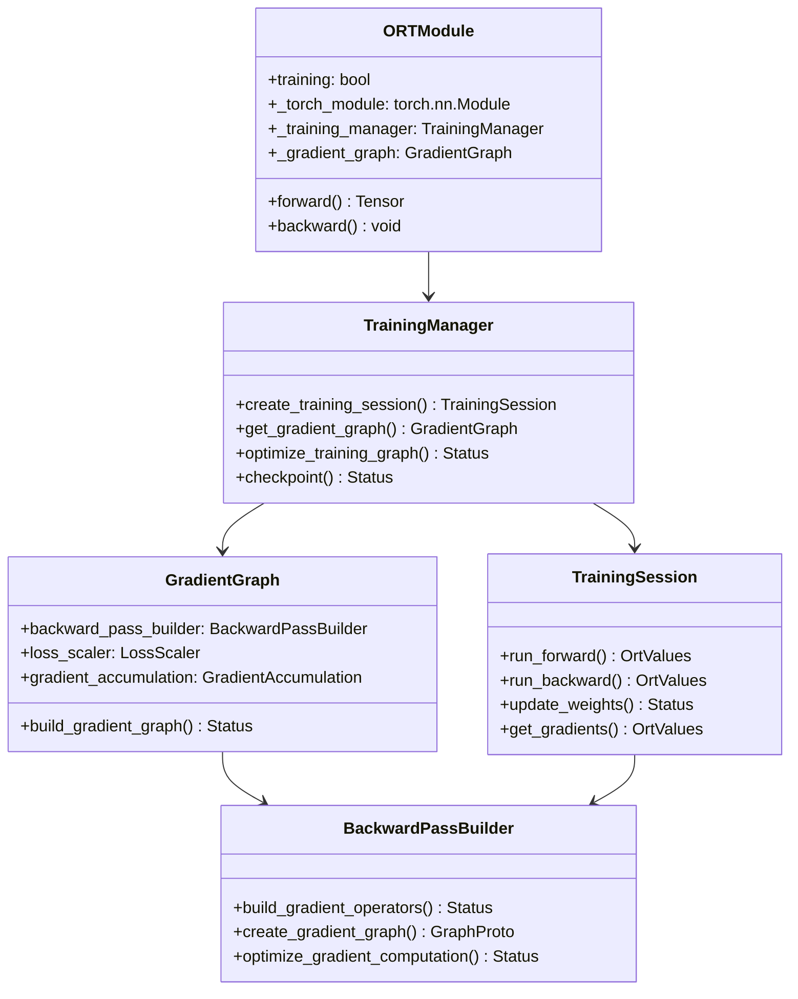

### Training Pipeline

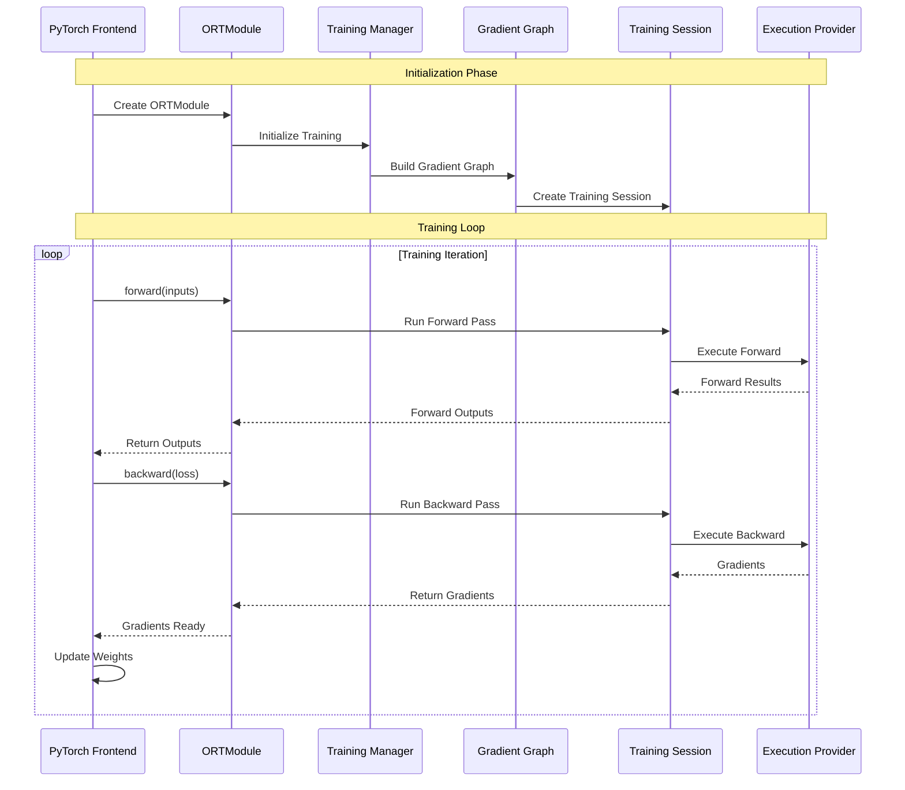

## Memory Management Differences

### Inference Memory Patterns

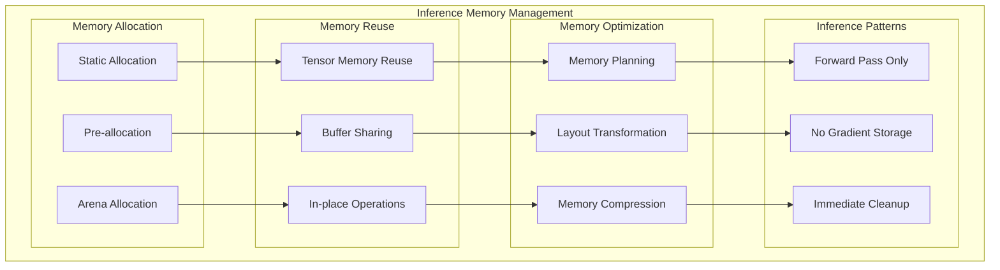

### Training Memory Patterns

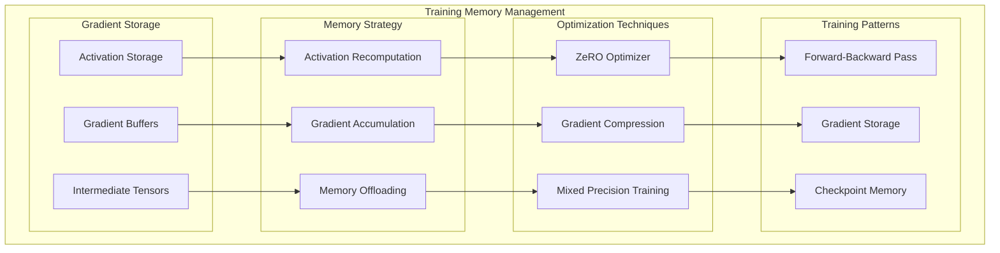

## Performance Characteristics

### Inference Performance Focus

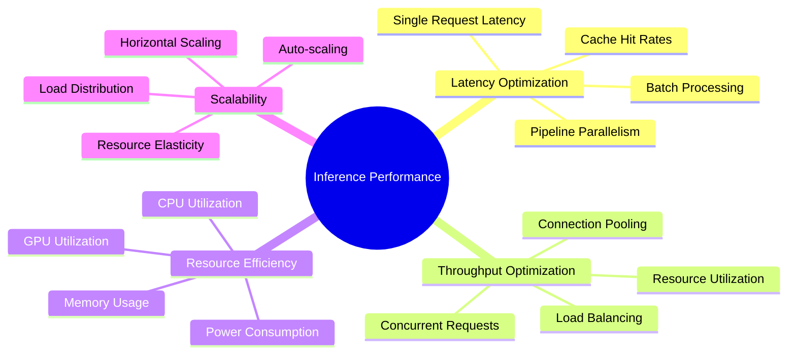

### Training Performance Focus

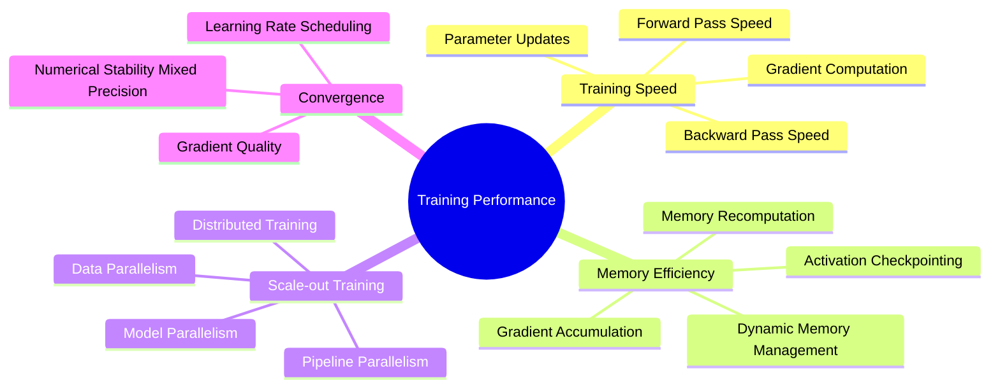

## Execution Provider Differences

### Provider Optimization Focus

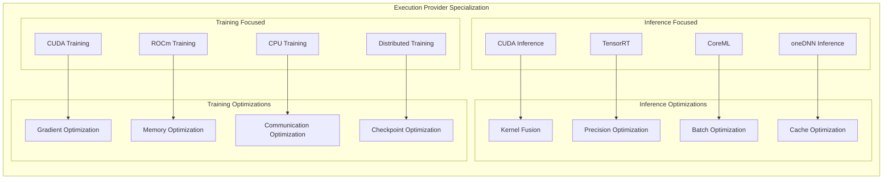

## Graph Optimization Differences

### Inference Graph Optimizations

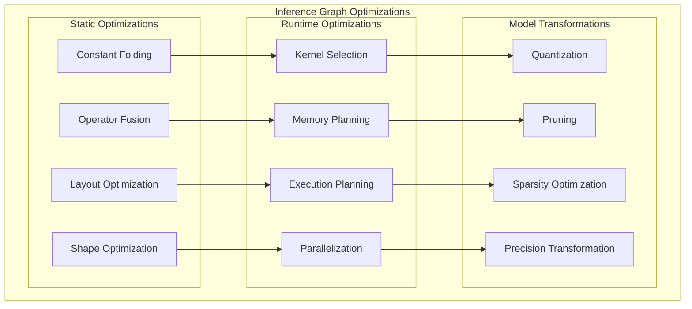

### Training Graph Optimizations

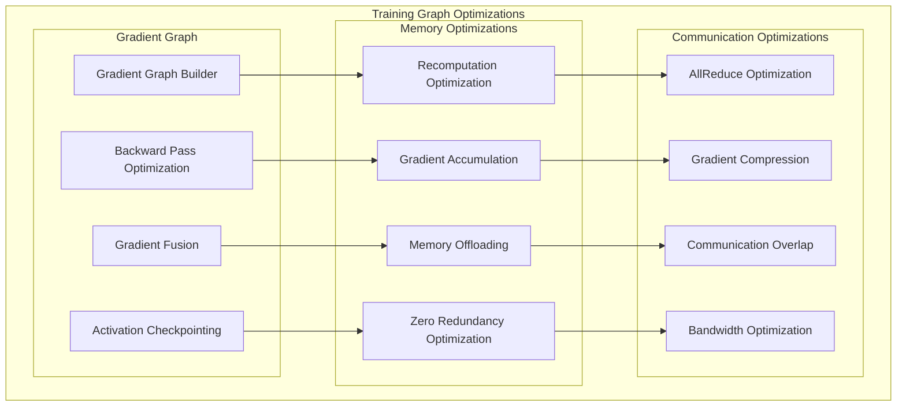

## Distributed Training Architecture

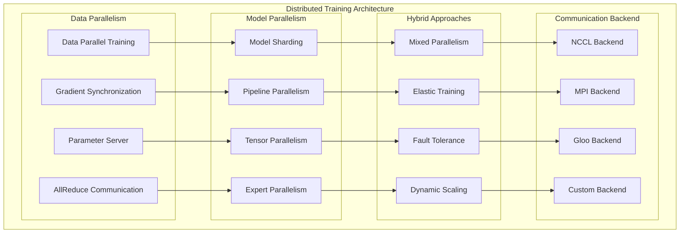

## Configuration Differences

### Inference Configuration

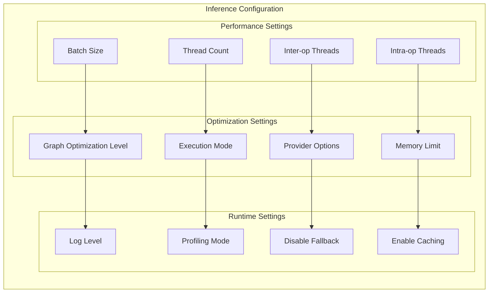

### Training Configuration

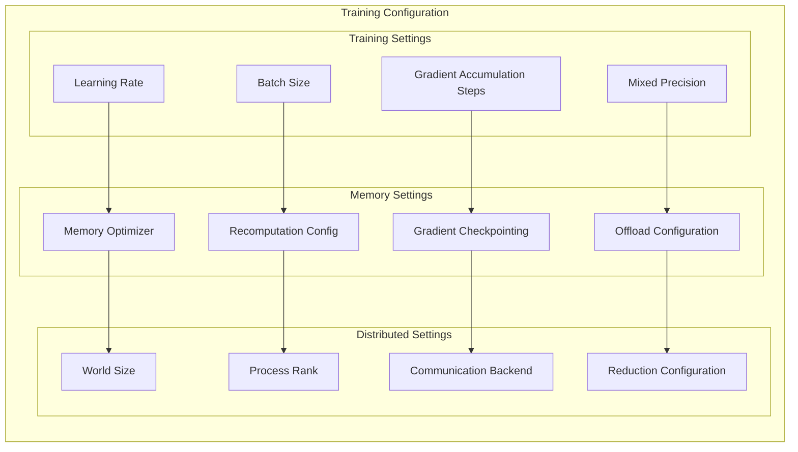

## Use Case Patterns

### Inference Use Cases

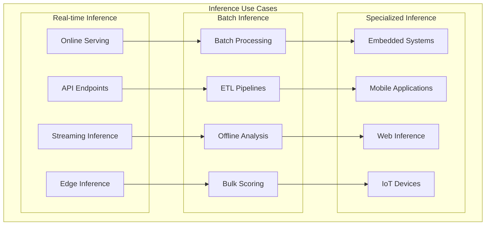

### Training Use Cases

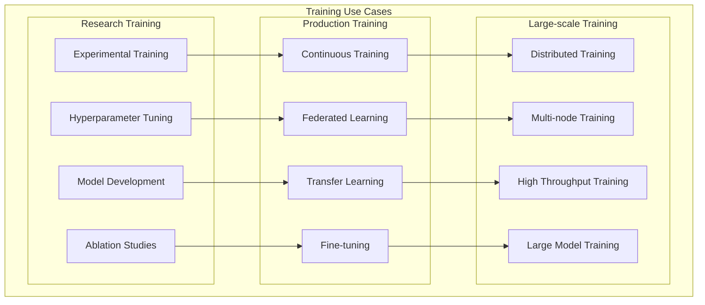

This comprehensive comparison highlights how ONNX Runtime's architecture adapts to the distinct requirements of training and inference workloads while maintaining a shared foundation for consistency and efficiency.