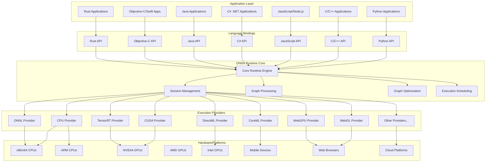
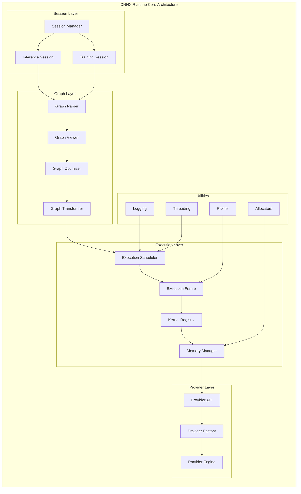
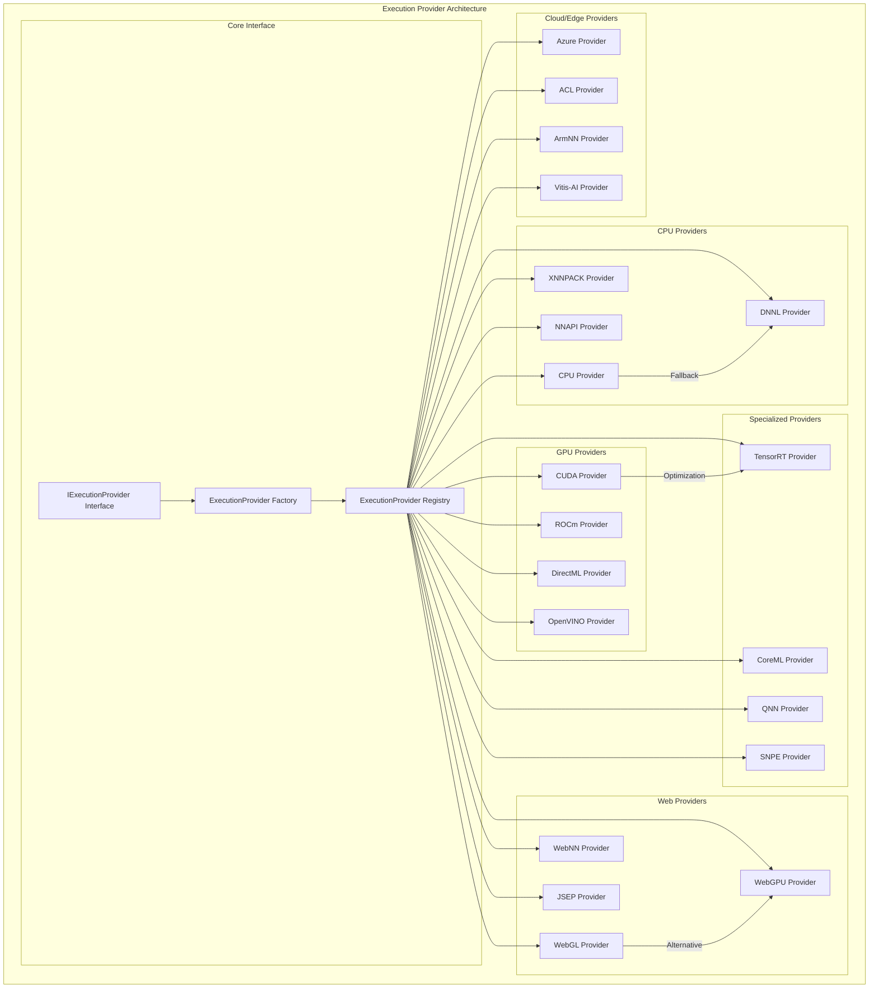
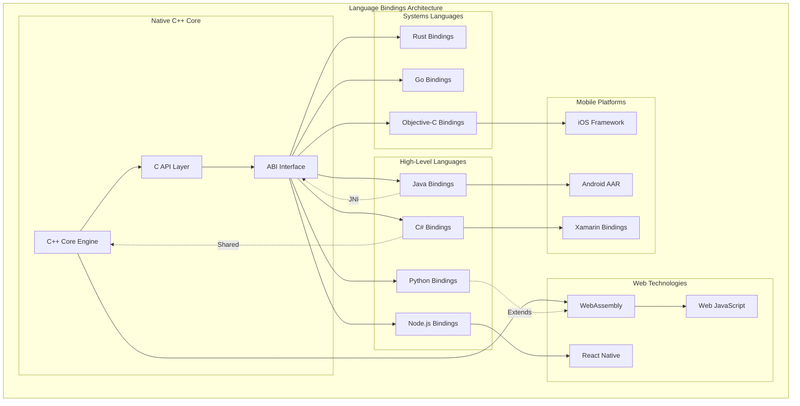
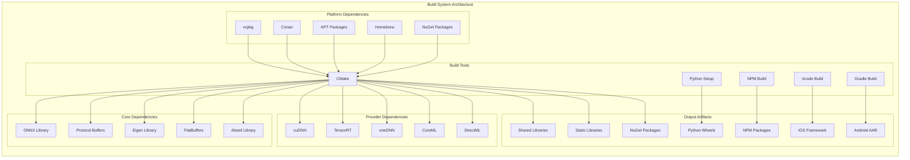
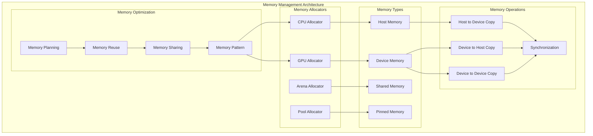
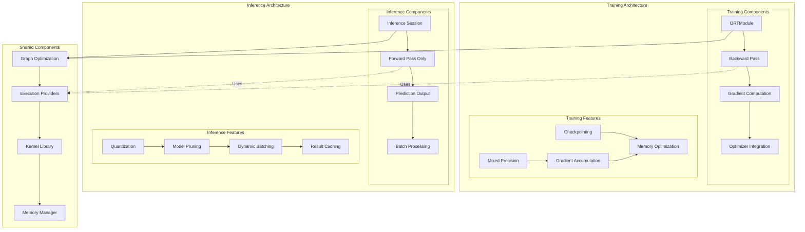
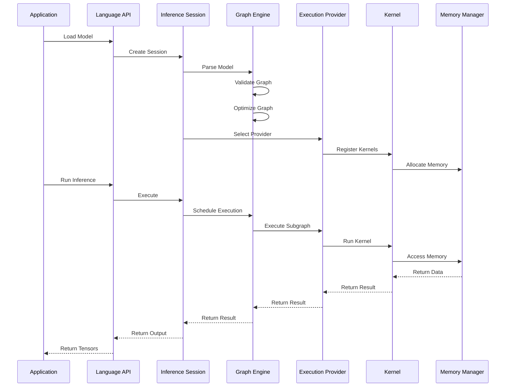

# ONNX Runtime Technical Architecture

This document provides a comprehensive overview of the ONNX Runtime technical architecture, including system design, component relationships, data flow, and deployment patterns.

## Table of Contents

1. [High-Level Architecture](#high-level-architecture)
2. [Core Components](#core-components)
3. [Execution Provider Ecosystem](#execution-provider-ecosystem)
4. [Data Flow and Processing Pipeline](#data-flow-and-processing-pipeline)
5. [Language Bindings and API Layers](#language-bindings-and-api-layers)
6. [Build System and Dependencies](#build-system-and-dependencies)
7. [Deployment Architectures](#deployment-architectures)
8. [Memory Management](#memory-management)
9. [Training vs Inference](#training-vs-inference)

## High-Level Architecture

ONNX Runtime is designed as a cross-platform, high-performance inference and training engine with a modular architecture that supports multiple hardware accelerators and programming languages.

## Core Components

The ONNX Runtime core consists of several key components that work together to provide efficient model execution:

## Execution Provider Ecosystem

ONNX Runtime's execution provider architecture enables support for diverse hardware accelerators:

## Data Flow and Processing Pipeline

The data processing pipeline shows how models and data flow through the system:

```mermaid
flowchart TD
    subgraph "Model Loading and Preparation"
        MODEL[ONNX Model File]
        PARSER[Model Parser]
        GRAPH[Graph Representation]
        VALIDATE[Model Validation]
    end
    
    subgraph "Graph Optimization"
        OPT1[Constant Folding]
        OPT2[Operator Fusion]
        OPT3[Layout Optimization]
        OPT4[Memory Optimization]
        OPT5[Provider-Specific Opts]
    end
    
    subgraph "Session Creation"
        CONFIG[Session Configuration]
        PROVIDER[Provider Selection]
        ALLOC_SETUP[Allocator Setup]
        KERNEL_REG[Kernel Registration]
    end
    
    subgraph "Execution Phase"
        INPUT[Input Tensors]
        SCHEDULE[Execution Scheduling]
        COMPUTE[Kernel Execution]
        MEMORY[Memory Management]
        OUTPUT[Output Tensors]
    end
    
    subgraph "Post-Processing"
        COPY[Data Copy]
        SYNC[Synchronization]
        CLEANUP[Resource Cleanup]
    end
    
    MODEL --> PARSER
    PARSER --> GRAPH
    GRAPH --> VALIDATE
    VALIDATE --> OPT1
    
    OPT1 --> OPT2
    OPT2 --> OPT3
    OPT3 --> OPT4
    OPT4 --> OPT5
    
    OPT5 --> CONFIG
    CONFIG --> PROVIDER
    PROVIDER --> ALLOC_SETUP
    ALLOC_SETUP --> KERNEL_REG
    
    KERNEL_REG --> INPUT
    INPUT --> SCHEDULE
    SCHEDULE --> COMPUTE
    COMPUTE --> MEMORY
    MEMORY --> OUTPUT
    
    OUTPUT --> COPY
    COPY --> SYNC
    SYNC --> CLEANUP
```

## Language Bindings and API Layers

ONNX Runtime provides APIs for multiple programming languages:

## Build System and Dependencies

The build system architecture showing how different components are built and packaged:

## Deployment Architectures

Different deployment patterns and architectures supported by ONNX Runtime:

```mermaid
graph TB
    subgraph "Deployment Architectures"
        subgraph "Cloud Deployment"
            CLOUD_API[REST API Server]
            CLOUD_BATCH[Batch Processing]
            CLOUD_STREAM[Streaming]
            CLOUD_SCALE[Auto Scaling]
        end
        
        subgraph "Edge Deployment"
            EDGE_DEVICE[Edge Devices]
            EDGE_IOT[IoT Devices]
            EDGE_MOBILE[Mobile Apps]
            EDGE_EMBEDDED[Embedded Systems]
        end
        
        subgraph "Web Deployment"
            WEB_BROWSER[Browser Runtime]
            WEB_NODE[Node.js Server]
            WEB_WORKER[Web Workers]
            WEB_SERVICE[Web Services]
        end
        
        subgraph "Enterprise Deployment"
            ENT_DATACENTER[Data Center]
            ENT_HYBRID[Hybrid Cloud]
            ENT_ONPREM[On-Premises]
            ENT_CONTAINER[Containerized]
        end
    end
    
    subgraph "Runtime Configurations"
        CONFIG_PERF[High Performance]
        CONFIG_SIZE[Minimal Size]
        CONFIG_POWER[Low Power]
        CONFIG_LATENCY[Low Latency]
    end
    
    CLOUD_API --> CONFIG_PERF
    CLOUD_BATCH --> CONFIG_PERF
    CLOUD_STREAM --> CONFIG_LATENCY
    CLOUD_SCALE --> CONFIG_PERF
    
    EDGE_DEVICE --> CONFIG_POWER
    EDGE_IOT --> CONFIG_SIZE
    EDGE_MOBILE --> CONFIG_SIZE
    EDGE_EMBEDDED --> CONFIG_SIZE
    
    WEB_BROWSER --> CONFIG_SIZE
    WEB_NODE --> CONFIG_PERF
    WEB_WORKER --> CONFIG_LATENCY
    WEB_SERVICE --> CONFIG_PERF
    
    ENT_DATACENTER --> CONFIG_PERF
    ENT_HYBRID --> CONFIG_PERF
    ENT_ONPREM --> CONFIG_PERF
    ENT_CONTAINER --> CONFIG_LATENCY
```

## Memory Management

Memory management architecture across different execution providers:

## Training vs Inference

Architectural differences between training and inference modes:

## Component Interaction Sequence

Detailed sequence of interactions during model execution:

---

## Related Documentation

This document provides a comprehensive view of the ONNX Runtime architecture. For more detailed information about specific components, refer to the following documentation:

### Detailed Architecture Documentation
- **[Architecture Directory](architecture/)** - Detailed architectural documentation
- **[Execution Providers](architecture/execution_providers.md)** - Comprehensive execution provider architecture
- **[Graph Processing](architecture/graph_processing.md)** - Graph optimization and transformation pipeline
- **[Language Bindings](architecture/language_bindings.md)** - Multi-language API implementation details
- **[Memory Management](architecture/memory_management.md)** - Advanced memory management strategies
- **[Build System](architecture/build_system.md)** - Build system architecture and CI/CD
- **[Deployment Patterns](architecture/deployment_patterns.md)** - Deployment strategies and patterns
- **[Training vs Inference](architecture/training_vs_inference.md)** - Architectural differences between modes

### Implementation Guides
- **[Memory Optimizer](Memory_Optimizer.md)** - Memory optimization techniques and configuration
- **[C API Guidelines](C_API_Guidelines.md)** - C API design and usage principles
- **[Build Guidelines](cmake_guideline.md)** - Build system configuration and usage

### Provider-Specific Documentation
- **[Execution Providers](execution_providers/)** - Provider-specific implementation details
- **[Python API Documentation](python/)** - Python binding implementation
- **[C/C++ Documentation](c_cxx/)** - Native API documentation

### Additional Resources
- **[FAQ](FAQ.md)** - Frequently asked questions
- **[Coding Conventions](Coding_Conventions_and_Standards.md)** - Development standards
- **[Contributing Guidelines](../CONTRIBUTING.md)** - How to contribute to the project