# Compiler Explorer Data Flow Architecture

This document complements the [Technical Architecture](TechnicalArchitecture.md) by focusing on data flows, request processing, and interaction patterns within Compiler Explorer.

## Table of Contents

- [Request Processing Flow](#request-processing-flow)
- [Compilation Data Flow](#compilation-data-flow)
- [WebSocket Communication](#websocket-communication)
- [Caching Strategies](#caching-strategies)
- [Configuration Loading](#configuration-loading)
- [Error Handling Flow](#error-handling-flow)

## Request Processing Flow

### Standard Web Request Flow

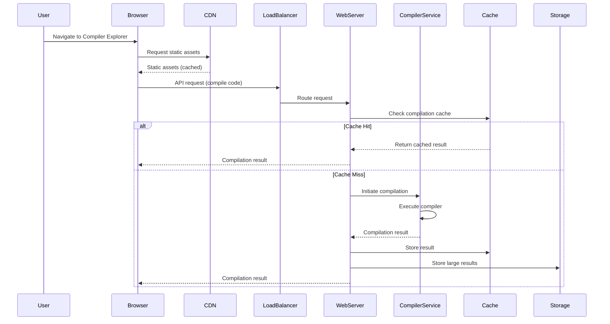

### Asynchronous Compilation Flow (SQS Workers)

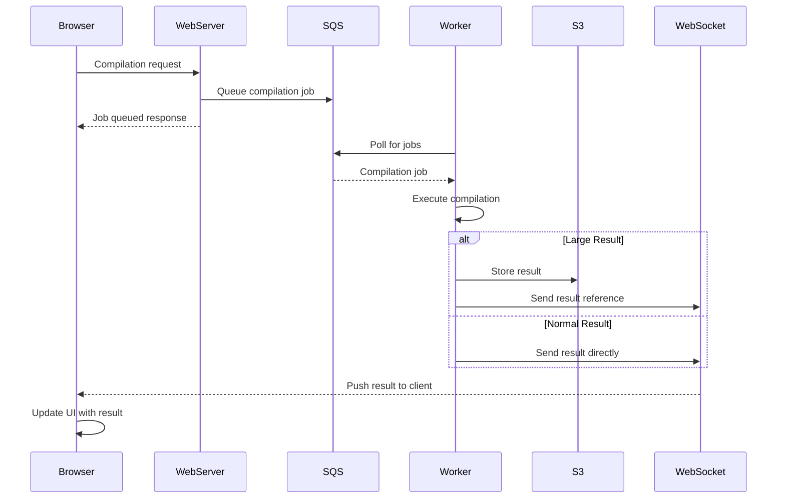

## Compilation Data Flow

### Single Compilation Process

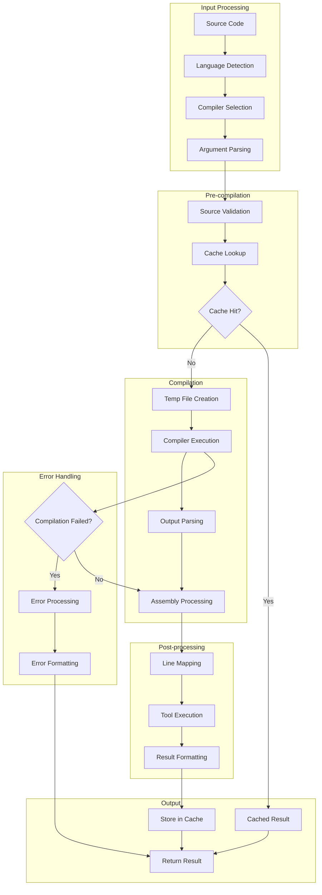

### Multi-compiler Compilation

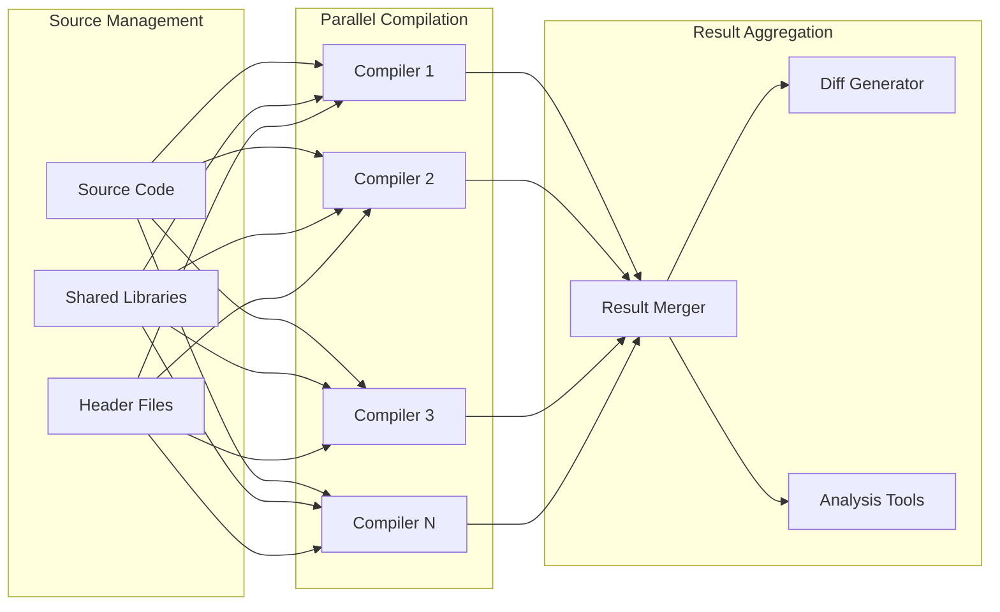

## WebSocket Communication

### Real-time Updates Flow

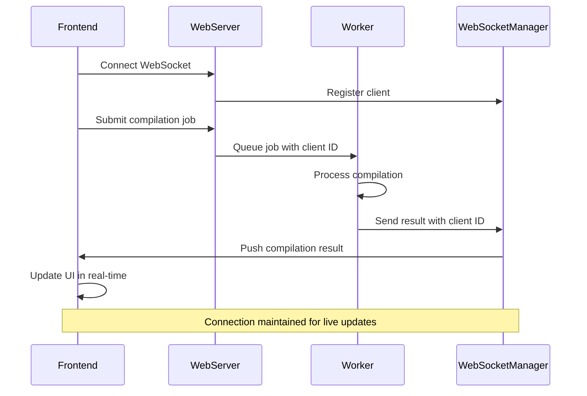

### WebSocket Event Types

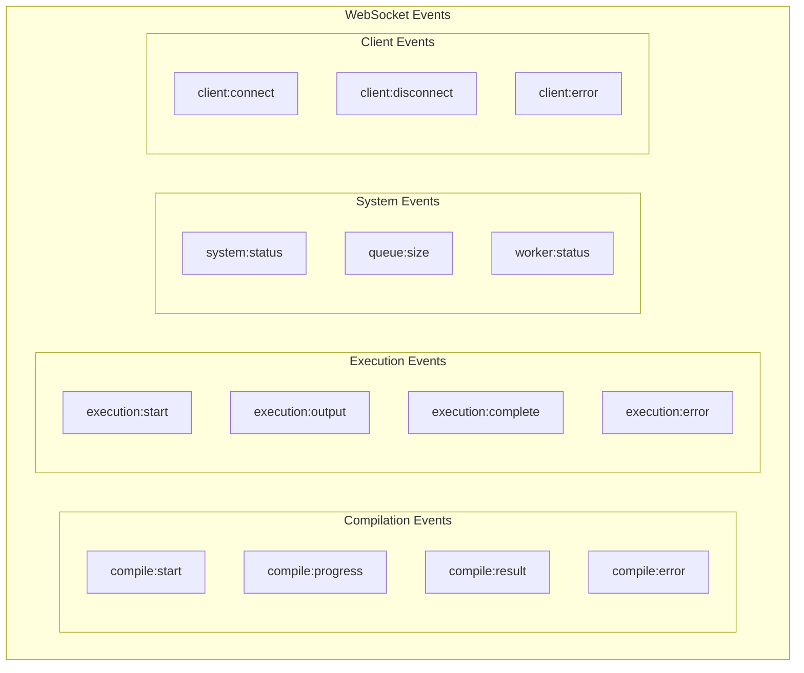

## Caching Strategies

### Multi-tier Caching Architecture

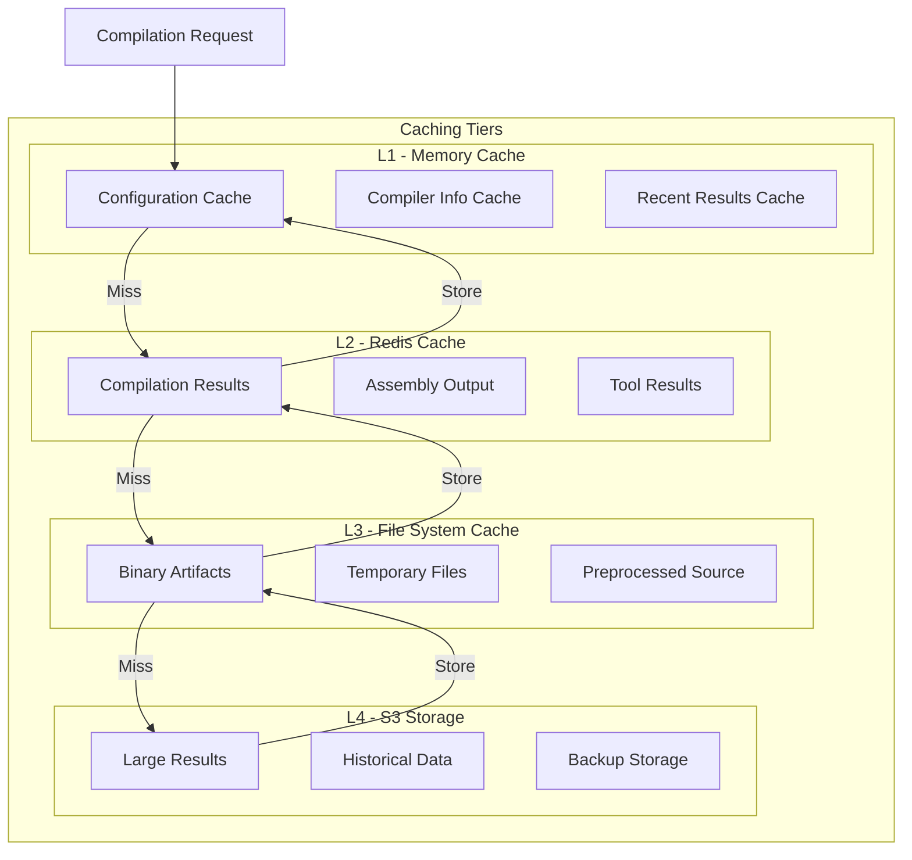

### Cache Key Strategy

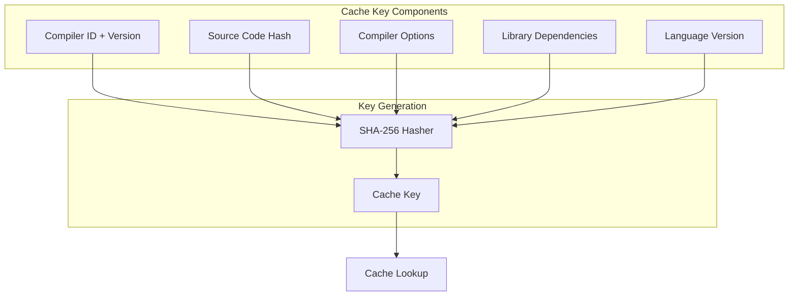

## Configuration Loading

### Configuration Cascade

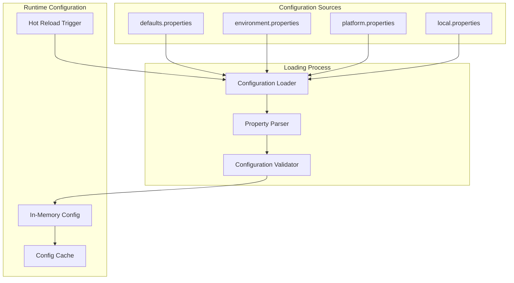

### Configuration Inheritance

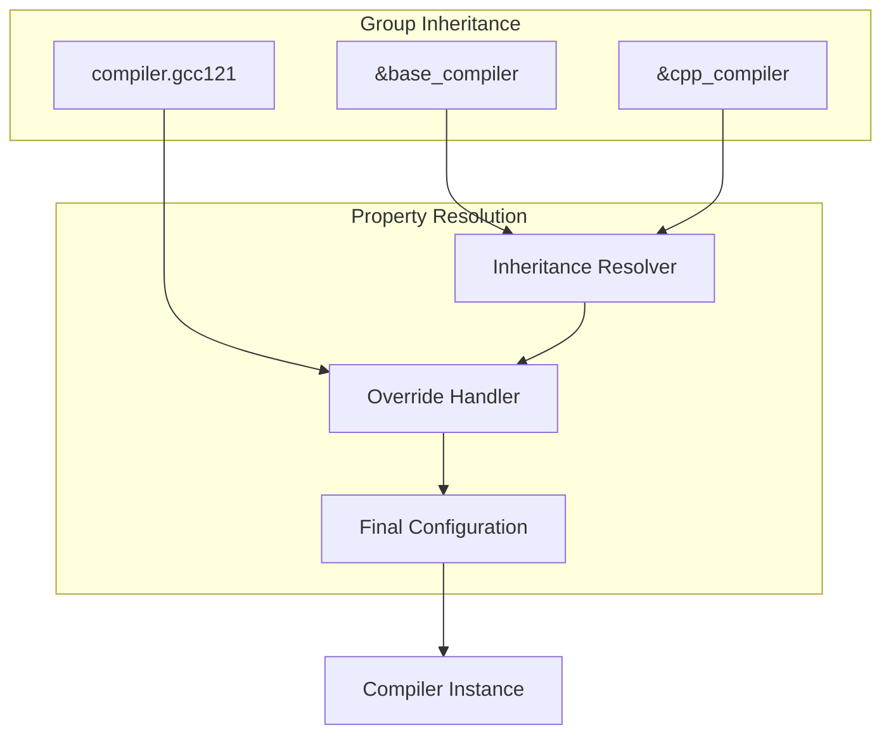

## Error Handling Flow

### Compilation Error Processing

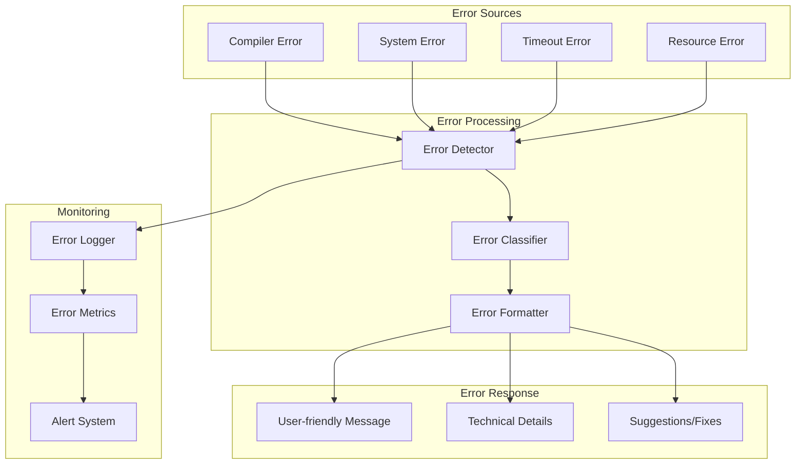

### Error Recovery Patterns

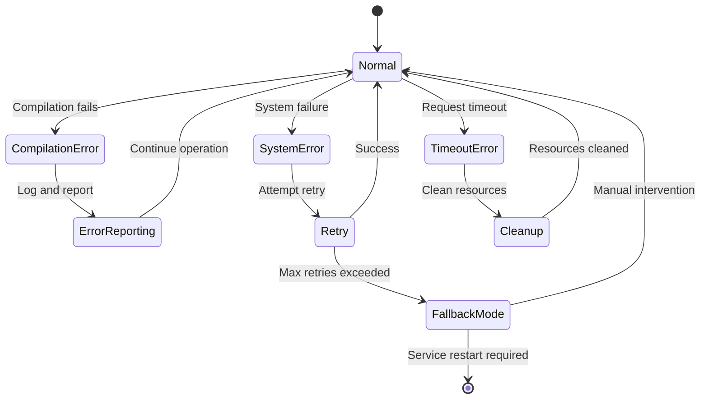

This data flow documentation provides detailed insights into how information moves through Compiler Explorer, complementing the structural architecture documentation with behavioral and processing patterns.