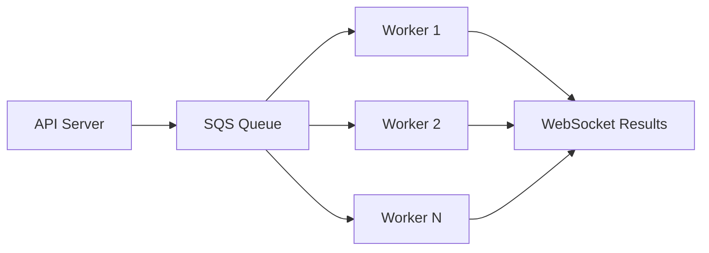

# Compiler Explorer Deployment Guide

This document provides deployment guidance for Compiler Explorer, referencing the comprehensive [Technical Architecture](TechnicalArchitecture.md) documentation.

## Quick Reference

For detailed architecture diagrams and system design, see:
- [Technical Architecture](TechnicalArchitecture.md) - Complete system architecture
- [Data Flow Architecture](DataFlowArchitecture.md) - Request processing and data flows

## Deployment Modes

### 1. Local Development

```bash
# Quick start for development
make dev
# or
npm start
```

**Architecture**: Single-node setup with in-memory caching and local file storage.

### 2. Docker Container

```bash
# Build and run in container
docker build -t compiler-explorer .
docker run -p 10240:10240 compiler-explorer
```

**Architecture**: Containerized single instance, suitable for isolated deployments.

### 3. Production (AWS)

**Architecture**: Multi-tier deployment with load balancing, worker queues, and distributed storage.

Key components (as detailed in [Technical Architecture](TechnicalArchitecture.md)):
- Application Load Balancer + CloudFront CDN
- ECS/EC2 web servers
- SQS message queues for compilation/execution workers
- S3 storage with Redis caching
- Monitoring with CloudWatch/Prometheus

## Configuration Architecture

The configuration system uses a hierarchical cascade (see [Configuration.md](Configuration.md)):

```
defaults.properties → environment.properties → platform.properties → local.properties
```

## Worker Architecture

For high-load deployments, Compiler Explorer supports worker-based processing:



Enable worker mode with:
```bash
# Compilation workers
--worker-mode compilation --queue-url <sqs-url>

# Execution workers  
--worker-mode execution --queue-url <sqs-url>
```

## Storage Architecture

Multi-tier storage system (see [Technical Architecture](TechnicalArchitecture.md) for detailed diagrams):

1. **L1 Cache**: In-memory (configuration, recent results)
2. **L2 Cache**: Redis (compilation results, assembly output)  
3. **L3 Cache**: File system (binary artifacts, temp files)
4. **L4 Storage**: S3 (large results, historical data)

## Monitoring

Production deployments include comprehensive monitoring:

- **Metrics**: Prometheus/Grafana dashboards
- **Logging**: Structured logging with Sentry integration
- **Health Checks**: Application and infrastructure health endpoints
- **Alerting**: CloudWatch/Prometheus alerting rules

## Security Considerations

- **Sandboxing**: All compilation/execution in isolated environments
- **Resource Limits**: CPU, memory, and time limits per request
- **Input Validation**: Source code and parameter validation
- **Network Security**: VPC, security groups, and IAM roles

## Scaling Patterns

The architecture supports horizontal scaling:

1. **Web Tier**: Scale web servers behind load balancer
2. **Worker Tier**: Auto-scaling worker instances based on queue depth
3. **Cache Tier**: Redis cluster for distributed caching
4. **Storage Tier**: S3 for unlimited storage scaling

For complete architectural details and system diagrams, refer to the [Technical Architecture](TechnicalArchitecture.md) documentation.