# Compiler Explorer Technical Architecture

This document provides a comprehensive overview of Compiler Explorer's technical architecture, including system components, data flows, and key design patterns.

## Table of Contents

- [Overview](#overview)
- [High-Level System Architecture](#high-level-system-architecture)
- [Frontend Architecture](#frontend-architecture)
- [Backend Architecture](#backend-architecture)
- [Compilation System](#compilation-system)
- [Storage and Caching](#storage-and-caching)
- [Execution System](#execution-system)
- [Deployment Architecture](#deployment-architecture)
- [Key Design Patterns](#key-design-patterns)
- [Related Documentation](#related-documentation)

## Overview

Compiler Explorer is a web-based interactive compiler exploration tool built with:

- **Frontend**: TypeScript with Monaco Editor and GoldenLayout
- **Backend**: Node.js with Express
- **Configuration**: Hierarchical `.properties` files
- **Compilation**: Multi-compiler support with worker queues
- **Storage**: S3, local filesystem, and caching layers
- **Deployment**: Docker containers with AWS infrastructure

## High-Level System Architecture

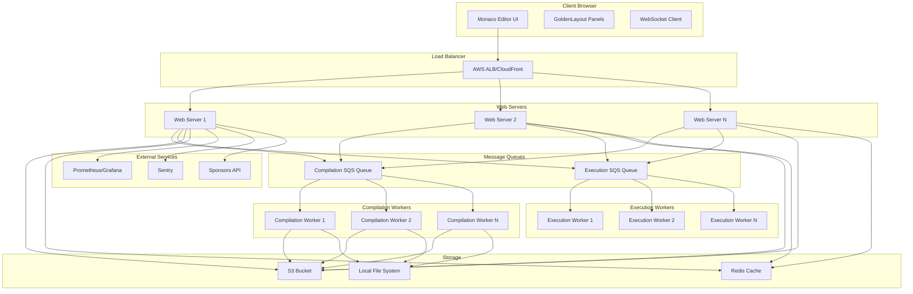

## Frontend Architecture

The frontend is built with TypeScript and uses Monaco Editor for code editing with GoldenLayout for flexible UI arrangement.

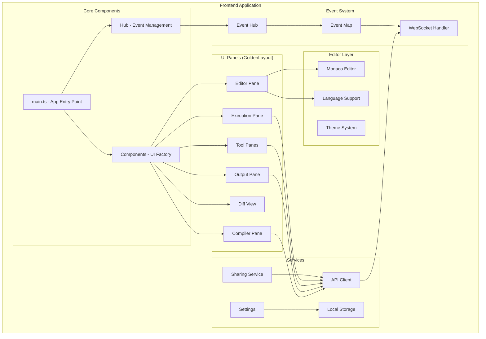

### Key Frontend Components

- **main.ts**: Application entry point, initializes all systems
- **Hub**: Central event management and component coordination
- **Monaco Editor**: Code editor with syntax highlighting and IntelliSense
- **GoldenLayout**: Flexible panel layout system
- **Event System**: Manages communication between components
- **API Client**: Handles REST API and WebSocket communication

## Backend Architecture

The backend is a Node.js application with Express serving REST APIs and managing compilation/execution workflows.

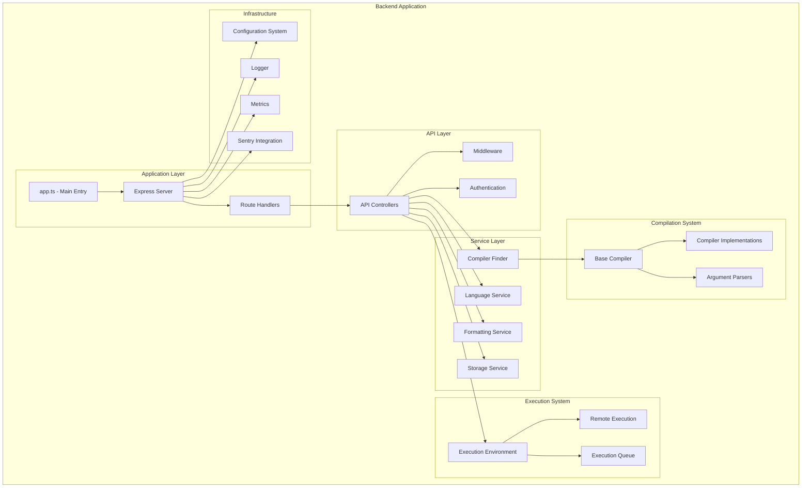

### Key Backend Components

- **Express Server**: HTTP server with REST API endpoints
- **Compiler Finder**: Discovers and manages available compilers
- **Base Compiler**: Abstract base class for all compiler implementations
- **Configuration System**: Hierarchical `.properties` file system
- **Storage Service**: Manages S3, local, and cached storage

## Compilation System

Compiler Explorer supports multiple compilation modes with both synchronous and asynchronous processing.

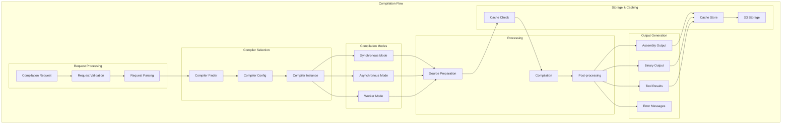

### Compilation Worker Architecture

For high-load scenarios, Compiler Explorer uses SQS-based worker queues:

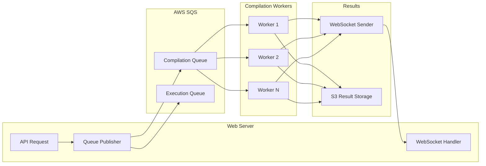

## Storage and Caching

Compiler Explorer uses a multi-tier storage system for optimal performance:

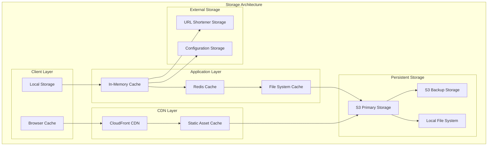

### Storage Types

1. **S3 Storage**: Primary storage for compilation results and large artifacts
2. **Redis Cache**: Fast access cache for frequently used data
3. **File System Cache**: Local caching for compilers and temporary files
4. **Memory Cache**: In-process caching for configuration and metadata

## Execution System

The execution system supports both local and remote code execution with security isolation:

```mermaid
graph TB
    subgraph "Execution Architecture"
        subgraph "Request Processing"
            EXEC_REQ[Execution Request]
            VALIDATION[Security Validation]
            ENV_SETUP[Environment Setup]
        end
        
        subgraph "Execution Environments"
            LOCAL_ENV[Local Environment]
            REMOTE_ENV[Remote Environment]
            DOCKER_ENV[Docker Environment]
        end
        
        subgraph "Security & Isolation"
            SANDBOX[Sandboxing]
            TIMEOUT[Timeout Control]
            RESOURCE_LIMITS[Resource Limits]
        end
        
        subgraph "Execution Modes"
            DIRECT[Direct Execution]
            WINE[Wine Emulation]
            QEMU[QEMU Emulation]
        end
        
        subgraph "Output Handling"
            STDOUT[Standard Output]
            STDERR[Standard Error]
            EXIT_CODE[Exit Code]
            METRICS_OUT[Execution Metrics]
        end
    end
    
    EXEC_REQ --> VALIDATION
    VALIDATION --> ENV_SETUP
    
    ENV_SETUP --> LOCAL_ENV
    ENV_SETUP --> REMOTE_ENV
    ENV_SETUP --> DOCKER_ENV
    
    LOCAL_ENV --> SANDBOX
    REMOTE_ENV --> SANDBOX
    DOCKER_ENV --> SANDBOX
    
    SANDBOX --> TIMEOUT
    TIMEOUT --> RESOURCE_LIMITS
    
    RESOURCE_LIMITS --> DIRECT
    RESOURCE_LIMITS --> WINE
    RESOURCE_LIMITS --> QEMU
    
    DIRECT --> STDOUT
    WINE --> STDOUT
    QEMU --> STDOUT
    
    STDOUT --> STDERR
    STDERR --> EXIT_CODE
    EXIT_CODE --> METRICS_OUT
```

## Deployment Architecture

Compiler Explorer is deployed using containerized microservices on AWS:

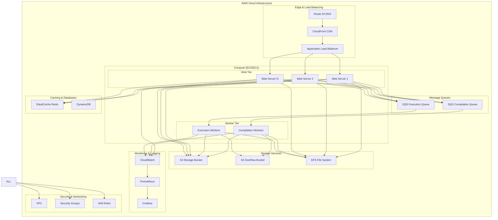

## Key Design Patterns

### 1. Configuration Hierarchy

Compiler Explorer uses a sophisticated configuration system with inheritance:

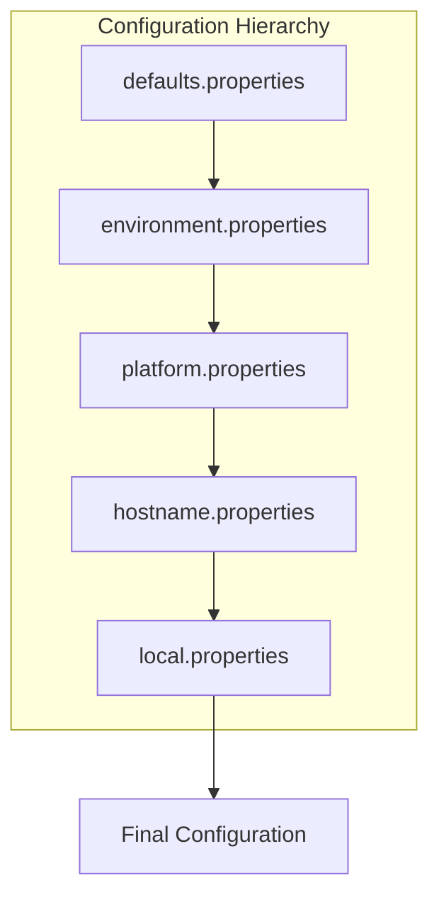

### 2. Plugin Architecture

Compilers and tools follow a plugin pattern:

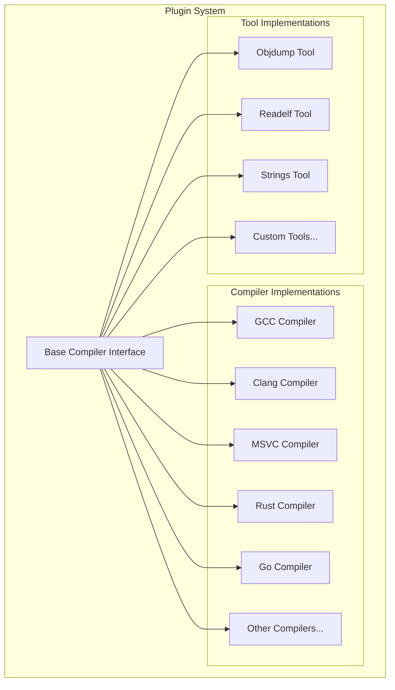

### 3. Event-Driven Architecture

The frontend uses event-driven communication:

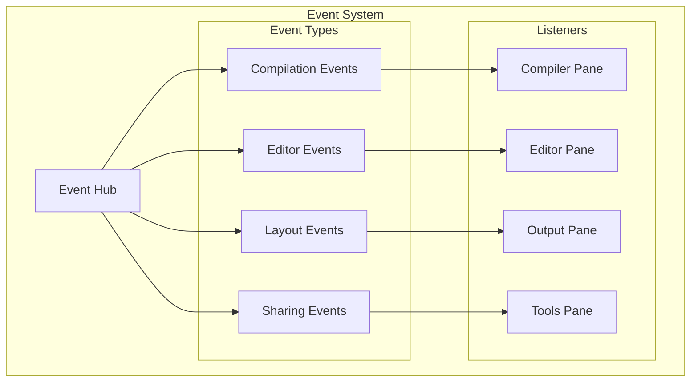

## Related Documentation

- [Configuration System](Configuration.md) - Detailed configuration documentation
- [API Documentation](API.md) - REST API specification
- [What is Compiler Explorer](WhatIsCompilerExplorer.md) - User-facing overview
- [Adding a Compiler](AddingACompiler.md) - Guide for adding new compilers
- [Adding a Language](AddingALanguage.md) - Guide for adding new languages
- [Privacy Policy](Privacy.md) - GDPR compliance and data handling

For implementation details, see the source code in:
- `/lib/` - Backend implementation
- `/static/` - Frontend implementation
- `/etc/config/` - Configuration files
- `/docs/` - Additional documentation