# ESM-2 Hypergraph Technical Architecture

This document provides comprehensive technical architecture documentation for the ESM-2 hypergraph mapping system, including detailed mermaid diagrams illustrating the system structure, data flow, and component interactions.

## Table of Contents

1. [System Overview](#system-overview)
2. [ESM-2 Model Architecture](#esm-2-model-architecture)
3. [Hypergraph Structure](#hypergraph-structure)
4. [Component Architecture](#component-architecture)
5. [Data Flow Diagrams](#data-flow-diagrams)
6. [Query Engine Architecture](#query-engine-architecture)
7. [Visualization Pipeline](#visualization-pipeline)
8. [API Architecture](#api-architecture)

## System Overview

The ESM-2 Hypergraph system represents the complete computational structure of the ESM-2 transformer model as a hypergraph, enabling detailed analysis and understanding of the model architecture.

## ESM-2 Model Architecture

The ESM-2 model follows a transformer architecture with specific components mapped to hypergraph nodes and edges.

### Model Configuration

- **Model**: ESM-2 (esm2_t6_8m-v1)
- **Layers**: 6 transformer layers
- **Attention Heads**: 20 per layer
- **Hidden Dimension**: 320
- **Intermediate Dimension**: 1280
- **Vocabulary Size**: 33
- **Max Sequence Length**: 1026

## Hypergraph Structure

The hypergraph representation maps each model component to nodes and their relationships to hyperedges.

### Node Distribution by Layer

```mermaid
graph TD
    subgraph "Layer Distribution"
        A[Input Layer] --> A1[Token Embedding]
        A --> A2[Positional Encoding]
        
        B[Layer 0] --> B1[Q/K/V Projections: 3]
        B --> B2[Multi-Head Attention: 1]
        B --> B3[Attention Output: 1]  
        B --> B4[LayerNorm: 2]
        B --> B5[FFN Layers: 2]
        B --> B6[Activation: 1]
        
        C[Layer 1-5] --> C1[Same Structure × 5]
        
        D[Output Layer] --> D1[Final LayerNorm: 1]
        D --> D2[Output Head: 1]
    end
```

## Component Architecture

### Core Classes and Their Relationships

## Data Flow Diagrams

### Hypergraph Construction Flow

### Query Processing Flow

## Query Engine Architecture

The query engine provides powerful analysis capabilities over the hypergraph structure.

### Query Types and Operations

## Visualization Pipeline

The visualization system generates multiple output formats for hypergraph analysis.

### Visualization Types

## API Architecture

### Main API Entry Points

### Data Models

## Implementation Details

### Hypergraph Construction Algorithm

### Query Processing Sequence

This architecture documentation provides a comprehensive view of the ESM-2 hypergraph system, enabling developers and researchers to understand the system structure, data flow, and component interactions through detailed mermaid diagrams.