# ESM-2 & GPT-2 Hypergraph Mapping with Prime Factorization MetaGraph

This repository contains complete hypergraph representations of both ESM-2 (Evolutionary Scale Modeling) and GPT-2 transformer models, enhanced with comprehensive analysis capabilities and a revolutionary **prime factorization tensor type system** for creating typed hypergraph (metagraph) representations.

## 🚀 **NEW: GPT-2 Transformer Implementation**

**MAJOR UPDATE:** Now includes a complete GPT-2 transformer implementation using the same hypergraph methodology, enabling comparative analysis between different transformer architectures:

- **GPT-2 Hypergraph**: Full causal language model representation
- **GPT-2 MetaGraph**: Enhanced with tensor shape types
- **Architectural Comparison**: Side-by-side analysis of ESM-2 vs GPT-2
- **All Model Sizes**: Support for GPT-2 Small, Medium, Large, and XL variants

### Key Architectural Differences Mapped

| Component | ESM-2 | GPT-2 |
|-----------|--------|--------|
| **Attention** | Bidirectional | Causal/Masked |
| **Position Encoding** | Rotary (RoPE) | Learned Embeddings |
| **Layer Normalization** | Post-norm | Pre-norm |
| **Vocabulary** | 33 amino acids | 50,257 tokens |
| **Use Case** | Protein understanding | Text generation |

### Quick Start - GPT-2
```python
from gpt2_hypergraph import create_gpt2_hypergraph
from gpt2_metagraph import create_gpt2_metagraph

# Create GPT-2 Small hypergraph
config = {"name": "gpt2_small", "num_layers": 12, "num_heads": 12, "hidden_dim": 768, ...}
hypergraph = create_gpt2_hypergraph(config)
metagraph = create_gpt2_metagraph(config)
```

## 🧮 Prime Factorization Tensor Type System

**NEW:** Convert tensor dimensions to prime factorizations to ensure unique shape expressions and define each topologically distinct tensor dimension shape as a type. This enables a typed hypergraph (metagraph) where federated clustering by type allows for a more compact & elegant mathematical model of the ESM2 transformer architecture as a metagraph topos with tensor bundles fibred over prime factor shape types.

### Mathematical Foundation

Each tensor shape `(B, d₁, d₂, ..., dₙ)` is represented as:
- **Prime Factorization**: `dᵢ = p₁^a₁ × p₂^a₂ × ... × pₖ^aₖ`
- **Type Signature**: `B×p₁^a₁*p₂^a₂*...*pₖ^aₖ×...`
- **Canonical Form**: `B ⊗ (p₁^a₁*p₂^a₂*...*pₖ^aₖ) ⊗ ...`

### Topological Configuration Optimizations

**NEW OPTIMIZATION FEATURES**: The system implements optimized topological configurations with only 2 types of operators:

#### Two-Type Operator System
- **Prime Index Grammars**: For nested unitary primes and irreducible dimensions
- **Product Grammars**: For composite products and reducible dimensions

#### Computational Mode Delegation
- **Spatial Concurrent Modes**: For reducible products & power series (P-class operations)
- **Temporal Asymmetric Modes**: For irreducible primes (sequence-dependent operations)

#### Hyper Property Translation
- **Primes → Node Values**: Unique prime factors become node values in fractal neural network
- **Powers → Edge Weights**: Prime powers become edge weights indicating prominence through repetition

#### P=NP Optimization
Since the system has **no addition** and **no polynomials**, all operations are in the P complexity class:
- Polynomial class is eliminated through multiplicative prime structure
- Reducible composites are delegated to spatial concurrent modes
- Error propagation from addition is avoided
- System achieves **P=NP** condition within the prime factorization domain

### Metagraph Topos Structure

- **Objects**: Tensor bundles fibred over prime factor shape types
- **Morphisms**: Typed hyperedges with compatibility information  
- **Fibration**: π: E → B where E is tensor bundle space, B is shape type space
- **Sheaf Structure**: Local sections representing computational data over the base topology
- **Fractal Structure**: Prime factorizations describe a fractal neural network in federated architecture

### Key Features

- **Federated Clustering**: Nodes grouped by tensor shape types for compact representation
- **Tensor Bundle Fibration**: Mathematical structure over prime factor shape types
- **Type Compatibility Analysis**: Automatic detection of tensor operation compatibility
- **Topological Classification**: Systematic categorization of tensor dimension structures
- **P=NP Complexity Optimization**: Elimination of polynomial time complexity through prime structure
- **Fractal Neural Network**: Prime powers create fractal depth in network topology
- **Spatial/Temporal Mode Separation**: Optimized computational delegation based on reducibility

## 🧬 New ESM-2 Structure Prediction Capabilities

Based on the groundbreaking research showing that language models can predict protein structure directly from sequence, this repository now includes:

### 🔬 Structure Analysis
- **Attention-based contact prediction** - Extract contact maps from transformer attention patterns
- **Perplexity-structure correlation** - Analyze how language model understanding correlates with structure quality
- **Atomic resolution metrics** - TM-score, contact precision, pLDDT confidence scoring
- **Structure emergence detection** - Identify when structural information emerges in representations

### 📈 Scaling Analysis  
- **Multi-scale model comparison** - Analyze 6 model sizes from 8M to 15B parameters
- **Performance scaling trends** - Track how structure prediction improves with model scale
- **Emergence thresholds** - Detect parameter counts where capabilities emerge
- **Parameter efficiency analysis** - Measure accuracy per parameter and computational cost

### ⚡ Speed Analysis
- **ESMFold vs traditional methods** - Compare with AlphaFold2, RosettaFold
- **Speedup quantification** - Up to 60x faster structure prediction
- **MSA elimination benefits** - No multiple sequence alignment required
- **Metagenomic scalability** - Analysis of 617M+ protein feasibility

## 🧬 Hypergredient Framework Architecture

**Revolutionary formulation design system** for cosmetic ingredients optimization, implementing advanced algorithms for ingredient selection, compatibility analysis, and multi-objective formulation optimization.

### Core Capabilities

**Hypergredient Definition:**
```
Hypergredient(*) := {ingredient_i | function(*) ∈ F_i, 
                     constraints ∈ C_i, 
                     performance ∈ P_i}
```

Where:
- **F_i** = Primary and secondary functions
- **C_i** = Constraints (pH stability, temperature, interactions)  
- **P_i** = Performance metrics (efficacy, bioavailability, safety)

### 🔷 Hypergredient Classes

The system implements **10 core hypergredient classes**:

- **H.CT**: Cellular Turnover Agents (Tretinoin, Bakuchiol, Retinol)
- **H.CS**: Collagen Synthesis Promoters (Matrixyl 3000, Vitamin C, Peptides)
- **H.AO**: Antioxidant Systems (Astaxanthin, Resveratrol, Vitamin E)
- **H.BR**: Barrier Repair Complex (Ceramides, Cholesterol)
- **H.ML**: Melanin Modulators (Alpha Arbutin, Tranexamic Acid)
- **H.HY**: Hydration Systems (Hyaluronic Acid, Beta-Glucan)
- **H.AI**: Anti-Inflammatory Agents (Niacinamide, Centella Asiatica)
- **H.MB**: Microbiome Balancers (Prebiotics, Probiotics)
- **H.SE**: Sebum Regulators (Zinc, Salicylic Acid)
- **H.PD**: Penetration/Delivery Enhancers (Liposomes, Peptides)

### 🧮 Advanced Features

- **Multi-objective optimization** with configurable weights for efficacy, safety, stability, and cost
- **Real-time compatibility checking** with dynamic interaction matrix
- **Synergy calculation** based on ingredient class interactions
- **Performance prediction** using composite scoring algorithms
- **Cost-effectiveness analysis** with budget optimization
- **Safety scoring** and risk assessment
- **Stability estimation** for formulation shelf-life

## Architecture Overview

The system provides a comprehensive hypergraph representation of the ESM-2 model for analysis and visualization:


📋 **[Complete Technical Architecture Documentation](ARCHITECTURE.md)** - Detailed diagrams and system design

## Model Configuration

The hypergraph is built for the following ESM-2 model configuration:

```json
{
  "name": "esm_backbone",
  "vocabulary_size": 33,
  "num_layers": 6,
  "num_heads": 20,
  "hidden_dim": 320,
  "intermediate_dim": 1280,
  "dropout": 0,
  "max_wavelength": 10000,
  "use_bias": true,
  "activation": "gelu",
  "layer_norm_eps": 0.00001,
  "use_pre_layer_norm": false,
  "position_embedding_type": "rotary",
  "max_sequence_length": 1026,
  "pad_token_id": 1
}
```

## Hypergraph Structure

The hypergraph contains **64 nodes** and **41 hyperedges** representing the complete ESM-2 model architecture:


### Node Types:
- **Embedding** (1): Token embedding layer
- **Positional** (1): Rotary positional encoding
- **Linear** (36): Linear transformation layers (Q/K/V projections, FFN layers)
- **Attention** (6): Multi-head self-attention mechanisms
- **LayerNorm** (13): Layer normalization components
- **Activation** (6): GELU activation functions
- **Output** (1): Final output head

### Edge Types:
- **Data Flow** (11): Standard data flow connections
- **Attention Prep** (6): Preparation for attention computation
- **Attention** (6): Attention mechanism connections
- **Residual** (12): Residual connections
- **Feed Forward** (6): Feed-forward network connections

## Model Architecture Flow


## Files

### Core Implementation
- `esm2_hypergraph.py`: Core hypergraph implementation
- `hypergraph_visualizer.py`: Visualization and analysis utilities
- `hypergraph_query.py`: Query engine for hypergraph analysis
- `main.py`: Main script to generate the hypergraph
- **`hypergredient_framework.py`**: Revolutionary cosmetic formulation optimization system
- **`cosmetic_cheminformatics_bridge.py`**: Bridge between hypergredient and cheminformatics frameworks

### Cosmetic Chemistry Framework
- `cheminformatics/types/atom_types.script`: OpenCog atom types for cosmetic chemistry (35+ types)
- `docs/COSMETIC_CHEMISTRY.md`: Comprehensive documentation and reference guide
- `examples/python/cosmetic_intro_example.py`: Basic cosmetic chemistry introduction
- `examples/python/cosmetic_chemistry_example.py`: Advanced formulation analysis and optimization
- `examples/scheme/cosmetic_formulation.scm`: Complex formulation modeling with OpenCog
- `examples/scheme/cosmetic_compatibility.scm`: Simple ingredient interaction checking

### Structure Analysis Modules
- `structure_analysis.py`: ESM-2 structure prediction analysis
- `scaling_analysis.py`: Model scaling behavior analysis
- `folding_speed_analysis.py`: Speed comparison with traditional methods

### Performance Testing Suite
- **`test_performance_evaluation.py`**: Comprehensive performance unit tests
- **`model_format_benchmarks.py`**: Model format comparison and benchmarking
- **`inference_reliability_tests.py`**: Inference reliability and accuracy testing
- **`comprehensive_performance_suite.py`**: Master performance orchestration script
- **[PERFORMANCE_TESTING.md](PERFORMANCE_TESTING.md)**: Complete performance testing documentation

### Generated Output Files
- `esm2_hypergraph.json`: Complete hypergraph data (generated)
- `hypergraph_analysis_report.md`: Detailed analysis report with mermaid diagrams (generated)
- `esm2_hypergraph.dot`: DOT file for graph visualization (generated)

### Documentation
- **[ARCHITECTURE.md](ARCHITECTURE.md)**: Comprehensive technical architecture documentation with detailed mermaid diagrams
- **[TECHNICAL_GUIDE.md](TECHNICAL_GUIDE.md)**: Implementation details, algorithms, and performance considerations  
- **[mermaid_diagrams/](mermaid_diagrams/)**: Standalone mermaid diagram files for all system components

### Utilities
- `generate_mermaid_diagrams.py`: Generate standalone mermaid diagram files

## Usage

### 🚀 Quick Start

```bash
# Generate both ESM-2 and GPT-2 hypergraphs with comparative analysis
python3 main.py

# Run GPT-2 specific examples and comparisons
python3 examples/gpt2_example.py

# Run comprehensive tests (includes GPT-2 tests)
python3 test_gpt2.py
```

### 🧬 ESM-2 Only Analysis
```bash
# Run ESM-2 specific analysis
python3 esm2_hypergraph.py

# Create ESM-2 metagraph with tensor types
python3 esm2_metagraph.py

# Query specific capabilities  
python3 hypergraph_query.py --query structure  # Structure prediction analysis
python3 hypergraph_query.py --query scaling    # Model scaling analysis  
python3 hypergraph_query.py --query speed      # Speed comparison analysis
python3 hypergraph_query.py --query stats      # Basic hypergraph statistics

# NEW: Performance testing suite
python3 comprehensive_performance_suite.py          # Full performance evaluation
python3 comprehensive_performance_suite.py --quick  # Quick benchmark
python3 test_performance_evaluation.py              # Unit tests for performance

# NEW: Hypergredient Framework queries
python3 hypergraph_query.py --query hypergredient     # Generate optimal formulation
python3 hypergraph_query.py --query compatibility     # Check ingredient compatibility  
python3 hypergraph_query.py --query ingredient --ingredient-id tretinoin  # Ingredient profile

# NEW: Persona-Based Training System
python3 hypergraph_query.py --query persona           # View available personas & demo predictions
python3 hypergraph_query.py --query persona_train     # Demonstrate persona training
python3 test_persona_training.py                      # Run persona training tests
```

### 🧬 Structure Prediction Analysis

Analyze how ESM-2 predicts protein structure from attention patterns:

```python
from structure_analysis import ESM2StructureAnalyzer
from esm2_hypergraph import create_esm2_hypergraph

# Create analyzer
config = {...}  # ESM-2 configuration
hypergraph = create_esm2_hypergraph(config)
analyzer = ESM2StructureAnalyzer(hypergraph)

# Analyze protein sequences
sequences = ["MKLLVLGLGGTAAMAAAQ...", "MEEGLLAAGGGPSPQPLP..."]
report = analyzer.generate_structure_report(sequences)

print(f"Mean TM-score: {report['aggregate_statistics']['mean_tm_score']:.3f}")
print(f"Perplexity correlation: {report['correlations']['perplexity_tm_score']:.3f}")
```

### 📈 Scaling Analysis

Study how structure prediction emerges across model scales (8M to 15B parameters):

```python
from scaling_analysis import ESM2ScalingAnalyzer

analyzer = ESM2ScalingAnalyzer()
report = analyzer.generate_scaling_report(test_sequences)

# View scaling trends
trends = report["scaling_analysis"]["scaling_trends"]
print(f"TM-score scaling: r={trends['tm_score_vs_size']['correlation']:.3f}")

# Find emergence thresholds
emergence = report["scaling_analysis"]["emergence_analysis"]
if emergence["structure_prediction_threshold"]:
    threshold = emergence["structure_prediction_threshold"]
    print(f"Structure emerges at {threshold['parameters']:,} parameters")
```

### ⚡ Speed Analysis

Compare ESMFold speed with traditional structure prediction methods:

```python
from folding_speed_analysis import ESMFoldSpeedAnalyzer

analyzer = ESMFoldSpeedAnalyzer()
report = analyzer.generate_speed_report([100, 200, 384, 500])

# View speedup factors
speedups = report["speed_comparison"]["speedup_factors"]
for method, speedup_list in speedups.items():
    for data in speedup_list:
        if data["sequence_length"] == 384:
            print(f"{method}: {data['speedup_factor']:.1f}x slower than ESMFold")

# Metagenomic scalability
meta = report["metagenomic_scalability"]
print(f"617M proteins: {meta['speedup_factor']:.1f}x faster than AlphaFold2")
```

### 🏁 Performance Testing

Comprehensive performance evaluation comparing model formats and inference methodologies:

```python
from comprehensive_performance_suite import ComprehensivePerformanceSuite

# Run full performance evaluation
suite = ComprehensivePerformanceSuite()
results = suite.run_all_tests()

# Performance summary
summary = results["performance_summary"]
print(f"Overall Grade: {summary['overall_grade']}")
print(f"Best format for storage: {summary['best_storage_format']}")
print(f"Best format for inference: {summary['best_inference_format']}")
print(f"Memory efficiency: {summary['memory_efficiency_score']}")

# Quick benchmark
quick_results = suite.run_quick_benchmark()
print(f"Parsing efficiency: {quick_results['parsing_efficiency']:.1f} MB/s")
```

#### Format Comparison Results

| Format | Compression Ratio | Load Speed | Memory Usage | Best For |
|--------|------------------|------------|--------------|----------|
| **Hypergraph JSON** | 0.50 | 0.8x | Moderate | Storage + Debug |
| **GGUF** | 0.30 | 1.3x | Low | Inference |
| **PyTorch Binary** | 0.80 | 1.0x | Low | Traditional |
| **SafeTensors** | 1.00 | 1.2x | Low | Safety |

### ⚛️ Prime Factorization MetaGraph Usage

Create and analyze the enhanced metagraph with tensor shape types:

```python
from esm2_metagraph import create_esm2_metagraph

# Create metagraph with tensor shape types
config = {...}  # ESM-2 configuration
metagraph = create_esm2_metagraph(config)

# View tensor shape types
analysis = metagraph.get_topos_analysis()
print(f"Total Shape Types: {analysis['tensor_type_analysis']['total_types']}")
print(f"Unique Mathematical Structures: {analysis['tensor_type_analysis']['unique_mathematical_structures']}")

# Analyze federated clusters
clusters = metagraph.get_federated_clusters()
for type_sig, cluster in clusters.items():
    print(f"Type: {type_sig}")
    print(f"  Mathematical Form: {cluster['canonical_form']}")
    print(f"  Topological Class: {cluster['topological_class']}")
    print(f"  Nodes: {cluster['node_count']}")
```

#### Query Tensor Shape Types

```bash
# View all tensor shape types with prime factorizations
python3 hypergraph_query.py --query tensor_types

# Analyze tensor bundles fibred over shape types
python3 hypergraph_query.py --query tensor_bundles

# View topos structure of the metagraph
python3 hypergraph_query.py --query topos

# Detailed prime factorization analysis
python3 hypergraph_query.py --query prime_analysis

# Complete metagraph analysis
python3 hypergraph_query.py --query metagraph
```

### 🧬 Cosmetic Chemistry Framework Usage

The repository now includes a comprehensive **OpenCog Cheminformatics Framework** for cosmetic chemistry applications with seamless integration to the existing hypergredient system.

#### Basic Cosmetic Chemistry Analysis

```python
from examples.python.cosmetic_intro_example import CosmeticChemistryFramework

# Initialize framework
framework = CosmeticChemistryFramework()

# Check ingredient compatibility
compatibility = framework.check_compatibility("Vitamin C", "Retinol")
print(f"Compatible: {compatibility['compatible']}")
print(f"Reason: {compatibility['reason']}")

# Create and validate formulations
moisturizer = framework.create_formulation("Daily Moisturizer", AtomType.SKINCARE_FORMULATION)
moisturizer.add_ingredient(framework.get_ingredient("Hyaluronic Acid"))
moisturizer.add_ingredient(framework.get_ingredient("Niacinamide"))

validation = framework.validate_formulation(moisturizer)
print(f"Formulation valid: {validation['valid']}")
```

#### Advanced Formulation Analysis

```python
from examples.python.cosmetic_chemistry_example import AdvancedCosmeticChemistryFramework

# Initialize advanced framework
framework = AdvancedCosmeticChemistryFramework()

# Comprehensive stability assessment
stability = framework.assess_stability(your_formulation)
print(f"Overall stability: {stability.overall_score:.2f}/1.0")
print(f"Shelf life: {stability.shelf_life_months} months")

# Regulatory compliance checking
compliance = framework.check_regulatory_compliance(your_formulation, "EU")
print(f"EU compliant: {compliance.compliant}")

# Multi-objective optimization
optimization = framework.optimize_formulation(your_formulation, ["stability", "cost", "safety"])
print(f"Predicted efficacy: {optimization.efficacy_prediction:.1%}")
```

#### Integrated Hypergredient-Cheminformatics Analysis

```python
from cosmetic_cheminformatics_bridge import CosmeticCheminformaticsBridge
from hypergredient_framework import FormulationRequest

# Initialize integrated system
bridge = CosmeticCheminformaticsBridge()

# Define formulation requirements
request = FormulationRequest(
    target_concerns=['wrinkles', 'firmness'],
    secondary_concerns=['dryness'],
    skin_type='normal_to_dry',
    budget=800.0,
    preferences=['gentle', 'stable']
)

# Get comprehensive analysis combining both frameworks
analysis = bridge.enhanced_formulation_analysis(request)
report = bridge.generate_comprehensive_report(request)
print(report)
```

#### Interactive Scheme Examples

Load the Scheme examples for OpenCog integration:

```scheme
;; Load the cosmetic chemistry atom types
(load "cheminformatics/types/atom_types.script")

;; Load formulation analysis system
(load "examples/scheme/cosmetic_formulation.scm")

;; Run interactive compatibility checker
(load "examples/scheme/cosmetic_compatibility.scm")

;; Use interactive functions
(quick-check "retinol" "niacinamide")
(analyze-routine "EVENING" '("retinol" "hyaluronic_acid"))
```

### 🧬 Hypergredient Framework Usage

#### Generate Optimal Formulations

Create optimized cosmetic formulations using multi-objective optimization:

```python
from hypergredient_framework import HypergredientDatabase, HypergredientOptimizer, FormulationRequest

# Initialize system
database = HypergredientDatabase()
optimizer = HypergredientOptimizer(database)

# Define formulation requirements
request = FormulationRequest(
    target_concerns=['wrinkles', 'firmness'],
    secondary_concerns=['dryness', 'dullness'],
    skin_type='normal_to_dry',
    budget=800.0,
    preferences=['gentle', 'stable']
)

# Generate optimal formulation
result = optimizer.optimize_formulation(request)

print(f"Generated formulation with {len(result.selected_hypergredients)} hypergredients")
print(f"Total cost: R{result.total_cost:.2f}")
print(f"Predicted efficacy: {result.predicted_efficacy:.1%}")
print(f"Safety score: {result.safety_score:.1f}/10")
print(f"Synergy score: {result.synergy_score:.2f}")

# View selected ingredients
for class_name, data in result.selected_hypergredients.items():
    ingredient = data['ingredient']
    print(f"{class_name}: {ingredient.name} ({data['percentage']:.1f}%)")
    print(f"  Reasoning: {data['reasoning']}")
```

#### Compatibility Analysis

Check ingredient compatibility and identify potential issues:

```python
from hypergredient_framework import HypergredientDatabase, HypergredientAnalyzer

database = HypergredientDatabase() 
analyzer = HypergredientAnalyzer(database)

# Check compatibility between ingredients
ingredients = ['retinol', 'vitamin_c_laa', 'niacinamide']
report = analyzer.generate_compatibility_report(ingredients)

print("Compatibility Matrix:")
for pair, status in report['compatibility_matrix'].items():
    print(f"  {pair}: {status}")

# View warnings and recommendations
for warning in report['warnings']:
    print(f"⚠️ {warning}")
    
for rec in report['recommendations']:
    print(f"✅ {rec}")
```

#### Ingredient Profiling

Get detailed profiles for individual hypergredients:

```python
# Get comprehensive ingredient analysis
profile = analyzer.generate_ingredient_profile('bakuchiol')

print(f"Ingredient: {profile['basic_info']['name']}")
print(f"Class: {profile['basic_info']['class']}")
print(f"Primary Function: {profile['basic_info']['primary_function']}")
print(f"Efficacy Score: {profile['performance_metrics']['efficacy_score']}/10")
print(f"Safety Score: {profile['performance_metrics']['safety_score']}/10")
print(f"Cost Efficiency: {profile['derived_metrics']['cost_efficiency']}")
print(f"Clinical Evidence: {profile['derived_metrics']['clinical_evidence']}")
```

#### CLI Usage Examples

```bash
# Generate anti-aging formulation with budget optimization
python3 hypergraph_query.py --query hypergredient

# Check compatibility between multiple ingredients
python3 hypergraph_query.py --query compatibility

# Get detailed profile for specific ingredient
python3 hypergraph_query.py --query ingredient --ingredient-id tretinoin
python3 hypergraph_query.py --query ingredient --ingredient-id bakuchiol
python3 hypergraph_query.py --query ingredient --ingredient-id niacinamide
```

#### Available Hypergredients

The database includes proven ingredients across all classes:

**H.CT (Cellular Turnover):** Tretinoin, Bakuchiol, Retinol, Retinyl Palmitate
**H.CS (Collagen Synthesis):** Matrixyl 3000, Argireline, Copper Peptides, Vitamin C
**H.AO (Antioxidants):** Astaxanthin, Resveratrol, Vitamin E, Ferulic Acid, CoQ10
**H.ML (Melanin Modulators):** Alpha Arbutin, Tranexamic Acid, Kojic Acid
**H.HY (Hydration):** Hyaluronic Acid, Beta-Glucan, Glycerin
**H.AI (Anti-Inflammatory):** Niacinamide, Centella Asiatica, Zinc

Each ingredient includes comprehensive data on efficacy, safety, stability, cost, pH ranges, and interactions.

#### 🎭 Persona-Based Training System

The framework includes an advanced persona-based training system that enables personalized formulation recommendations based on individual user characteristics and preferences.

**Default Personas Available:**
- **Sensitive Skin Specialist**: Prioritizes gentle, hypoallergenic formulations
- **Anti-Aging Enthusiast**: Seeks powerful anti-aging ingredients with proven efficacy  
- **Acne-Prone Specialist**: Focuses on oil control and acne treatment
- **Natural Beauty Advocate**: Prefers natural and organic ingredients

**Query Available Personas:**
```bash
python3 hypergraph_query.py --query persona
```

**Demonstrate Persona Training:**
```bash
python3 hypergraph_query.py --query persona_train
```

**Example Persona Usage:**
```python
from hypergredient_framework import PersonaTrainingSystem, HypergredientAI

# Initialize persona-aware AI
persona_system = PersonaTrainingSystem()
ai_system = HypergredientAI(persona_system)

# Set active persona
ai_system.persona_system.set_active_persona('sensitive_skin')

# Get persona-aware predictions
prediction = ai_system.predict_optimal_combination(request)
print(f"Active persona: {prediction['active_persona']}")
print(f"Persona adjustments: {prediction['persona_adjustments']}")
```

**Custom Persona Creation:**
```python
from hypergredient_framework import PersonaProfile

custom_persona = PersonaProfile(
    persona_id="mature_skin",
    name="Mature Skin Expert", 
    description="Focuses on age-related skin concerns",
    skin_type="mature",
    primary_concerns=["fine_lines", "loss_of_elasticity"],
    sensitivity_level=0.6,
    safety_priority=0.75
)

persona_system.add_persona(custom_persona)
```

**Training with User Data:**
```python
# Train persona with real user feedback
ai_system.train_with_persona(
    'sensitive_skin', 
    training_requests,    # List of FormulationRequest objects
    training_results,     # List of FormulationResult objects  
    training_feedback     # List of user satisfaction scores
)
```

For detailed documentation, see [`PERSONA_TRAINING_GUIDE.md`](PERSONA_TRAINING_GUIDE.md).

### Generate Hypergraph

```bash
python3 main.py
```

This creates:
- `esm2_hypergraph.json`: Full hypergraph data structure
- `hypergraph_analysis_report.md`: Comprehensive analysis report with mermaid diagrams
- `esm2_hypergraph.dot`: Graph visualization file
- Structure/scaling/speed analysis demo reports

### Generate Standalone Mermaid Diagrams

```bash
python3 generate_mermaid_diagrams.py
```

This creates a `mermaid_diagrams/` directory with:
- Individual `.mmd` files for each diagram type
- Combined `all_diagrams.md` with all diagrams
- `README.md` with usage instructions

### Query Hypergraph

The query engine provides various analysis capabilities:

```mermaid
flowchart LR
    A[Query Request] --> B{Query Type}
    
    B -->|stats| C[Get Statistics<br/>Nodes, Edges, Types]
    B -->|attention| D[Analyze Attention<br/>Structure & Patterns] 
    B -->|params| E[Parameter Flow<br/>Analysis]
    B -->|bottlenecks| F[Find Bottlenecks<br/>High Fan-in/out]
    B -->|path| G[Find Computational<br/>Path A→B]
    B -->|subgraph| H[Extract Layer<br/>Subgraph]
    B -->|structure| I[🧬 Structure Prediction<br/>Analysis]
    B -->|scaling| J[📈 Model Scaling<br/>Analysis]
    B -->|speed| K[⚡ Speed Comparison<br/>Analysis]
    
    C --> L[JSON Output]
    D --> L
    E --> L
    F --> L
    I --> L
    J --> L
    K --> L
    G --> M[Path Visualization]
    H --> N[Subgraph Export]
```


    B -->|subgraph| H[Extract Layer<br/>Subgraph]
    
    C --> I[JSON Output]
    D --> I
    E --> I
    F --> I
    G --> J[Path Visualization]
    H --> K[Subgraph Export]
```

```bash
# Get basic statistics
python3 hypergraph_query.py --query stats

# Analyze attention structure
python3 hypergraph_query.py --query attention

# Analyze parameter distribution
python3 hypergraph_query.py --query params

# Find bottlenecks
python3 hypergraph_query.py --query bottlenecks

# Find computational path between nodes
python3 hypergraph_query.py --query path --start token_embedding --end output_head

# Export subgraph for specific layers
python3 hypergraph_query.py --query subgraph --layer-start 0 --layer-end 2

# NEW: Structure prediction analysis
python3 hypergraph_query.py --query structure

# NEW: Model scaling analysis (8M to 15B parameters)
python3 hypergraph_query.py --query scaling

# NEW: Speed comparison analysis (ESMFold vs AlphaFold/RosettaFold)
python3 hypergraph_query.py --query speed
```

### Visualize Graph

Generate PNG visualization from DOT file:

```bash
dot -Tpng esm2_hypergraph.dot -o esm2_hypergraph.png
```

## Model Architecture Summary

```
INPUT LAYER:
  Token Embedding (vocab=33 -> hidden=320)
  Rotary Positional Encoding

TRANSFORMER LAYERS (6x):
  Multi-Head Self-Attention:
    - Query/Key/Value Projections (320 -> 320)
    - 20 attention heads, head dimension: 16
    - Output Projection
    - Residual Connection
  Post-Attention Layer Norm
  Feed-Forward Network:
    - Linear (320 -> 1280)
    - GELU Activation
    - Linear (1280 -> 320)
    - Residual Connection
  Post-FFN Layer Norm

OUTPUT LAYER:
  Final Layer Norm
  Output Head
```

## Parameter Count

Total parameters: **7,400,640**

- Embedding layer: 10,560 parameters
- Each transformer layer: 1,231,680 parameters
- 6 transformer layers: 7,390,080 parameters

## Requirements

No external dependencies required for basic functionality. Optional dependencies for enhanced visualization are listed in `requirements.txt`.

## Features

### ESM-2 Hypergraph Analysis
- **Complete Model Mapping**: Every component of the ESM-2 model is represented as nodes and hyperedges
- **Hypergraph Structure**: Uses hyperedges to represent complex multi-input/multi-output relationships
- **Query Engine**: Powerful query capabilities for analysis and exploration
- **Visualization**: Multiple visualization formats including DOT graphs and text-based diagrams
- **Parameter Analysis**: Detailed parameter counting and distribution analysis
- **Path Finding**: Computational path discovery between any two nodes
- **Subgraph Extraction**: Export specific portions of the hypergraph

### Structure Prediction Capabilities
- **Attention-based Contact Prediction**: Extract structural information from transformer attention
- **Perplexity-Structure Correlation**: Analyze language model understanding vs structure quality
- **Scaling Analysis**: Track capability emergence across model sizes (8M to 15B parameters)
- **Speed Benchmarking**: Compare ESMFold with AlphaFold2 and RosettaFold
- **Metagenomic Analysis**: Evaluate feasibility for large-scale protein analysis

### 🧬 Hypergredient Framework
- **Multi-Objective Optimization**: Balance efficacy, safety, stability, and cost in formulations
- **Real-Time Compatibility Analysis**: Detect ingredient interactions and incompatibilities
- **Dynamic Database**: 10 hypergredient classes with comprehensive ingredient data
- **Synergy Calculation**: Advanced algorithms for ingredient combination optimization
- **Performance Prediction**: Estimate formulation efficacy and safety scores
- **🎭 Persona-Based Training**: Personalized AI that adapts to individual user preferences and skin types
- **Cost Optimization**: Budget-aware formulation generation with cost-effectiveness analysis
- **Safety Assessment**: Risk-benefit analysis with detailed safety scoring

## API Reference

### Component Architecture


### ESM2Hypergraph Class

Main class representing the hypergraph:

- `create_esm2_hypergraph(config)`: Factory function to create hypergraph
- `get_statistics()`: Get hypergraph statistics
- `to_dict()`: Convert to dictionary representation
- `save_to_json(filepath)`: Save to JSON file
- `visualize_summary()`: Generate text summary

### HypergraphQueryEngine Class

Query engine for analysis:

- `find_nodes_by_type(node_type)`: Find nodes by type
- `find_nodes_by_layer(layer_idx)`: Find nodes by layer
- `get_node_dependencies(node_id)`: Get node dependencies
- `get_computational_path(start, end)`: Find path between nodes
- `analyze_parameter_flow()`: Analyze parameter distribution

This hypergraph representation provides a comprehensive view of the ESM-2 model's computational structure, enabling detailed analysis and understanding of the model architecture.
