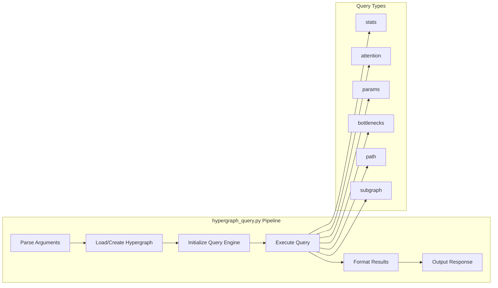

# ESM-2 Hypergraph Technical Implementation Guide

This guide provides detailed technical implementation diagrams and flows for developers working with the ESM-2 hypergraph system.

## Table of Contents

1. [Implementation Flow](#implementation-flow)
2. [Data Structures](#data-structures)
3. [Algorithm Details](#algorithm-details)
4. [Processing Pipelines](#processing-pipelines)
5. [Performance Considerations](#performance-considerations)

## Implementation Flow

### Hypergraph Construction Sequence


### Node Creation Process


## Data Structures

### Core Data Models


### Memory Layout


## Algorithm Details

### Path Finding Algorithm (BFS)


### Parameter Flow Analysis


### Bottleneck Detection Algorithm


## Processing Pipelines

### Complete Generation Pipeline


### Query Processing Pipeline



### Visualization Pipeline


## Performance Considerations

### Complexity Analysis

```mermaid
graph TB
    subgraph "Time Complexity"
        A[Hypergraph Construction: O(L × H)]
        B[Path Finding: O(V + E)]
        C[Statistics Calculation: O(V + E)]
        D[Bottleneck Detection: O(V × E)]
        E[Parameter Analysis: O(V)]
    end
    
    subgraph "Space Complexity"
        F[Node Storage: O(V)]
        G[Edge Storage: O(E)]
        H[Adjacency List: O(V + E)]
        I[Query Results: O(k)]
    end
    
    subgraph "Where:"
        J[V = 64 nodes]
        K[E = 41 edges]
        L[L = 6 layers]
        M[H = 20 heads]
    end
```

### Memory Usage Patterns


### Optimization Strategies


This technical guide provides implementation-level details for developers working with the ESM-2 hypergraph system, including algorithms, data structures, and performance considerations.