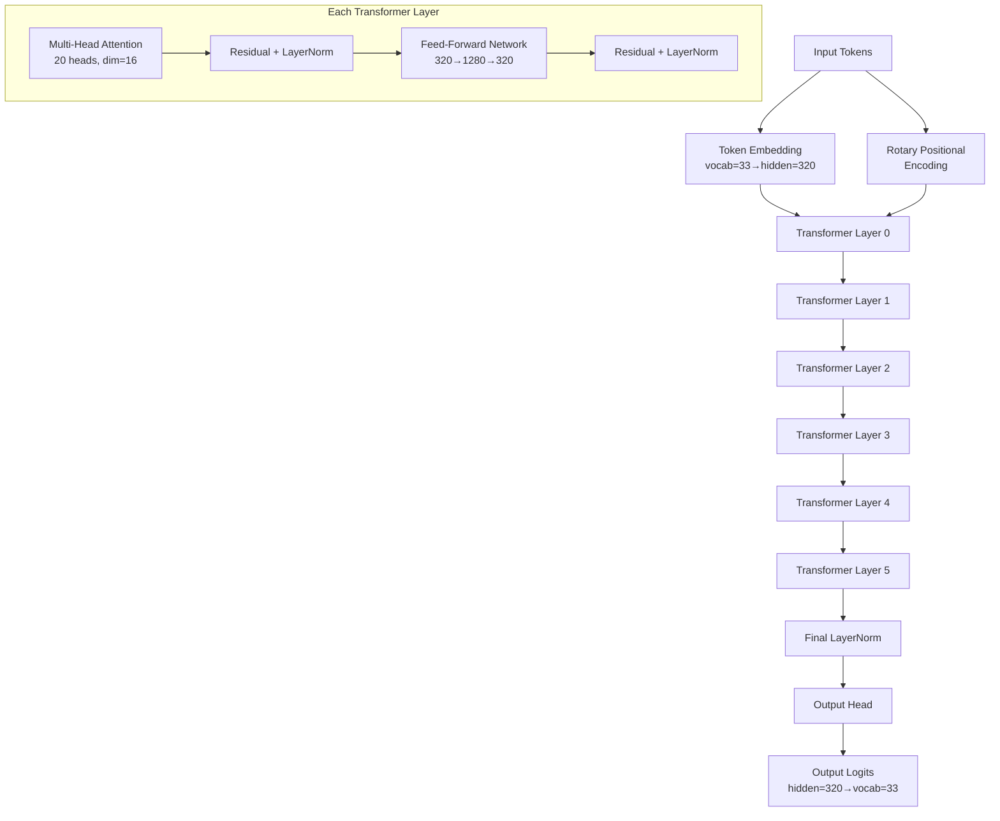
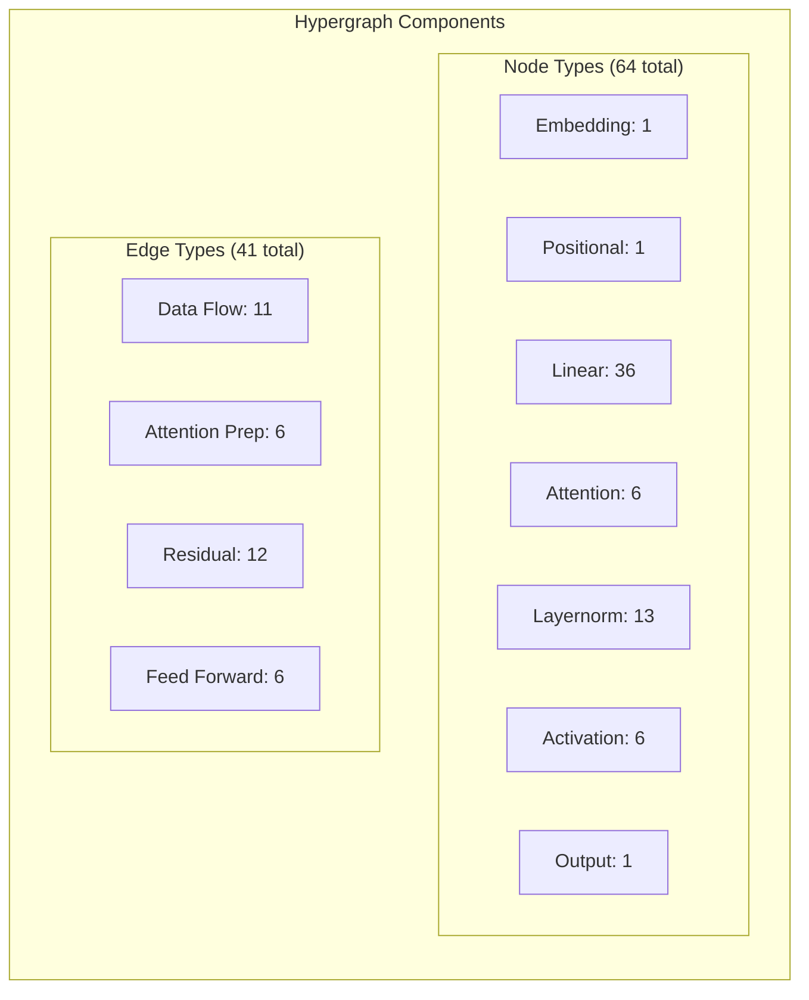
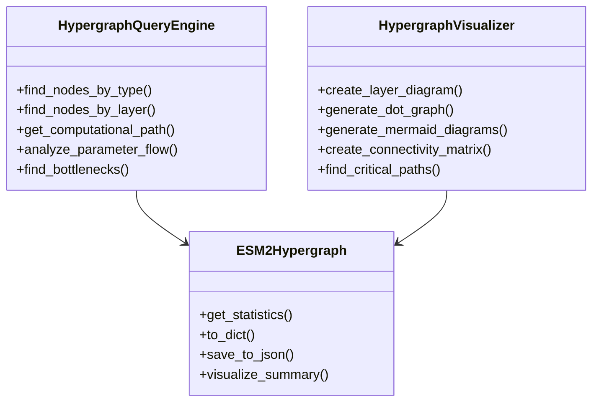
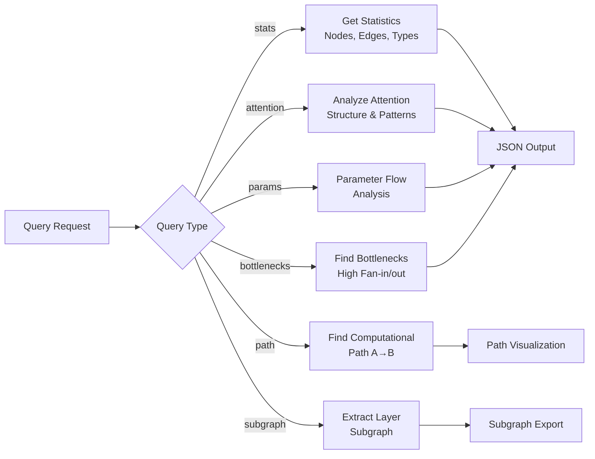

# ESM-2 Hypergraph Analysis Report

## Model Configuration
```json
{
  "name": "esm_backbone",
  "trainable": true,
  "vocabulary_size": 33,
  "num_layers": 6,
  "num_heads": 20,
  "hidden_dim": 320,
  "intermediate_dim": 1280,
  "dropout": 0,
  "max_wavelength": 10000,
  "use_bias": true,
  "activation": "gelu",
  "layer_norm_eps": 1e-05,
  "use_pre_layer_norm": false,
  "position_embedding_type": "rotary",
  "max_sequence_length": 1026,
  "pad_token_id": 1
}
```

## Architecture Overview
```
ESM-2 Architecture Hypergraph
==================================================

INPUT LAYER:
  Token Embedding (vocab=33 -> hidden=320)
  Rotary Positional Encoding

TRANSFORMER LAYER 0:
  Multi-Head Self-Attention:
    - Query/Key/Value Projections (320 -> 320)
    - 20 attention heads
    - Head dimension: 16
    - Output Projection
  + Residual Connection
  Post-Attention Layer Norm
  Feed-Forward Network:
    - Linear (320 -> 1280)
    - GELU Activation
    - Linear (1280 -> 320)
  + Residual Connection
  Post-FFN Layer Norm

TRANSFORMER LAYER 1:
  Multi-Head Self-Attention:
    - Query/Key/Value Projections (320 -> 320)
    - 20 attention heads
    - Head dimension: 16
    - Output Projection
  + Residual Connection
  Post-Attention Layer Norm
  Feed-Forward Network:
    - Linear (320 -> 1280)
    - GELU Activation
    - Linear (1280 -> 320)
  + Residual Connection
  Post-FFN Layer Norm

TRANSFORMER LAYER 2:
  Multi-Head Self-Attention:
    - Query/Key/Value Projections (320 -> 320)
    - 20 attention heads
    - Head dimension: 16
    - Output Projection
  + Residual Connection
  Post-Attention Layer Norm
  Feed-Forward Network:
    - Linear (320 -> 1280)
    - GELU Activation
    - Linear (1280 -> 320)
  + Residual Connection
  Post-FFN Layer Norm

TRANSFORMER LAYER 3:
  Multi-Head Self-Attention:
    - Query/Key/Value Projections (320 -> 320)
    - 20 attention heads
    - Head dimension: 16
    - Output Projection
  + Residual Connection
  Post-Attention Layer Norm
  Feed-Forward Network:
    - Linear (320 -> 1280)
    - GELU Activation
    - Linear (1280 -> 320)
  + Residual Connection
  Post-FFN Layer Norm

TRANSFORMER LAYER 4:
  Multi-Head Self-Attention:
    - Query/Key/Value Projections (320 -> 320)
    - 20 attention heads
    - Head dimension: 16
    - Output Projection
  + Residual Connection
  Post-Attention Layer Norm
  Feed-Forward Network:
    - Linear (320 -> 1280)
    - GELU Activation
    - Linear (1280 -> 320)
  + Residual Connection
  Post-FFN Layer Norm

TRANSFORMER LAYER 5:
  Multi-Head Self-Attention:
    - Query/Key/Value Projections (320 -> 320)
    - 20 attention heads
    - Head dimension: 16
    - Output Projection
  + Residual Connection
  Post-Attention Layer Norm
  Feed-Forward Network:
    - Linear (320 -> 1280)
    - GELU Activation
    - Linear (1280 -> 320)
  + Residual Connection
  Post-FFN Layer Norm

OUTPUT LAYER:
  Final Layer Norm
  Output Head

```

## Model Architecture Flow


## Hypergraph Structure


## Component Architecture


## Query Processing Flow


## Hypergraph Statistics
- **Total Nodes**: 64
- **Total Hyperedges**: 41
- **Maximum Hyperedge Size**: 4

### Node Types Distribution
- embedding: 1
- positional: 1
- linear: 36
- attention: 6
- layernorm: 13
- activation: 6
- output: 1

### Edge Types Distribution
- data_flow: 11
- attention_prep: 6
- attention: 6
- residual: 12
- feed_forward: 6

## Connectivity Analysis
- **Total Connections**: 70

## Layer-wise Analysis
### Input Layer
- Nodes: 2
- Edges: 4
- Edge Types:
  - data_flow: 3
  - residual: 1

### Transformer Layer 0
- Nodes: 10
- Edges: 8
- Edge Types:
  - data_flow: 2
  - attention_prep: 1
  - attention: 1
  - residual: 3
  - feed_forward: 1

### Transformer Layer 1
- Nodes: 10
- Edges: 7
- Edge Types:
  - attention_prep: 1
  - attention: 1
  - data_flow: 1
  - residual: 3
  - feed_forward: 1

### Transformer Layer 2
- Nodes: 10
- Edges: 7
- Edge Types:
  - attention_prep: 1
  - attention: 1
  - data_flow: 1
  - residual: 3
  - feed_forward: 1

### Transformer Layer 3
- Nodes: 10
- Edges: 7
- Edge Types:
  - attention_prep: 1
  - attention: 1
  - data_flow: 1
  - residual: 3
  - feed_forward: 1

### Transformer Layer 4
- Nodes: 10
- Edges: 7
- Edge Types:
  - attention_prep: 1
  - attention: 1
  - data_flow: 1
  - residual: 3
  - feed_forward: 1

### Transformer Layer 5
- Nodes: 10
- Edges: 7
- Edge Types:
  - attention_prep: 1
  - attention: 1
  - data_flow: 2
  - residual: 2
  - feed_forward: 1

### Output Layer
- Nodes: 2
- Edges: 3
- Edge Types:
  - residual: 1
  - data_flow: 2

## Critical Paths
### Path 1
layer_5_post_ffn_norm -> final_layer_norm -> output_head

## Graph Visualization
A DOT file has been generated for graph visualization:
```bash
dot -Tpng esm2_hypergraph.dot -o esm2_hypergraph.png
```