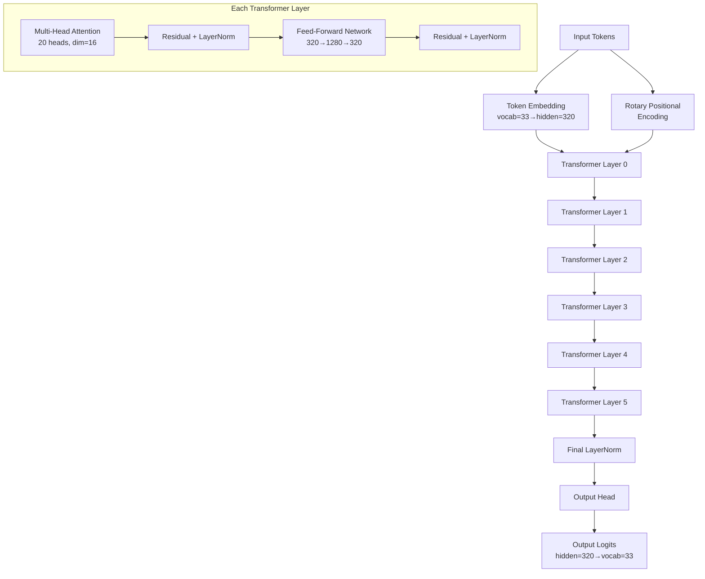
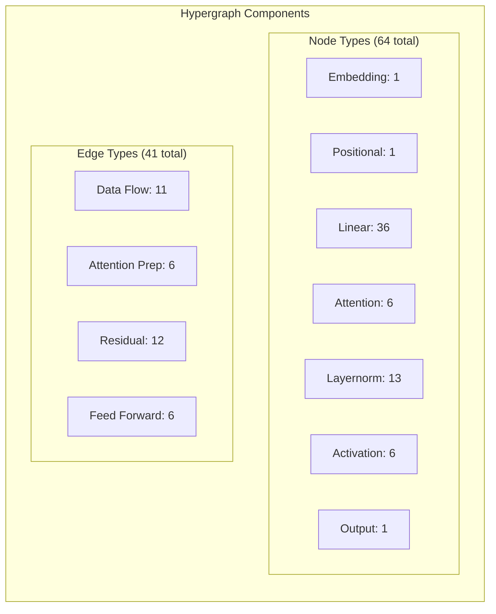
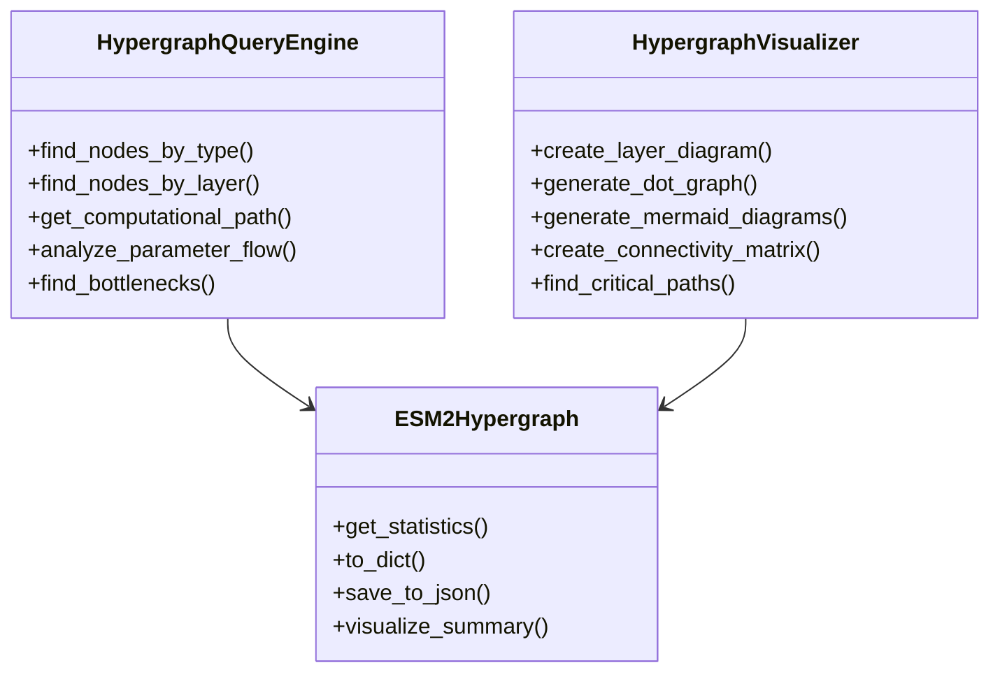
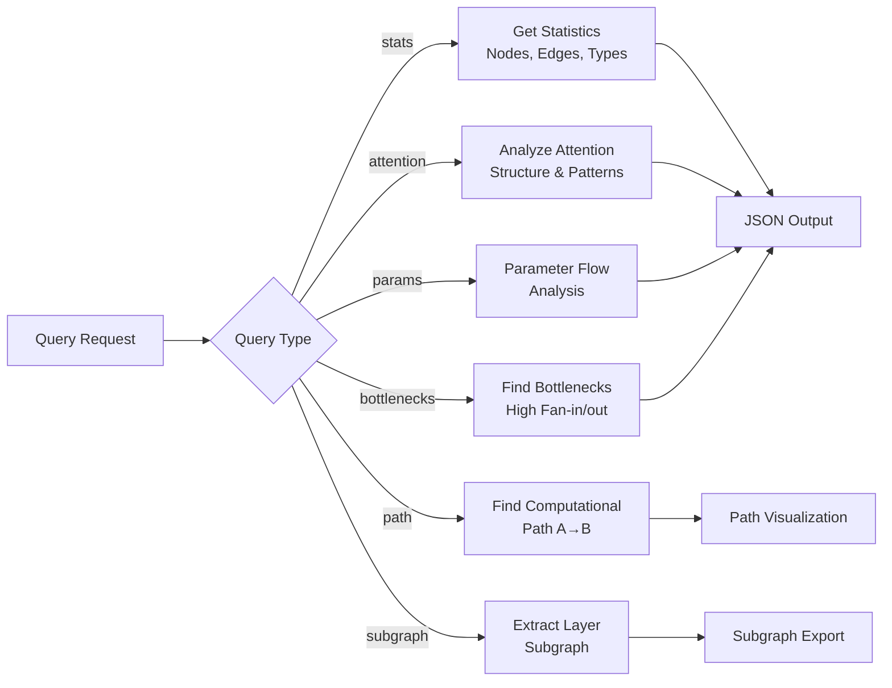

# ESM-2 Hypergraph Mermaid Diagrams

This document contains all mermaid diagrams for the ESM-2 hypergraph system.

## ESM-2 Model Architecture Flow

## Hypergraph Node and Edge Distribution

## Component Class Architecture

## Query Processing Flow

