# ORRRG - Technical Architecture Documentation

## Table of Contents
1. [System Overview](#system-overview)
2. [High-Level Architecture](#high-level-architecture)
3. [Core Components](#core-components)
4. [Component Interactions](#component-interactions)
5. [Data Flow Pipelines](#data-flow-pipelines)
6. [Evolution Engine Architecture](#evolution-engine-architecture)
7. [Autognosis System](#autognosis-system)
8. [Deployment Architecture](#deployment-architecture)
9. [Security Architecture](#security-architecture)

---

## System Overview

ORRRG (Omnipotent Research and Reasoning Reactive Grid) is a revolutionary self-evolving integration system that seamlessly coordinates eight specialized research and development components with advanced evolutionary capabilities.

### Key Architectural Principles

1. **Self-Organization**: Dynamic component discovery and adaptive integration
2. **Evolution-Driven**: Genetic programming and emergent behavior synthesis
3. **Multi-Domain Integration**: Unified knowledge representation across domains
4. **Reactive Architecture**: Event-driven asynchronous communication
5. **Hierarchical Self-Awareness**: Multi-level cognitive introspection

---

## High-Level Architecture

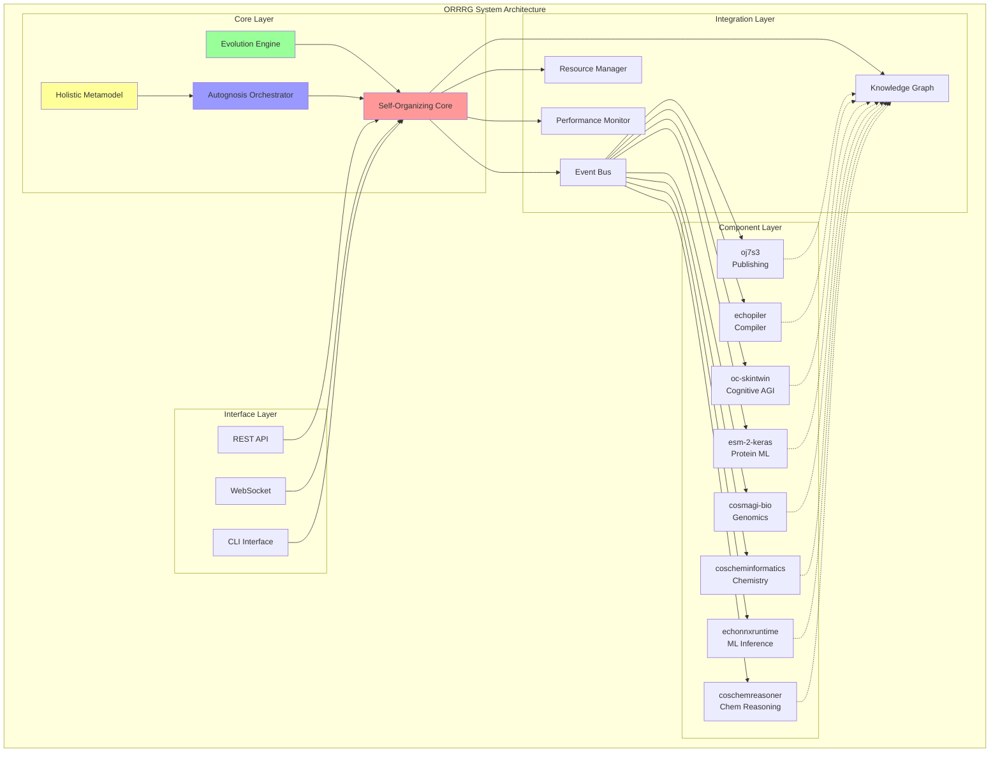

---

## Core Components

### Self-Organizing Core (SOC)

The central orchestration hub that manages component lifecycle and coordination.

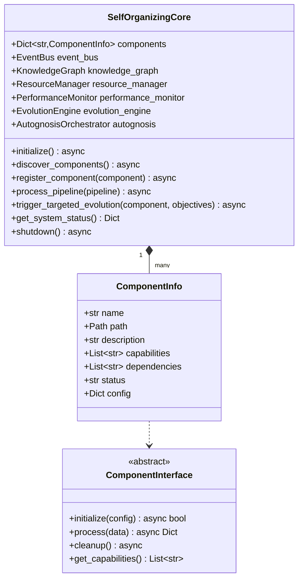

**Responsibilities:**
- Component discovery and registration
- Event routing and message passing
- Resource allocation and load balancing
- Cross-component data flow orchestration
- System health monitoring and optimization

### Evolution Engine

Implements genetic programming and emergent behavior synthesis.

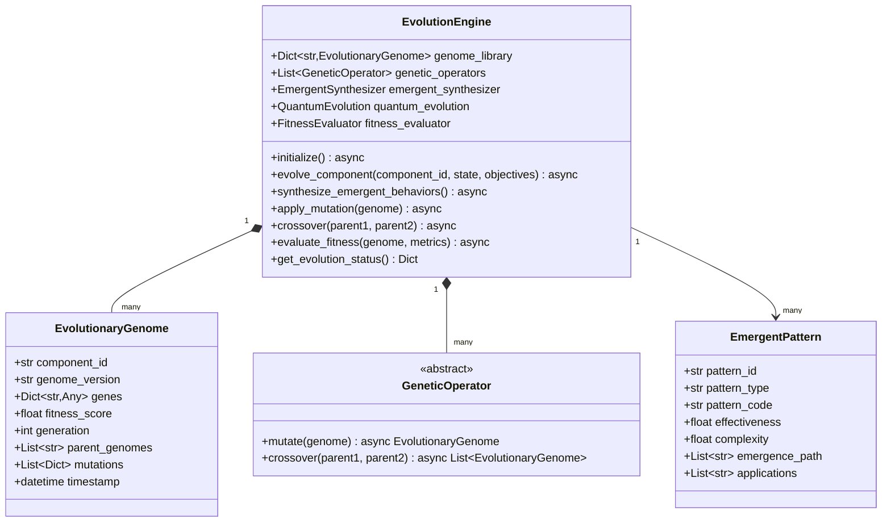

**Key Capabilities:**
- Adaptive mutation with learning
- Quantum-inspired evolutionary algorithms
- Emergent pattern discovery and synthesis
- Self-modifying code generation
- Multi-objective fitness evaluation

### Autognosis Orchestrator

Hierarchical self-awareness and meta-cognitive capabilities.

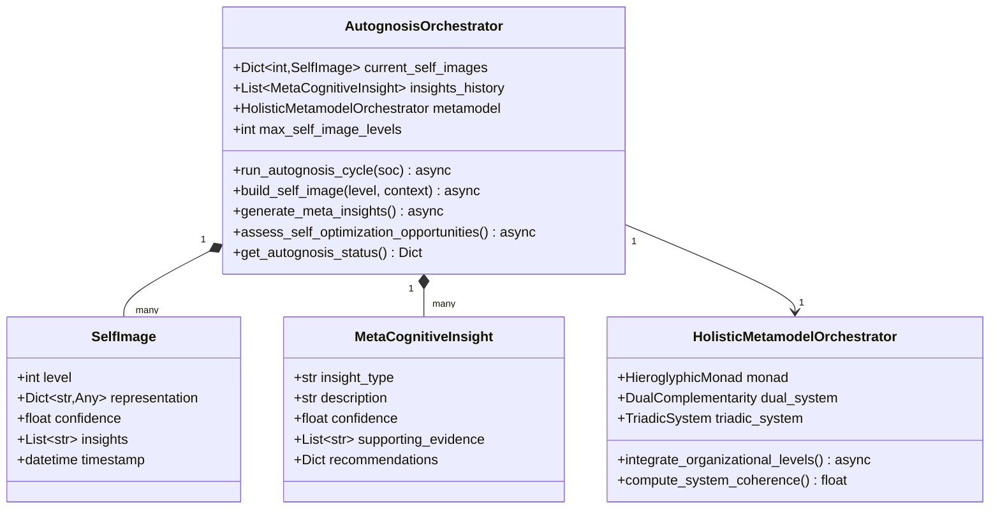

**Hierarchical Levels:**
1. **Level 0**: Raw component status and metrics
2. **Level 1**: Component interaction patterns
3. **Level 2**: System-level emergent behaviors
4. **Level 3**: Self-optimization strategies
5. **Level 4**: Meta-cognitive understanding
6. **Level 5+**: Recursive self-modeling

---

## Component Interactions

### Event-Driven Communication

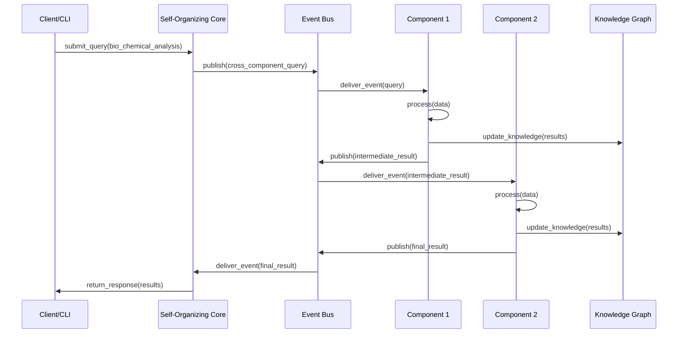

### Cross-Component Data Flow

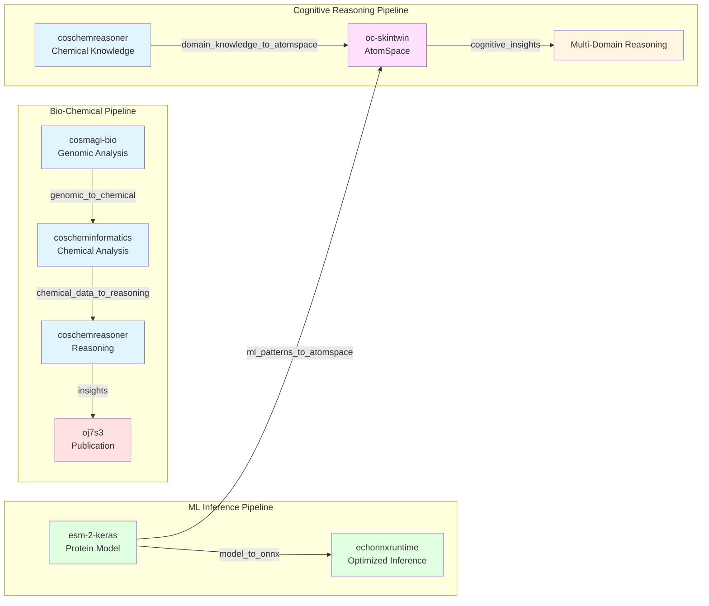

---

## Data Flow Pipelines

### Bio-Chemical Analysis Pipeline

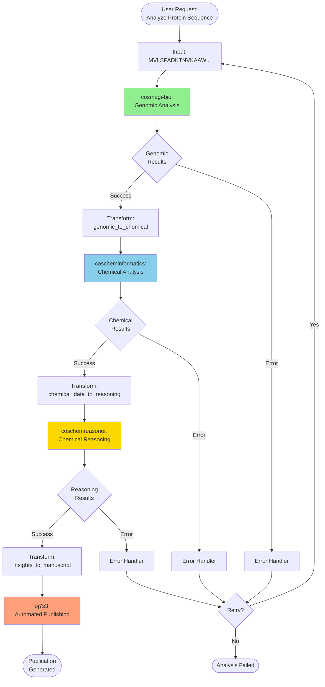

### Evolution Cycle

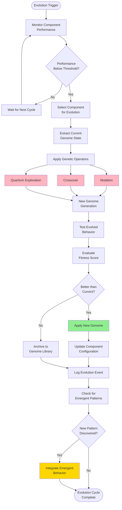

---

## Evolution Engine Architecture

### Genetic Programming Layers

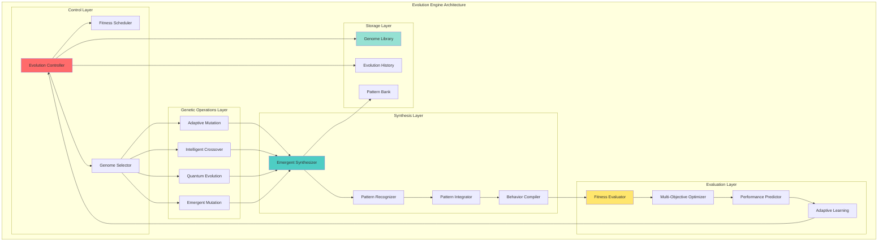

### Quantum-Inspired Evolution

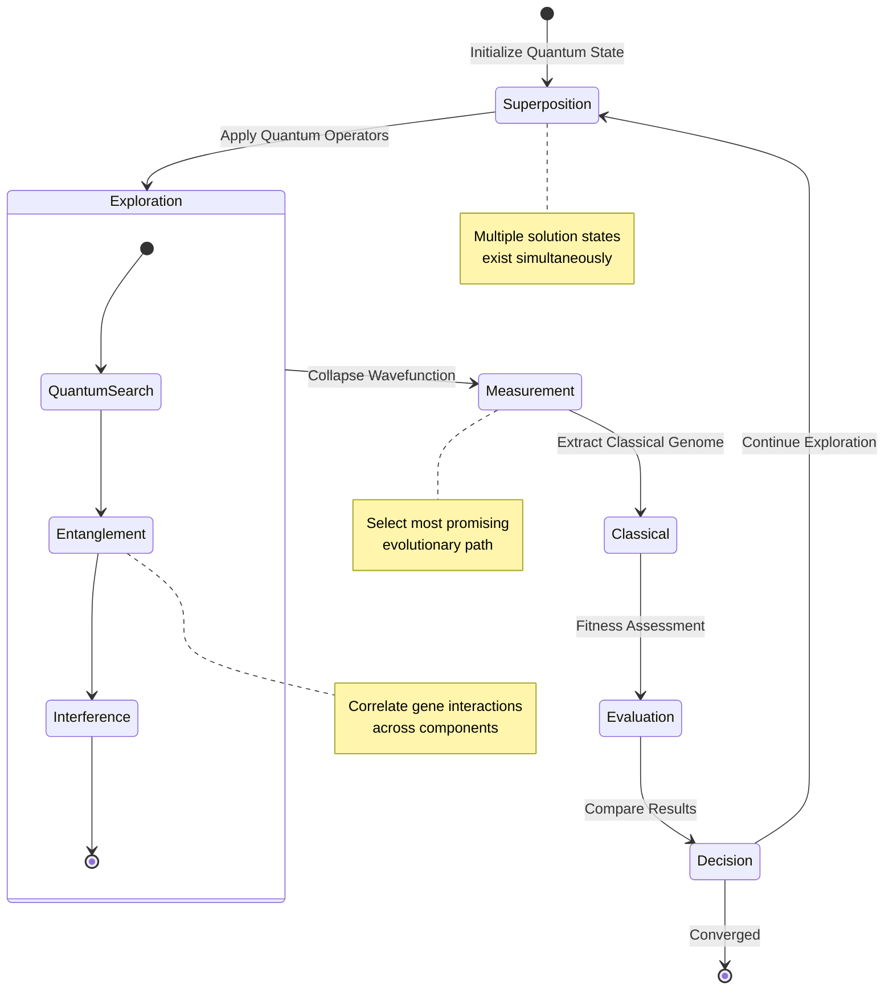

---

## Autognosis System

### Self-Awareness Hierarchy

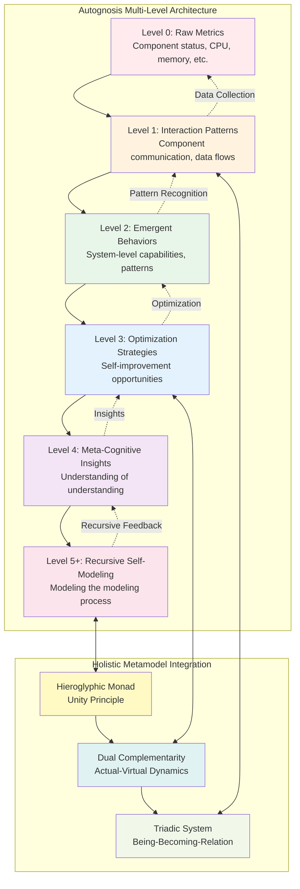

### Autognosis Cycle

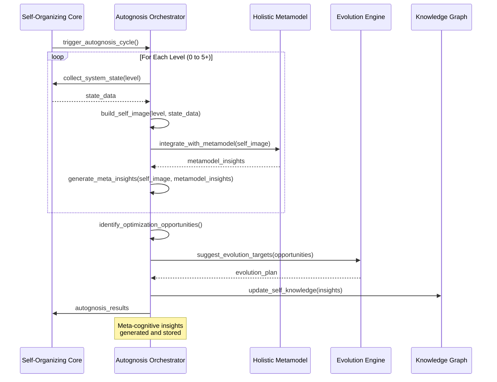

---

## Deployment Architecture

### Single-Node Deployment

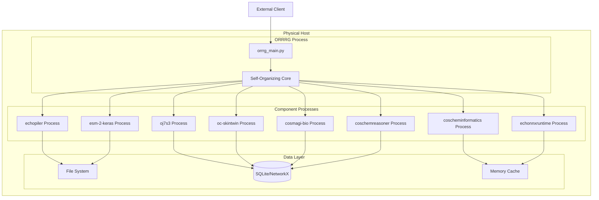

### Distributed Deployment

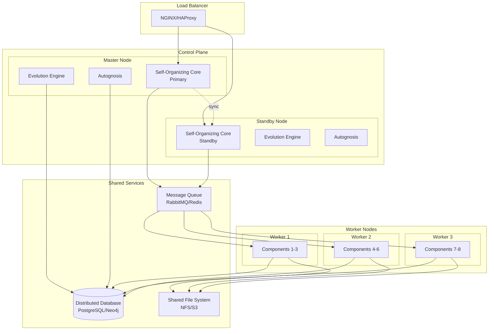

---

## Security Architecture

### Access Control and Authentication

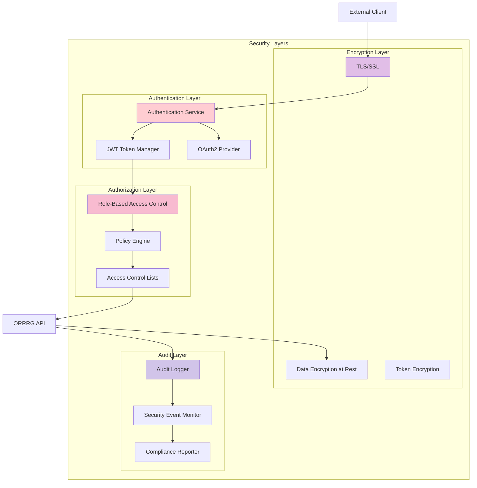

### Component Isolation

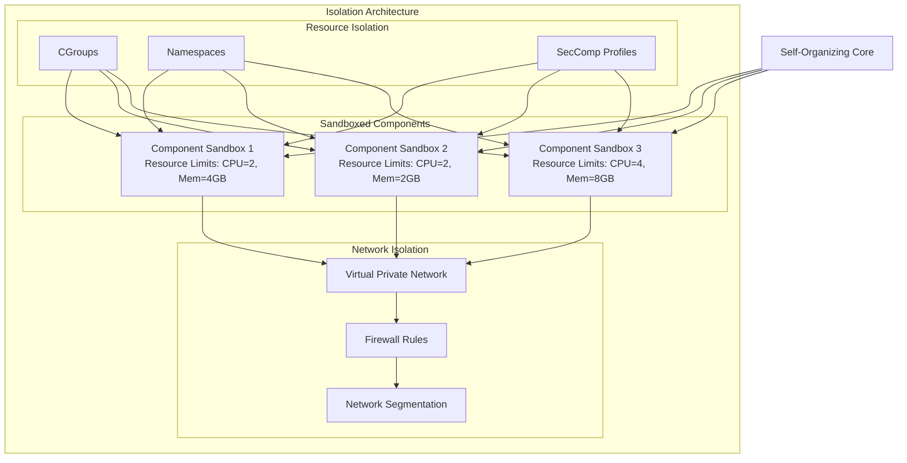

---

## Performance Optimization

### Monitoring and Metrics

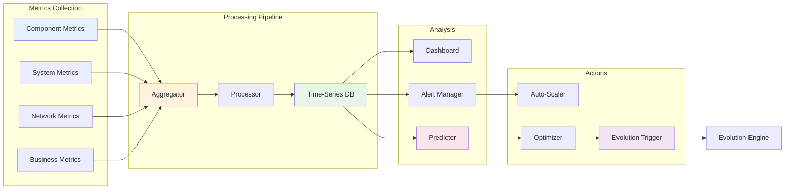

---

## Conclusion

This architecture documentation provides a comprehensive view of the ORRRG system, from high-level design to detailed component interactions. The system is designed to be:

- **Scalable**: From single-node to distributed deployments
- **Evolvable**: Self-improvement through genetic programming
- **Self-Aware**: Hierarchical meta-cognitive capabilities
- **Secure**: Multi-layered security with isolation and encryption
- **Observable**: Comprehensive monitoring and metrics

For formal specifications, see [Z++ Formal Specification](FORMAL_SPECIFICATION_ZPP.md).

For self-awareness details, see [Autognosis Documentation](AUTOGNOSIS.md).

For organizational theory, see [Holistic Metamodel](HOLISTIC_METAMODEL.md).
